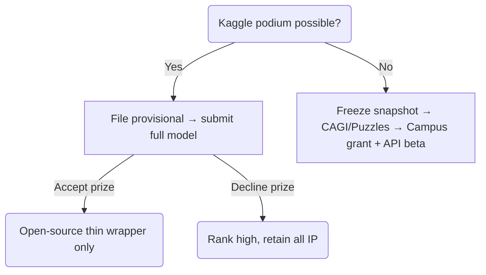

# 🌐 Unified Systems Map + Market Scouting   *(snapshot 2025‑04‑18)*

> **One printable dashboard** that tracks every moving part for the next 18 months **and** shows which external prize/contract markets you can tap for each side‑project.

---

## 1 · 30‑Thousand‑Foot Systems Map

| Layer | Assets & Inputs | Flows & Couplings | Outputs & Success Signals |
|-------|-----------------|-------------------|---------------------------|
| **1   Personal runway** | • $35 k passive/yr<br>• $1 k savings/mo | • Funds living + reagents<br>• Runway < 6 mo → SAFE / grant / Kaggle purse tops up | ≥ 6 mo cash runway |
| **2   Code / Model** | • Private SOTA ckpt (ΔTM > AF‑3)<br>• Lite public ckpt for Kaggle/OSS | • Dual‑repo split<br>• Apache‑2.0 wrapper satisfies OSS/prize rules | Blinded ΔTM > 0.05 on ≥30 RNAs |
| **3   Data** | • PDB<br>• Synthetic RFdiffusion<br>• Upcoming SHAPE‑seq | • Private mix for training<br>• Only licence‑clean subsets go public | Unique RNA corpus (claims + moat) |
| **4   Wet‑lab infra** | • Campus bench/core **or** DIY micro‑lab ($12 k cap‑ex) | • SHAPE assays ↔ model loop<br>• Cryo‑EM outsourced | 14‑day DM‑T cycle<br>≥ 70 % SHAPE concordance |
| **5   Capital channels** | • Kaggle $45 k (opt.)<br>• Campus grant $5–10 k<br>• DARPA/Wellcome $2–5 M<br>• Seed $8–12 M | • Cash → compute + wet‑lab<br>• Better model → LOIs → cash | 2 paid pilots ≥ $50 k<br>Seed closed < 10 mo |
| **6   Reputation / Influence** | • Kaggle badge<br>• bioRxiv pre‑print<br>• Campus PR | • Stars/citations feed Π(t) influence tensor | > 1 000 stars<br>> 3 conf invites |

---

## 2 · Decision Tree (condensed)



---

## 3 · Campus‑Negotiation Cheat‑Sheet

| Ask | Win‑rate | “Give‑back” Token |
|-----|---------|-------------------|
| ½ bench + fume hood | 80 % | PI as minor co‑author |
| $5 k consumables credit | 50 % | Host 1‑day workshop |
| 250 A100 GPU‑h/mo | 70 % | Monthly utilisation report |
| 20 % cryo‑EM discount | 60 % | Let facility use images in marketing |

---

## 4 · Risk Matrix (top 5)

| Risk | Likelihood | Impact | Control |
|------|-----------|--------|---------|
| OSS erodes moat | ⚠︎ Med | High | Patent + dual‑repo + private weights |
| Univ. IP grab | ⚠︎ Med | High | MoU waiver before bench use |
| Compute cost spike | ⚠︎ Low‑Med | Med | Quantise, off‑peak GPUs, spot‑cap |
| Regulators ignore in‑silico | ⚠︎ Med | High | Bundle SHAPE kit + KOL letter |
| Runway over‑run | ⚠︎ Low | High | SAFE/grant trigger at < 4 mo |

---

## 5 · 18‑Month Execution Timeline

| Week | Deliverable | KPI |
|------|-------------|----|
| 0‑2 | Kaggle strategy + provisional filed | Patent ✔ |
| 2‑4 | Campus MoU signed | Badge ✔ |
| 4‑6 | 3 SHAPE pilots + bioRxiv draft | ≥ 70 % concordance |
| 6‑8 | Beta API live | 50 wait‑list |
| 8‑10 | 2 × $50 k LOIs | $100 k ARR |
| 10‑14| Campus grant + DARPA white‑paper | ≥ $100 k ND cash |
| 14‑18| Seed deck + road‑show | Term‑sheet |

---

## 6 · Go/No‑Go Gates

1. **ΔTM > 0.1 vs AF‑3** → else iterate model.  
2. **≥ 2 pilots or $100 k grant** → else cut burn, spin consulting.  
3. **Runway ≥ 8 mo** → else SAFE bridge.

---

## 7 · Parallel Market Cheat‑Sheet (other projects)

| Project | Prize Market | Contract / SaaS Market | Analogy |
|---------|--------------|------------------------|---------|
| ARC‑AGI | **ARC Prize** ($1 M+) | Eval‑as‑a‑Service, superalignment labs | Blinded set → cash, API |
| Primordial BH | **NASA / ESA data challenges** | SBIR Phase I/II, FDL sub‑contracts | Instrument data, gov money |
| Cultivation | **XPRIZE Health Longevity** | ARPA‑H BAA, wearable SDK licences | Open protocol → SaaS |

**Leverage moves:** split‑repo, provisional patent, hosted API upsell.

---

## 8 · Immediate Actions (next 7 days)

1. Submit **“intent to compete”** for ARC‑Prize 2025.  
2. Add NASA & ESA challenge RSS feeds to Slack #alerts.  
3. Email PI about MoU draft; propose 30‑min meeting.

---

### TL;DR

*Freeze a benchmark‑beating checkpoint, file your provisional, and lock a campus MoU this month.*  
Everything else—pilots, grants, seed—flows from that foundation with the roadmap above.

---

*Need templates (MoU, provisional claims, reagent shopping list)? Ping me.*
```
