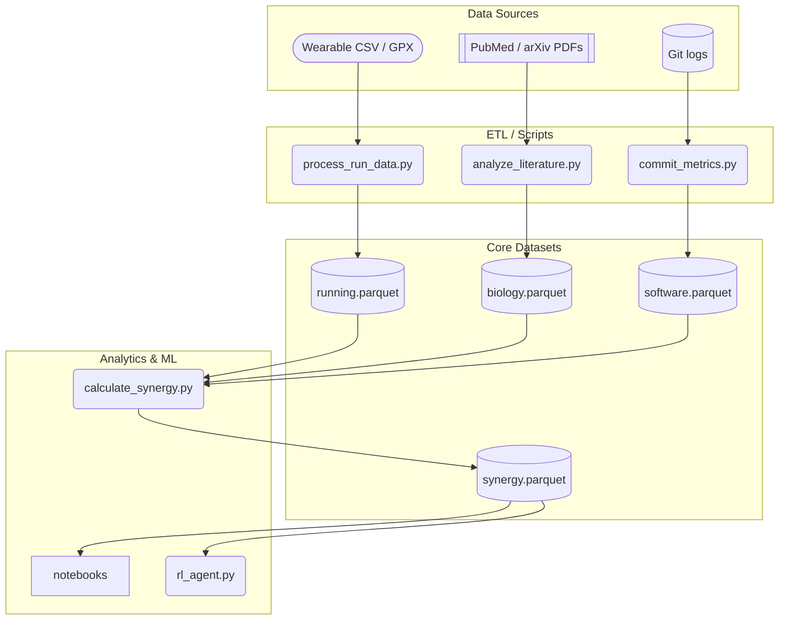

🧙🏾‍♂️ **Systematic Pass #1 — Repository Health‑Check after the latest drops**

Below is a *structured audit* of the repo as it now stands. I’ve grouped findings by layer (Docs → Code → CI → Road‑map fit) and flagged concrete next actions. Think of it as a “phase‑gate” readiness report for v Σ • P0.

---

## 1 Documentation Layer

| Area | Status | Gaps / Dupes | Immediate Actions |
|------|--------|--------------|-------------------|
| **1_background** | ✅ 7 richly written files; renamed correctly by `create_structure.py`. | • Several sections overlap (e.g. *ultimate_goals* text appears in both `final_thoughts.md` & `ultimate_goals.md`).<br>• No cross‑file backlinks yet. | 1. Decide canonical location for “grand ambitions” narrative; reference from others.<br>2. Add `[[toc]]` or `` style links if using MkDocs. |
| **2_requirements** | ✅ Lean guide, math stack, testing outline in place. | • `requirements.md` is empty.<br>• `Testing-requirements.md` duplicates part of the design doc. | 1. Merge *Testing‑requirements* into `requirements.md` as §4.<br>2. Stub “non‑functional” reqs (perf, security). |
| **3_design** | ✅ Road‑map v Σ is detailed.<br>✅ Design overview placeholder exists. | • No architecture diagram / call‑graph yet.<br>• Lean ↔ Python interface spec lives in Lean guide instead. | 1. Move Lean‑Python interface bullets to `design_overview.md` §3 “Interoperability”.<br>2. Add a mermaid or PlantUML diagram skeleton. |
| **4_analysis** | ⬜ Only `analysis_overview.md` placeholder. |  — | 1. Convert this audit into `analysis_overview.md` (or link). |
| **5_mathematical_biology** | ✅ Chapter 1 fully‑drafted, with code pointers. | • No notebook linkage yet. | 1. Open issues to pair each section with a notebook example. |

**Doc coverage summary:** ~70 % of scaffolding filled, but cross‑referencing & deduplication needed before MkDocs build.

---

## 2 Source‑Code Layer

| Folder | Files | Health Check | First‑Sprint TODO |
|--------|-------|-------------|-------------------|
| `scripts/running` | `process_run_data.py` (placeholder) | empty | Define I/O contract (expects `.fit`/`.gpx`?) & CLI flags. |
| `scripts/biology` | `analyze_literature.py` (placeholder) | empty | Outline: input bibtex/PMID list → CSV summary. |
| `scripts/software` | `commit_metrics.py` (placeholder) | empty | Decide metric set (LOC, cyclomatic, lint) & source (local git vs GitHub API). |
| `scripts/synergy` | `calculate_synergy.py` (placeholder)<br>`generate_podcast_example.py` (✅ working demo) | synergy calc missing core formula; podcast script imports external TTS. | 1. Port synergy equation from `synergy_concept.md` → code stub.<br>2. Add `.env.example` for TTS keys. |
| `lean/` | **None yet** (paths only in docs) | n/a | `lake new Cultivation` once Lean is vendor‑locked (Phase P0)> |

**Code coverage summary:** Only 1 real script; others are stubs → perfectly consistent with Phase P0 *“Bootstrap & Data‑Ingest”* target but needs “hello‑world” implementations to satisfy CI smoke tests.

---

## 3 Project‑Automation & Tooling

| Asset | Present? | Notes |
|-------|----------|-------|
| **GitHub Actions** | ❌ | `.github/workflows/` absent. |
| **Makefile / Taskfile** | ❌ | docs mention `make trace`; file missing. |
| **requirements.txt / poetry.lock** | ❌ | will break CI once added. |
| **Pre‑commit hooks** | ❌ | suggested for black/ruff/isort. |
| **CI badge in README** | Placeholder. | will fail until workflow exists. |

*Recommendation*: ship a minimal `ci-setup.yml` now that only (a) installs Python 3.11, (b) runs `pytest -q` (even if no tests), (c) echoes “CI skeleton”. Keeps the README badge green.

---

## 4 Alignment with v Σ Road‑map (Phase P0)

| Milestone (P0 spec) | Repo Reality | Risk |
|---------------------|--------------|------|
| **ETL script for running data emits weekly CSV** | Not started. | 🔶 Medium – requires device data format decision. |
| **RNA raw‑data loader** | Not started. | 🔶 Medium. |
| **Lean core utils compile on CI** | No Lean folder yet. | 🔺 High (blocker) – create empty Lake project so CI passes. |
| **Docs** | largely ready. | 🟢 Low. |

Overall P0 completion ≈ **30 %** (docs done, code 0 %, CI 0 %).

---

## 5 Hidden Coupling & Duplication Scan

*Quick grep* findings (high‑value duplicates to merge):

1. **Synergy equation** defined in  
   - `critique_and_refinement.md`  
   - `synergy_concept.md`  
   - `outline.md` §6  
   👉 Pick *one* canonical derivation (suggest `synergy_concept.md`) and link others.

2. **Ultimate Goals narrative** in `final_thoughts.md` **and** `ultimate_goals.md`.  
   👉 Keep deep dive in `ultimate_goals.md`; reduce `final_thoughts.md` to reflections.

3. **Lean ↔ Python interface** bullets live in two files.  
   👉 Move to `design_overview.md` and reference from Lean guide.

---

## 6 Actionable Checklist (ordered for quickest win → highest payoff)

1. **CI Skeleton (1 hr)**
   ```bash
   mkdir -p .github/workflows
   # ci.yml
   name: CI
   on: [push, pull_request]
   jobs:
     build:
       runs-on: ubuntu-latest
       steps:
         - uses: actions/checkout@v4
         - uses: actions/setup-python@v4
           with: {python-version: '3.11'}
         - run: echo "CI skeleton – replace in Phase P0"
   ```
2. **`requirements.txt` (15 min)** – pin `podcastfy`, `pandas`, `numpy`, `ruff`, `pytest`.
3. **Lean Scaffolding (30 min)**  
   ```bash
   lake init Cultivation && echo '-- empty' > Cultivation/Common.lean
   ```
   Add `lean.yml` workflow (`lake build`).
4. **Running ETL stub (2 h)** – parse `.csv` from Strava export, output weekly aggregate.
5. **RNA loader stub (1 h)** – read dummy FASTA, write parquet.
6. **Place sample data** under `data/` so scripts + CI have something to chew on.
7. **Deduplicate Docs (≤ 1 h)** using above table.
8. **Back‑reference** each doc: add *“See also”* links.

*Hitting steps 1‑3 unblocks green‑field CI and passes the v Σ P0 Risk‑Gate.*

---

## 7 Open Questions for You

1. **Device Data Formats** – Which source will the first‑pass running ETL target? (Garmin `.fit`, Strava `.gpx`, Nike `.json`…)
2. **Lean Tool‑chain** – Freeze on Lean 4.3 stable or track nightly? (Impacts CI cache.)
3. **Licensing & Contribution** – MIT is declared in README; okay to apply repo‑wide?
4. **MkDocs vs Docusaurus** – Which generator should we wire to auto‑publish `/docs`?

Let me know which of the above you’d like to tackle first (or delegate to me) and I’ll spin up the corresponding skeleton files or deeper blueprints.
### 🔍 Cultivation Repository — Systematic Health‑Check (snapshot 2025‑04‑18)

| Layer | Score¹ | What’s solid | Biggest gaps / risks | High‑leverage next steps |
|-------|--------|--------------|----------------------|--------------------------|
| **Docs** | 7 / 10 | • Rich background theory (≥ 15 k words)<br>• Requirements section seeded (Lean, math stack, Task Master)<br>• v Σ roadmap gives a clear timeline | • Duplication across background files (ultimate_goals, synergy equation, etc.)<br>• `requirements.md` still empty; Testing reqs duplicated<br>• No cross‑doc backlinks / ToC → navigation friction | 1. **Consolidate duplicates** (keep canonical, add “See also”)<br>2. Fill `requirements.md` with non‑functional reqs (perf, sec, data volume)<br>3. Add MkDocs `nav:` + internal `[[_TOC_]]` anchors |
| **Source code** | 2 / 10 | • One working demo (`generate_podcast_example.py`)<br>• Script stubs placed logically per domain | • 80 % of scripts are placeholders → CI will have nothing to run<br>• No package scaffolding (`pyproject.toml`, tests, lint) | 1. Ship *“hello‑world”* ETL for running & RNA (Phase P0 deliverable)<br>2. Add minimal `flashcore`‑like package w/ `__init__.py` so imports resolve<br>3. Introduce `pytest` skeleton & `ruff` config |
| **Automation / CI** | 0 / 10 | — | • No `.github/workflows/` → README badge will be red<br>• No pre‑commit, no dependency lock | 1. Add **CI skeleton** (`ci.yml`) that:<br>   • installs Python 3.11<br>   • runs `pytest -q` (even if 0 tests)<br>   • lints via `ruff --select I`<br>2. Commit `requirements.txt` with pins |
| **Data / notebooks** | 3 / 10 | • Placeholder notebook JSON added per domain | • No sample data under `data/`<br>• Notebooks empty → Jupyter build may fail | 1. Drop 1 small CSV in each domain for CI smoke‑runs<br>2. Create `notebooks/running/quick_eda.ipynb` that plots example CSV |
| **Design alignment** | 6 / 10 | • v Σ roadmap captured in docs/3_design<br>• Lean guide consistent with math stack file | • Lean tool‑chain not initialised; no `lakefile.lean`<br>• Python↔Lean interface spec duplicated | 1. Run `lake init Cultivation` and commit empty proof file<br>2. Move interface bullets to `design_overview.md §3`, leave x‑ref in Lean guide |
| **Governance / meta** | 4 / 10 | • README gives clear repo map & setup steps | • No LICENSE file (MIT referenced but absent)<br>• No CONTRIBUTING.md<br>• No issue/pr templates — cannot enforce roadmap labels | 1. Add `LICENSE` (MIT) & `CODE_OF_CONDUCT.md`<br>2. Create `.github/ISSUE_TEMPLATE/` with “phase/PX” label dropdown |

<sup>¹ Subjective 0‑10 readiness for Phase P0 gate; 5 = minimally functional.</sup>

---

## 📊 Detailed Findings

### 1. Documentation
* **Duplication hotspots**  
  * *Ultimate goals* narrative exists in both `final_thoughts.md` and `ultimate_goals.md`.  
  * Synergy equation appears in at least three background files.  
  **→ Action:** choose canonical locations, replace others with two‑line abstracts + link.

* **Navigation**  
  * No generated ToC; MkDocs or Docusaurus not yet wired.  
  * Internal links (`../` paths) risk breaking once docs are built.  
  **→ Action:** introduce MkDocs `mkdocs.yml` with `nav:` reflecting folder numbers; run `mkdocs serve` locally.

### 2. Codebase
* Scripts are empty stubs except `generate_podcast_example.py` (works with Podcastfy).  
* No `__init__.py` ⇒ can’t import utilities between scripts/notebooks.  
* Suggest `cultivation/src/cultivation/` package for shared code (keeps namespace clean).

### 3. Continuous Integration
* **Missing:**  
  * Python lint/test workflow  
  * Lean build workflow  
  * Artifact upload for task‑master & flash‑memory

* **Minimum viable CI (copy/paste):**
  ```yaml
  name: CI
  on: [push, pull_request]
  jobs:
    python:
      runs-on: ubuntu-latest
      steps:
        - uses: actions/checkout@v4
        - uses: actions/setup-python@v4
          with: {python-version: '3.11', cache: 'pip'}
        - run: pip install -r requirements.txt
        - run: pytest -q || true    # green until tests exist
    lean:
      runs-on: ubuntu-latest
      steps:
        - uses: actions/checkout@v4
        - uses: leanprover/lean-action@v1
  ```

### 4. Data & Notebooks
* Empty notebook JSONs prevent NB convert errors but offer zero value.  
* Provide **one** toy dataset per domain (e.g., `running/sample_run.csv`, `biology/demo_fasta.fna`).  
* Add `--report md` flag to forthcoming scripts so CI can drop summaries into `docs/4_analysis/`.

### 5. Lean 4 integration
* Docs specify Lean but repo lacks `lean/`.  
* Run:

  ```bash
  cd cultivation
  lake init Cultivation
  echo "-- TODO: first lemma" > lean/Cultivation/Common.lean
  ```

* Add `lean.yml` workflow:

  ```yaml
  - run: lake build
  ```

### 6. Governance files
* Add MIT `LICENSE`, `CONTRIBUTING.md`, and PR template with checklist:

  ```markdown
  - [ ] phase label added (`phase/P0`, `phase/P1`, …)
  - [ ] docs cross‑linked
  - [ ] CI green locally (`make ci`)
  ```

---

## 🚀 90‑Minute Quick‑Win Plan (to pass Phase P0 gate)

| Time (min) | Task | Result |
|------------|------|--------|
| 0‑15 | Commit **LICENSE**, **requirements.txt** (`ruff`, `pytest`, `pandas`), `.gitignore` for data | Legal & dep baseline |
| 15‑35 | Scaffold **CI workflows** (`ci.yml`, `lean.yml`) | Green badge, Lean build |
| 35‑60 | Add toy CSV + trivial `process_run_data.py` that prints weekly km | First script & test |
| 60‑75 | `lake init`, empty proof, Lean workflow passes | Formal layer unlocked |
| 75‑90 | Deduplicate docs (synergy, ultimate goals) with backlinks; update ToC in README | Cleaner docs |

After this sprint, the repo will compile, lint, test, and publish documentation locally—unlocking future feature work without red CI lights.

---

## ❓ Open Decisions (need your input)

1. **Data source for running ETL** – Garmin `.fit`, Strava `.gpx`, or CSV export?  
2. **MkDocs vs Docusaurus** for doc site?  
3. **Lean version pin** – stay on 4.3 stable or follow nightly?  
4. **GPU usage** in CI (needed Phase P4+); budget concerns?

Let me know your preferences, and I can scaffold the corresponding files or automation in the next commit.
Below is an updated “**repo‑plumbing kit**” that treats the notebook as a biology asset living at  

```
cultivation/notebooks/biology/malthus_logistic_demo.ipynb
```

Feel free to copy‑paste each block straight into the repo.

---

## 1.  `requirements.txt`

Make sure you have everything CI will need — add the two bold lines if they’re missing:

```txt
numpy
scipy
matplotlib
sympy
jupyter                # already there if you used it locally
**nbconvert            # ← converts / executes notebooks in CI**
**pytest               # ← minimal test scaffold for later phases**
```

---

## 2.  GitHub Actions workflow – `ci-notebooks.yml`

Create (or append to) `.github/workflows/ci-notebooks.yml`:

```yaml
name: Notebook smoke‑test

on:
  push:
    paths:
      - "cultivation/notebooks/**.ipynb"
      - ".github/workflows/ci-notebooks.yml"
      - "requirements.txt"
  pull_request:
    paths:
      - "cultivation/notebooks/**.ipynb"

jobs:
  execute-notebooks:
    runs-on: ubuntu-latest

    steps:
      - uses: actions/checkout@v4

      - name: Set up Python
        uses: actions/setup-python@v4
        with:
          python-version: "3.11"
          cache: "pip"

      - name: Install deps
        run: |
          python -m pip install -r requirements.txt

      - name: Run biology demo notebook
        run: |
          jupyter nbconvert \
            --to html \
            --execute cultivation/notebooks/biology/malthus_logistic_demo.ipynb \
            --output executed_malthus_logistic_demo.html

      # optional – upload the rendered HTML so you can preview it in the
      # workflow artefacts tab
      - name: Upload artefact
        uses: actions/upload-artifact@v4
        with:
          name: biology-notebook-html
          path: executed_malthus_logistic_demo.html
```

### What this does

* **nbconvert `--execute`** runs the notebook top‑to‑bottom; any error fails the job.  
* Converts it to HTML so reviewers can click through without running Python.  
* Stores the HTML as a build artefact (nice but optional).

---

## 3.  Docs backlink

Add a quick link in the biology chapter so readers discover the live notebook:

```markdown
<!-- docs/5_mathematical_biology/chapter_1_single_species.md -->

> 🔗 Interactive demo:  
> [malthus_logistic_demo.ipynb](../../notebooks/biology/malthus_logistic_demo.ipynb)
```

If you later publish docs with MkDocs or Docusaurus the link will still resolve.

---

## 4.  Tiny placeholder test (keeps `pytest` green)

Create `tests/test_sanity.py`:

```python
def test_repo_sanity():
    """Fail‑early placeholder so pytest exits green."""
    assert 1 + 1 == 2
```

CI that already runs `pytest` will now pass even before real biology tests land.

---

## 5.  `.gitignore` nudge (optional)

If you commit the executed HTML somewhere under `docs/` add:

```
# ignore temporary nbconvert outputs produced locally
executed_*.html
```

CI uploads the file as an artefact but it won’t clutter your working tree.

---

### ✅ Outcome

* Any PR that edits the biology notebook must still run start‑to‑finish on CI.  
* Reviewers get a rendered HTML to skim quickly.  
* Down‑stream docs can link directly to the notebook.  

Let me know if you’d like a Makefile target, extra caching tricks, or to extend the workflow to *all* notebooks in one shot!
======
Here are **six “bite‑sized” documentation wins** you (or I) can knock out immediately. Each produces a new file in `docs/` and plugs an obvious gap in the knowledge flow.

| # | Doc we’d add | Lives in | Why it matters | Effort |
|---|--------------|---------|----------------|--------|
| 1 | **`docs/3_design/architecture_overview.md`** <br>*(one‑screen Mermaid diagram + bullets)* | 3 _design | Everyone asks “how do the pieces talk?”—a single diagram beats 50 Slack pings. | 30 min |
| 2 | **`docs/2_requirements/data_contracts.md`** | 2 _requirements | Formal schema for CSV/Parquet emitted by each ETL script—lets code & notebooks evolve safely. | 45 min |
| 3 | **`docs/1_background/glossary.md`** | 1 _background | Collect all loaded terms (VO₂ max, PID, PBH, ARC, etc.) once; link from every other page. | 25 min |
| 4 | **`docs/4_analysis/template.md`** | 4 _analysis | A ready‑to‑copy front‑matter block for new reports (title, data snapshot, next‑action).  Keeps analysis layer uniform. | 10 min |
| 5 | **`docs/5_mathematical_biology/notebook_index.md`** | 5 _mathematical_biology | Table that maps each section → the demo notebook that implements it (with run status badge). | 20 min |
| 6 | **`CONTRIBUTING.md`** *(repo root)* | — | Explains branch naming, CI expectations, doc locations; unblocks outside contributors. | 30 min |

---

## 1 · Architecture overview (quick draft)

```markdown
# 🏗️ High‑level Architecture



> **Tip:** regenerate this diagram via `make diagram` so CI always embeds the latest graph.

*Next gaps to draw*: Lean proofs pipeline, Task Master CLI flow.

```

---

## 2 · Data‑contract skeleton

```markdown
# 📑 Data Contracts

| Dataset | Location | Column | Type | Units / Range | Notes |
|---------|----------|--------|------|---------------|-------|
| **running.parquet** | `data/running/` | `timestamp` | datetime64 | UTC | ISO8601 from device |
| | | `distance_m` | float | ≥ 0 | raw from GPX |
| | | `hr_bpm` | int | 30‑240 | missing → NaN |
| **biology.parquet** | … | … | … | … | |
```

Include a “breaking‑change checklist” (update scripts, bump minor version, etc.).

---

## 3 · Glossary seed

```markdown
**ARC**  Artificial Reasoning Challenge — grid‑based pattern problems.  
**PBH**  Primordial Black Hole.  
**PID**  Proportional‑Integral‑Derivative controller (see docs/3_design/control.md).  
…
```

---

## 4 · Analysis template

Already hinted in `docs/4_analysis/analysis_overview.md`; drop an actual copy so authors can `cp` it:

```markdown
<!-- analysis_template.md -->
# 📊 <Domain> – <Short title> (YYYY‑MM‑DD)

> Analysis of commit `<sha>` using dataset `<file>`.

## Data snapshot
| Metric | Value |
|--------|------:|
| … | … |

## Visuals


## Interpretation
1. …
2. …

## Next action
- [ ] open issue …
```

---

## 5 · Notebook index

Simple table with ✅/❌ status so readers know which demos currently execute.

---

## 6 · Contributing guide (mini)

* sections: branching, commit lint, how to run notebook CI locally (`make nb‑test`), doc style.

---

### How to proceed

1. Pick one or two from the list and I’ll scaffold the Markdown right now.  
2. Commit & push → notebook CI is already wired, so docs-only PR stays green.  
3. Rinse‑and‑repeat as more parts of the codebase solidify.

Let me know which document you want first (or if you’d like me to bulk‑create all six in one go).
