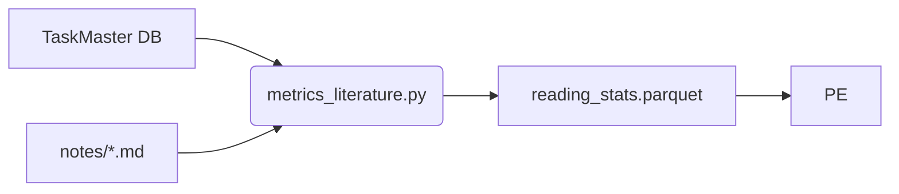

# 📚 Literature Pipeline & DocInsight Integration  
*Turning scattered pre‑prints into structured insight, metrics, and action for the **Cultivation** programme.*

---

## 0 · Reading Map

| Section | Why read it? | If you need more… |
|---------|--------------|-------------------|
| **§ 1 Vision & Goals** | What we’re building and how we’ll know it works | Roadmap → `docs/3_design/architecture_overview.md` |
| **§ 2 Context (C4 L‑1)** | How ETL‑B slots into the whole system & fallback story | High‑level C4 → same file § 1 |
| **§ 3 Folder Layout** | Where code/data live & naming rules | —
| **§ 4 Component Catalogue** | Who‑does‑what across P0‑P2 | Links to code stubs |
| **§ 5 Interfaces & API Contracts** | Exact JSON for DocInsight HTTP calls + note skeleton | DocInsight vendored docs |
| **§ 6 Data Schemas** | Paper metadata, reading stats, LanceDB handling | `schemas/` dir |
| **§ 7 Process Flow (P0‑P2)** | Sequence diagrams & fallback branches | —
| **§ 8 Synergy/Potential Hooks** | Equations & metric wiring into Π | `potential_overview.md` |
| **§ 9 Testing** | Layered test plan & mocking patterns | `tests/literature/` |
| **§ 10 CI/CD** | GitHub Action snippets & Docker image | `.github/workflows/` |
| **§ 11 Roadmap & ADRs** | Open decisions + deadlines | `docs/3_design/adr/` |
| **§ 12 Glossary** | Project‑specific jargon | —

Legend · **P0** = baseline **P1** = automation **P2** = metrics coupling P≥3 = stretch.

---

## 1 · Vision & Measurable Goals

| ID | Goal | Phase | “Done” Definition |
|----|------|-------|-------------------|
| **LIT‑01** | *One‑command ingest* of an arXiv URL/ID | P0 | `pdf/2404.12345.pdf` + `metadata/2404.12345.json` exist |
| **LIT‑02** | *Semantic search & summary* across all curated papers | P0 | `lit-search "logistic"` returns answer with `relevance_score ≥ 0.60` |
| **LIT‑03** | *Nightly* pre‑print fetch for tags `ml, rna, arc` | P1 | GitHub Action commit/PR with ≥1 new PDF when available |
| **LIT‑04** | Task Master surfaces *one unread* paper daily | P1 | Automation issue created, task visible in TM CLI |
| **LIT‑05** | Reading metrics feed **C(t)** in Potential Π | P2 | `reading_stats.parquet` consumed by `potential_engine.py` |

---

## 2 · System Context (C4 Level 1)

```mermaid
flowchart TD
    subgraph Cultivation
        direction LR
        ETL_R[ETL_R<br/>(Running)]
        ETL_S[ETL_S<br/>(Commits)]
        ETL_B[[**ETL_B**<br/>(Literature)]]
        SY[calculate_synergy.py]
        PE[potential_engine.py]
        SCHED[optimize_time.py]
        DS[(Data Store<br/>CSV/Parquet)]
    end

    ETL_R --> SY
    ETL_S --> SY
    ETL_B -->|C(t)| SY
    SY --> PE
    PE --> SCHED
    ETL_B --> DS

    subgraph DocInsight Service
        DI_API(HTTP API)<br/>\n`/start_research`\n`/get_results`
        DI_DB[(LanceDB index)]
    end

    ETL_B <..>|search/summarise| DI_API
    classDef opt stroke-dasharray:5,5
    DI_API:::opt
```

*Fallback behaviour* — if `DI_API` is unreachable, ETL‑B logs a warning and completes ingest without search/summary; downstream metrics default `novel_vectors = 0`.

---

## 3 · Folder & Naming Conventions

```
cultivation/
├─ literature/
│  ├─ pdf/                 # raw PDFs (PK = arXiv ID)
│  ├─ metadata/            # 2404.12345.json
│  ├─ notes/               # 2404.12345.md
│  ├─ cards/               # spaced‑repetition export
│  └─ .gitignore           # excludes *.pdf, LanceDB artefacts
├─ scripts/
│  └─ literature/
│     ├─ fetch_paper.py          # ingest single paper (P0)
│     ├─ docinsight_client.py    # async HTTP client (P0)
│     ├─ fetch_arxiv_batch.py    # nightly batch (P1)
│     └─ metrics_literature.py   # produce reading_stats (P2)
├─ third_party/
│  └─ docinsight/          # vendored, Git submodule @ commit abc123
└─ schemas/                # JSON‑Schema & Great‑Expectations
```

*DocInsight* stores its **LanceDB** index under `third_party/docinsight/.cache/`; path is `.gitignored` and rebuilt in CI from PDFs.

---

## 4 · Component Catalogue

| Name | Phase | Responsibility | Inputs | Outputs |
|------|-------|----------------|--------|---------|
| **fetch_paper.py** | P0 | • Download PDF/metadata<br>• Create note skeleton<br>• Kick DocInsight indexing & abstract summary | arXiv URL/ID | PDF • JSON • MD note |
| **docinsight_client.py** | P0 | Thin wrapper: <br>`start(query)` → job_id • `poll(job_id)` | Query string | JSON (`answer`,`score`, `chunks`) |
| **lit-search CLI** | P0 | User‑facing search: wraps client | Query | Markdown answer |
| **fetch_arxiv_batch.py** | P1 | Scheduled tag‑based fetch (cron) | tag list | Multiple PDFs/JSON |
| **metrics_literature.py** | P2 | Parse notes & TaskMaster logs → weekly stats | notes/, TM DB | `reading_stats.parquet` |
| **DocInsight Service** | P0‑P2 | RAG pipeline, semantic index | `literature/pdf/` dir | LanceDB • HTTP answers |

---

## 5 · Interfaces & API Contracts

### 5.1 DocInsight HTTP

| Endpoint | Method | Request (body) | Response |
|----------|--------|---------------|----------|
| `/start_research` | POST | `{ "query": "string", "force_index": ["2404.12345.pdf"]? }` | `{ "job_id": "uuid" }` |
| `/get_results` | POST | `{ "job_ids": ["uuid", ...] }` | `[ { "job_id": "...", "status": "done|pending|error", "answer": "markdown", "relevance": 0.87, "novelty": 0.34, "chunks": [...] } ]` |

*`novelty`* = cosine distance of answer‑supporting chunk embeddings vs. 6‑week moving average corpus centroid (0 = old, 1 = fully novel).

### 5.2 Note Skeleton (`notes/{id}.md`)

```markdown
# {{ title }}
*ArXiv {{ id }} · {{ year }}*

> **Abstract (autofilled):**  
> {{ abstract }}

## TL;DR  <!-- mark complete when filled -->
- [ ]

## Key Points
- [ ]

## Relevance to Cultivation
- [ ]

## TODOs
- [ ] implement ___ in `scripts/`
```

---

## 6 · Data Schemas

### 6.1 Paper Metadata (`metadata/*.json`)

```jsonc
{
  "id": "2404.12345",
  "title": "Synergy in Logistic Growth Models",
  "authors": ["A. Euler", "L. Verhulst"],
  "year": 2024,
  "tags": ["ml", "rna"],
  "abstract": "...",
  "code_links": ["https://github.com/euler/logistic"],
  "imported_at": "2025-04-18T10:03:00Z"
}
```

*Validated in CI via `schemas/paper.schema.json` + Great Expectations (from P1).*

### 6.2 Reading Stats (`reading_stats.parquet`)

| col | type | description |
|-----|------|-------------|
| `iso_week` | date | Monday of ISO‑week |
| `papers_read` | int | notes with `TL;DR` ✔️ |
| `minutes_spent` | int | Sum TaskMaster *actual* minutes |
| `avg_novelty` | float | Mean of `novelty` scores for that week (0‑1) |

---

## 7 · Process Flow

### 7.1 P0 — Single Ingest & Search

```mermaid
sequenceDiagram
    autonumber
    participant Dev
    participant FP as fetch_paper.py
    participant FS as FileStore
    participant DI as DocInsight API
    participant NC as Note
    Dev->>FP: fetch_paper 2404.12345
    FP->>FS: save PDF + metadata
    FP->>DI: /start_research {query: "abstract of 2404.12345", force_index:[pdf]}
    DI-->>FP: {job_id}
    loop poll
        FP->>DI: /get_results {job_id}
        alt done
            DI-->>FP: answer + novelty
        else pending
            FP-->>Dev: spinner
        end
    end
    FP->>NC: write note (abstract, placeholder TL;DR)
    FP-->>Dev: "Paper ingested ✓"
```

*If `/start_research` fails → skip DI steps, write note skeleton, mark `novelty = 0`.*

### 7.2 P1 — Nightly Batch  
*See `ci-literature.yml`; essentially a loop over IDs + optional `force_index` batch call.*

### 7.3 P2 — Metrics



---

## 8 · Synergy & Potential Integration

\[Equation 1 — cognitive channel\]

\[
C(t)=\alpha_1\frac{\text{papers\_read}}{\max_{6w}}+
     \alpha_2\frac{\text{minutes\_spent}}{\max_{6w}}+
     \alpha_3\,\text{avg\_novelty}
\]

*Weights* \(\alpha_i\) updated monthly via ridge regression (see **ADR‑03 Potential‑Weights**).  
`avg_novelty` gracefully degrades to 0 when DocInsight is offline.

---

## 9 · Testing Strategy

| Layer | Example | Tool | Phase |
|-------|---------|------|-------|
| **Unit** | `fetch_paper` saves valid JSON (network mocked) | `pytest`, `responses` | P0 |
| **Contract** | Mock DI server → `lit-search` returns `relevance≥0.6` | `pytest` + `aiohttp` fixture | P0 |
| **Schema** | `metadata/*.json` vs. JSON‑Schema | Great Expectations | P1 |
| **Integration** | Batch fetch → metrics pipeline yields weekly row | `pytest` | P2 |
| **E2E** | GH Action runs `lit-search "logistic"` smoke test | GitHub Actions | P0 |

Mock server script: `tests/mocks/docinsight_mock.py` implements same endpoints.

---

## 10 · CI / CD

### 10.1 Docker Image (optional local dev)

```
docker build -f docker/Dockerfile.docinsight -t cultivation/docinsight:0.4 .
docker compose -f docker/docker-compose.yml up -d docinsight
```

### 10.2 GitHub Action `ci-literature.yml`

```yaml
name: literature-nightly
on:
  schedule: [{cron: '0 6 * * 1'}]  # Monday 06:00 UTC
jobs:
  batch-fetch:
    runs-on: ubuntu-latest
    env:
      DOCINSIGHT_URL: http://localhost:8000
    services:
      docinsight:
        image: cultivation/docinsight:0.4
        ports: ['8000:8000']
    steps:
      - uses: actions/checkout@v4
      - run: pip install -r requirements.txt
      - run: python scripts/literature/fetch_arxiv_batch.py --tags ml rna arc
      - run: python scripts/literature/docinsight_client.py reindex literature/pdf
      - name: Commit new PDFs & metadata
        run: |
          git config --local user.name 'github-actions'
          git config --local user.email 'actions@github.com'
          git add literature/pdf/*.pdf literature/metadata/*.json || true
          git diff --staged --quiet || \
            git commit -m "ci: weekly arXiv ingest" && git push
```

*(Action opens a PR if `push` rights are restricted in main branch protection.)*

---

## 11 · Roadmap & Open Decisions

| ID | Question | Target ADR | Needed by |
|----|----------|------------|-----------|
| **Q‑LIT‑01** | Vendored submodule vs. GHCR Docker for DocInsight | ADR‑05 | P0 |
| **Q‑LIT‑02** | Disable Sci‑Hub (`scidownl`) by default? | ADR‑06 | P0 |
| **Q‑LIT‑03** | Store LanceDB index in repo artifacts vs. rebuild in CI | ADR‑07 | P1 |
| **Q‑LIT‑04** | Obsidian vault sync for notes? | ADR‑08 | P2 |

---

## 12 · Glossary

| Term | Definition |
|------|------------|
| **DocInsight** | Vendored RAG micro‑service supplying semantic search, novelty & summaries. |
| **ETL‑B** | Cultivation’s literature Extract‑Transform‑Load pipeline (this subsystem). |
| **LanceDB** | Columnar vector store used by DocInsight for embedding search. |
| **novelty** | Cosine distance (0‑1) between retrieved chunk embeddings and 6‑week corpus centroid. |
| **Task Master** | Personal task‑queue tool used across Cultivation (cf. `task_master_integration.md`). |
| **Π (Potential)** | Multi‑channel potential function capturing Growth Capacity (see background docs). |
| **ΔB pred** | Synergy baseline prediction model (SARIMA / moving average). |

---

### ✨ Outcome

* **P0** → reproducible single‑paper ingest & repo‑local semantic search.  
* **P1** → automated corpus growth + daily reading nudges.  
* **P2** → closed feedback loop: cognitive effort metrics flow into Synergy & Potential.

This document unifies conceptual clarity, concrete file paths, exact API contracts, robust testing, and CI automation—**greater than the sum of its parts** and ready for immediate implementation.
