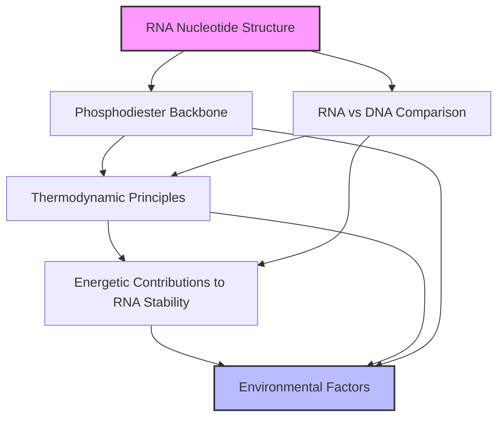

# Pillar 1 Concept Map: RNA Biophysical Modeling Foundations

This concept map visualizes the relationships and learning progression among the six core subsections of Pillar 1. Use this map to orient yourself, identify dependencies, and understand how each topic contributes to the overall understanding of RNA structure and thermodynamics.

## Legend & Explanatory Notes
- **Arrows** indicate prerequisite or logical learning flow.
- **Node colors** highlight starting (pink) and ending (blue) points in the learning journey.
- **Bidirectional relationships** are implied where concepts mutually inform each other (see cross-reference sections in each topic for details).

## How to Use
- Begin at "RNA Nucleotide Structure" and follow arrows through the map.
- Refer to the cross-reference sections in each topic for deeper explanations of the relationships.
- Use this map as a quick reference when navigating the knowledge base or planning your study sequence.

---
> **Tip:** Consider updating this map as the curriculum evolves or as new relationships are discovered.
