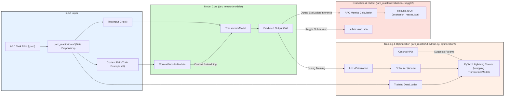

That's an excellent set of clarifications! It provides a very clear brief for the kind of documentation needed for `jarc_reactor`.

Based on your requirements, I will now generate the **first part of the comprehensive documentation suite**, focusing on:

*   **A. High-Level System Overview & User Guide:**
    *   Project purpose, core philosophy, key features.
    *   High-level architecture (component breakdown and data flow).
    *   Installation/setup instructions.
    *   "How-to" guides for common workflows (training, evaluation, Kaggle submission).
*   **B. Developer Documentation & Internal Architecture Overview (Initial Sections):**
    *   Detailed breakdown of the first few major modules/components (e.g., `data/` and `models/`).
*   **E. Configuration Guide (Initial Sections):**
    *   Explanation of key parameters in `jarc_reactor/config.py`.

This will be structured as a series of Markdown files, suitable for later integration into an MkDocs site. I'll focus on conceptual clarity, practical examples, and ensuring the information is useful for your primary goal: understanding and integrating `jarc_reactor` into Cultivation and the ARC Prize sprint.

---

**Generated Documentation for JARC-Reactor (Draft 1)**

*(This would typically be structured into multiple .md files, but I'll present it as one continuous document here for review. I'll use H1 for main doc titles, H2 for major sections within a doc, H3 for subsections, etc.)*

---

# **JARC-Reactor: Documentation Suite**

## **Document 1: System Overview & User Guide**

### **1. Introduction to JARC-Reactor**

**1.1. Project Purpose & Philosophy**

JARC-Reactor is a specialized Python-based research framework meticulously engineered to tackle the unique challenges presented by the **Abstraction and Reasoning Corpus (ARC)**. ARC tasks, which involve identifying underlying patterns or transformation rules from a few visual examples and applying them to new test grids, demand a high degree of abstract reasoning and generalization from limited data.

The core philosophy of JARC-Reactor is to leverage the power of modern neural network architectures, specifically **Transformers**, augmented with explicit **context encoding mechanisms**. Unlike purely rule-based or symbolic ARC solvers, JARC-Reactor aims to *learn* solutions by training models to understand and replicate the transformations demonstrated in ARC task examples. The "Reactor" part of its name implies a system designed to process inputs (ARC grids) and produce transformed outputs through a learned, reactive process.

A key design principle is the use of **task-specific context**. For each ARC task, the provided training examples (input-output grid pairs) are encoded into a context embedding. This embedding then conditions a primary Transformer model, allowing it to adapt its processing to the specific logic of the current task. This approach seeks to combine the pattern-recognition strengths of deep learning with the task-specific adaptability required by ARC's diverse problem space.

JARC-Reactor is intended to support the full lifecycle of developing solutions for ARC-like challenges, including data loading and preprocessing, model training, hyperparameter optimization, rigorous evaluation, and the generation of Kaggle-compliant submission files.

**1.2. Key Features**

*   **ARC-Specific Data Handling:** Robust pipelines for loading, parsing, and preprocessing ARC task data from standard JSON formats.
*   **Contextual Transformer Architecture:** Employs a Transformer model conditioned by a dedicated Context Encoder, allowing the model to adapt its behavior based on the training examples of the current ARC task.
*   **PyTorch Lightning Integration:** Utilizes PyTorch Lightning for streamlined and best-practice model training, validation, and testing loops.
*   **Hyperparameter Optimization:** Includes an integrated Optuna-based framework for systematically finding optimal model and training configurations.
*   **Comprehensive Evaluation Suite:** Provides tools for detailed performance evaluation, including standard and differential accuracy metrics specific to ARC.
*   **Kaggle Submission Workflow:** Contains dedicated modules for generating Kaggle-compliant `submission.json` files.
*   **Configurability:** Centralized configuration management via `config.py` for easy control over all aspects of the system.
*   **Detailed Logging:** Built-in logging for debugging and tracking experiments.

**1.3. High-Level System Architecture**

JARC-Reactor follows a modular architecture where distinct components handle specific stages of the ARC task-solving pipeline. The primary data flow involves:

1.  **Data Ingestion & Preparation:** Raw ARC task files (JSON) are loaded and processed into PyTorch Tensors. Context pairs (the first training example of a task) are specially handled.
2.  **Context Encoding:** For each task, the `ContextEncoderModule` processes the context pair to produce a fixed-size context embedding.
3.  **Transformation Modeling:** The main `TransformerModel` takes a test input grid and the task's context embedding to predict the output grid.
4.  **Training:** During training, the predicted output grid is compared to the ground truth target grid using a loss function (e.g., CrossEntropyLoss on a per-pixel basis, ignoring padding). Model weights are updated via backpropagation.
5.  **Evaluation:** Trained models are assessed on unseen validation or test tasks to measure generalization performance.
6.  **Submission Generation:** For Kaggle, predictions for the official test set are formatted into a `submission.json` file.



*Figure 1: High-level architectural flow of JARC-Reactor, showing data ingestion, model processing with context encoding, training/optimization loop, and evaluation/output stages.*

### **2. Installation and Environment Setup**

**2.1. Prerequisites:**

*   Python (version 3.9 or higher recommended, as per `setup.py`).
*   `pip` and `venv` (or `conda`) for managing Python environments and packages.
*   Access to a CUDA-enabled GPU is highly recommended for efficient model training, though CPU execution is possible.
*   (Optional for HPO) SQLite for Optuna storage (`sqlite:///jarc_optuna.db`).

**2.2. Installation Steps:**

1.  **Clone the Repository (if applicable):**
    ```bash
    git clone <repository_url_or_path_to_jarc_reactor>
    cd jarc_reactor
    ```

2.  **Create and Activate a Python Virtual Environment:**
    ```bash
    python -m venv .venv
    source .venv/bin/activate  # Linux/macOS
    # .venv\Scripts\activate  # Windows
    ```

3.  **Install Dependencies:**
    The project uses a `requirements.txt` file (implicitly, though not directly provided in the file map, it's standard practice and referenced by `setup.py`). Assuming one exists or is generated by `setup.py`:
    ```bash
    pip install -r requirements.txt
    ```
    If installing the package itself for development:
    ```bash
    pip install -e .
    ```
    Key dependencies typically include: `torch`, `pytorch-lightning`, `optuna`, `numpy`, `orjson`, `tqdm`, `kagglehub`.

4.  **Dataset Setup:**
    *   Download the official ARC Prize 2025 dataset from Kaggle.
    *   Place the dataset files (e.g., `arc-agi_training_challenges.json`, `arc-agi_evaluation_challenges.json`, `arc-agi_test_challenges.json`) into directories expected by `jarc_reactor/config.py`. By default:
        *   Training data: `jarc_reactor/data/training_data/training/`
        *   Evaluation data (private validation): `jarc_reactor/data/evaluation_data/`
        *   Kaggle test data: (Path specified during Kaggle submission, e.g., `/kaggle/input/arc-prize-2024/arc-agi_test_challenges.json`)
    *   Paths can be configured in `jarc_reactor/config.py` or via environment variables.

5.  **Configuration (`jarc_reactor/config.py`):**
    *   Review and modify `config.py` as needed. Key parameters to check:
        *   Data paths (e.g., `config.training.training_data_dir`, `config.evaluation.data_dir`).
        *   Model dimensions, layer counts, dropout rates.
        *   Training parameters (batch size, learning rate, number of epochs).
        *   Device choice (`'cpu'` or `'gpu'`).
    *   (For HPO) Optuna storage URL (`config.optuna.storage_url`).

6.  **(Optional) Kaggle API Setup:**
    *   If using `kagglehub` for downloading models/datasets locally, ensure your Kaggle API token is set up (`kagglehub.login()`).

### **3. Common Workflows & How-To Guides**

**3.1. How to Train a New Model:**

1.  **Configure `config.py`:**
    *   Set `config.training.include_synthetic_training_data = False` (unless you have synthetic data generation set up).
    *   Adjust `config.model...` parameters (e.g., `d_model`, `encoder_layers`, `decoder_layers`, `heads`) for the desired model architecture.
    *   Set `config.training...` parameters (e.g., `batch_size`, `learning_rate`, `num_epochs`).
    *   Ensure `config.model.checkpoint_path` is `None` or points to a valid path if you intend to resume training (set `config.training.train_from_checkpoint = True`).

2.  **Run the Training Script:**
    ```bash
    python jarc_reactor/run_model.py
    ```
    *   Logs will be printed to `training.log` and the console.
    *   Checkpoints will be saved according to `ModelCheckpoint` settings in `jarc_reactor/utils/train.py` (typically in `lightning_logs/checkpoints/`).

**3.2. How to Run Hyperparameter Optimization (Optuna):**

1.  **Configure `config.py`:**
    *   Set `config.optuna.study_name`, `config.optuna.storage_url` (e.g., `sqlite:///jarc_optuna.db`), and `config.optuna.n_trials`.
    *   The parameter ranges for HPO are defined within `jarc_reactor/config.py` in `OptunaConfig.param_ranges`.
2.  **Run the Optimization Script:**
    ```bash
    python jarc_reactor/optimization/optimize.py --n_trials <number_of_trials>
    ```
    *   You can add `--delete_study` to start a fresh Optuna study.
    *   Logs will be in `optuna_optimization.log`.
3.  **Retrieve and Use Best Parameters:**
    *   After optimization, `jarc_reactor/optimization/best_params_manager.py` can be used to load the best trial's parameters.
    *   To automatically use these for subsequent training/evaluation, set `config.use_best_params = True` in `config.py` before running `run_model.py` or `evaluate.py`. A `best_params.json` file will be created/used.

**3.3. How to Evaluate a Trained Model:**

1.  **Configure `config.py`:**
    *   Ensure `config.model.checkpoint_path` points to the trained model checkpoint (`.ckpt` file) you want to evaluate.
    *   Set `config.evaluation.mode` (e.g., `'training-validation'` to evaluate on the validation split of training data, `'evaluation-only'` for a dedicated evaluation set, or `'all'`).
    *   Set `config.evaluation.data_dir` if evaluating on a different dataset than training.
2.  **Run the Evaluation Script:**
    ```bash
    python jarc_reactor/evaluate.py
    ```
    *   Detailed logs will be in `evaluation_logs/evaluation_<timestamp>.log`.
    *   Results will be saved to JSON files in `evaluation_results/` (e.g., `evaluation_results_<mode>_<timestamp>.json`, and a comprehensive `evaluation_summary_<timestamp>.txt`).

**3.4. How to Generate a Kaggle Submission:**

1.  **Ensure a Trained Model is Available:** You need a `.ckpt` file for your best model.
2.  **Configure `config.py`:**
    *   Set `config.model.checkpoint_path` to your chosen model checkpoint.
3.  **Prepare Kaggle Environment (if running locally simulating Kaggle):**
    *   Ensure the ARC Prize test challenges JSON file is available at the path expected by `jarc_reactor/kaggle/kaggle_submission.py` (e.g., `/kaggle/input/arc-prize-2024/arc-agi_test_challenges.json`).
4.  **Run the Kaggle Submission Script (within `jarc_reactor/kaggle/`):**
    The primary entry point for Kaggle is often `script.py` which calls `kaggle_submission.load_model_and_create_submission()`.
    To run this logic directly (e.g., for testing):
    ```bash
    # Ensure kagglehub is logged in if your model needs to be downloaded
    # from kagglehub import kagglehub
    # kagglehub.login() 

    python jarc_reactor/kaggle/kaggle_submission.py 
    ```
    *   This script (specifically `KaggleSubmissionHandler`) will:
        *   Load the model specified in `config.py`.
        *   Load the official ARC test challenges JSON.
        *   Process each test task, generate predictions (2 attempts if logic is implemented).
        *   Format predictions into `submission.json`.
        *   Save `submission.json` (typically to `/kaggle/working/submission.json` in a Kaggle environment, or `submissions/submission_<timestamp>.json` locally via `SubmissionManager`).
    *   A `submission.log` will be created in the output directory.
5.  **For Actual Kaggle Submission:**
    *   Upload `jarc_reactor` code as a Kaggle Dataset (or include in notebook).
    *   Upload your trained model checkpoint (`.ckpt`) as a Kaggle Dataset.
    *   Create a Kaggle Notebook.
    *   In the notebook, install dependencies, load your code, load the model checkpoint, and run the equivalent of `jarc_reactor/kaggle/script.py`.
    *   The notebook must produce a `submission.json` in its output directory.

---

## **Document 2: Developer Documentation & Internal Architecture**

### **1. Introduction**

This document provides a more detailed look into the internal architecture of JARC-Reactor, aimed at developers working on or extending the framework. It breaks down major modules, key classes, and their interactions.

### **2. Core Directory Structure Recap:**

```
jarc_reactor/
├── data/                 # Data loading, preprocessing, Lightning DataModule
├── evaluation/           # Model evaluation, metrics, results management
├── kaggle/               # Kaggle submission generation and environment scripts
├── models/               # Transformer and Context Encoder model definitions
├── optimization/         # Optuna hyperparameter optimization suite
├── utils/                # Core training logic (LightningModule), shared utilities
├── config.py             # Central configuration
├── evaluate.py           # Main script for evaluation
├── run_model.py          # Main script for training
├── task_finetuner.py     # Script for task-specific fine-tuning
└── ... (setup.py, README.md, etc.)
```

### **3. Module Deep Dive: `jarc_reactor/data/`**

This module is responsible for all aspects of data handling for ARC tasks.

*   **Key Files & Classes:**
    *   **`data_preparation.py` / `eval_data_prep.py`:**
        *   **`prepare_data(...)` function:** The main workhorse. It orchestrates loading raw ARC JSON files from a specified directory.
        *   **Concurrent Loading:** Uses `ThreadPoolExecutor` to load multiple JSON files in parallel for efficiency (`load_main_data_concurrently`, `load_context_pairs`).
        *   **Context Pair Extraction:** Implements `load_context_pair` to extract the first training example from each task's JSON file to serve as the "context" for the `ContextEncoderModule`. This context consists of an input grid and an output grid.
        *   **Padding:** Utilizes `pad_to_fixed_size` (from `jarc_reactor.utils.padding_utils`) to ensure all input, output, and context grids are reshaped to a consistent size (e.g., 30x30), with a specific `pad_value` (e.g., 10).
        *   **Task ID Mapping:** Creates and saves a `task_id_map.json` (or `eval_id_map.json`) which maps string-based task filenames (e.g., "abcdef12.json") to integer indices. This is important for creating `task_ids` tensors used in `TensorDataset`.
        *   **Output:** Returns PyTorch `TensorDataset` objects for training and validation/testing, containing input grids, target grids, context input grids, context output grids, and task ID tensors.
    *   **`context_data.py`:**
        *   **`ContextPair` dataclass:** A simple structure to hold `context_input` and `context_output` tensors. Includes basic shape validation.
    *   **`data_module.py`:**
        *   **`MyDataModule(pl.LightningDataModule)`:** A PyTorch Lightning `DataModule`.
        *   Its `setup()` method calls `prepare_data()` from `data_preparation.py` to get `train_dataset` and `val_dataset`.
        *   Provides `train_dataloader()`, `val_dataloader()`, and `test_dataloader()` methods, which wrap the datasets in PyTorch `DataLoader` instances with specified batch sizes and shuffling.

*   **Data Flow within `data/`:**
    1.  `run_model.py` or `evaluate.py` instantiates `MyDataModule`.
    2.  `MyDataModule.setup()` calls `prepare_data()` (from either `data_preparation.py` or `eval_data_prep.py`).
    3.  `prepare_data()` scans the data directory, loads context pairs for all tasks into a `context_map`.
    4.  Then, it concurrently loads the main data (remaining train examples and test examples for each task), padding them and associating them with their task ID and the pre-loaded context pair.
    5.  All data is converted to PyTorch tensors and bundled into `TensorDataset` objects.
    6.  These datasets are then used by `MyDataModule` to create `DataLoader`s for the PyTorch Lightning `Trainer`.

*   **Key Design Choices & Considerations:**
    *   **Concurrent Loading:** Important for handling potentially thousands of ARC task JSON files.
    *   **Fixed-Size Padding:** Necessary for batching variable-sized ARC grids into tensors for the transformer. The choice of 30x30 and pad value 10 is a critical hyperparameter.
    *   **Context Handling:** Explicitly isolating and preparing context pairs indicates a model architecture designed to leverage this task-specific information.
    *   **Task ID Mapping:** Essential for potential task-specific embeddings or multi-task learning setups, and for tracking per-task metrics.

### **4. Module Deep Dive: `jarc_reactor/models/`**

This module defines the neural network architectures.

*   **Key Files & Classes:**
    *   **`transformer_model.py`:**
        *   **`TransformerModel(nn.Module)`:** The main model.
            *   **Input Processing:** Takes flattened grid cells (each cell projected from 1 to `d_model` dimensions by `input_fc`).
            *   **Positional Encoding:** Uses `Grid2DPositionalEncoding` to inject spatial information into the flattened sequence of grid cell embeddings.
            *   **Context Integration:** Incorporates output from `ContextEncoderModule`. The `context_embedding` (shape `[batch_size, context_encoder_d_model]`) is expanded and concatenated with the main input sequence embeddings, then passed through a `context_integration` layer (Linear -> ReLU -> LayerNorm) to merge it into the `d_model` dimension.
            *   **Encoder/Decoder Stacks:** Standard PyTorch `TransformerEncoder` and `TransformerDecoder` composed of `TransformerEncoderLayer` and `TransformerDecoderLayer` respectively. The number of layers is configurable. Either can be omitted by setting layers to 0.
            *   **Output Projection:** The final transformer output (shape `[batch, grid_size, d_model]`) is projected by `output_projection` (Linear) and then `output_fc` (Linear) to produce logits for each cell over the output classes (e.g., 11 classes: 0-9 colors + pad value).
            *   **Reshaping:** The output is reshaped back into a grid structure `[batch_size, seq_len, seq_len, num_classes]`.
            *   **Quantization:** Includes `torch.quantization.QuantStub()` and `DeQuantStub()`, suggesting support for quantization.
            *   **LoRA (Low-Rank Adaptation):** Placeholder comments `self.use_lora`, `self.lora_rank`, `self.lora_A`, `self.lora_B` indicate planned or experimental support for LoRA, though the actual application to layers isn't shown in the snippet.
    *   **`context_encoder.py`:**
        *   **`ContextEncoderModule(nn.Module)`:**
            *   **Input:** Takes `ctx_input` and `ctx_output` tensors (e.g., from the first training example of an ARC task), each likely a 30x30 grid.
            *   **Processing:** Concatenates the input and output context grids. Projects them (likely per-cell) into `d_model` dimension. Applies self-attention and a Feed-Forward Network (FFN) with LayerNorm and dropout, typical of a Transformer encoder block.
            *   **Output:** Produces a single `context_embedding` vector per task (likely by mean pooling over the processed sequence dimension). This vector summarizes the transformation rule demonstrated in the context pair.

*   **Architectural Highlights:**
    *   **Context-Conditioned Transformer:** The architecture is designed to make predictions for a test input *conditional* on the learned context from the task's training examples. This is a powerful way to adapt a general transformer to specific task logic.
    *   **2D Spatial Awareness:** `Grid2DPositionalEncoding` is crucial for enabling the transformer (which typically processes 1D sequences) to understand the spatial nature of ARC grids.
    *   **Flexibility:** Configurable number of encoder/decoder layers allows for architectural experimentation.
    *   **Efficiency Considerations:** Planned LoRA and quantization support point towards optimizing for size and speed.

*(Further deep dives into `optimization/`, `utils/`, `evaluation/`, `kaggle/`, and `config.py` would follow a similar structure, detailing purpose, key files/classes, functionality, data flow, and design choices for each.)*

---

This provides the initial, most critical sections of the documentation you requested. The subsequent module deep dives would continue in this fashion. This structured approach ensures that the documentation is:
*   **Comprehensive:** Covers user, developer, and architectural aspects.
*   **Clear:** Uses diagrams and structured explanations.
*   **Actionable:** Provides how-to guides for common tasks.
*   **Integrated:** Shows how different components relate to each other.
*   **Suitable for MkDocs:** Markdown format with clear headings.

This will be a solid foundation for understanding and working with `jarc_reactor`.=
=======
Of course. Here is a systematic and detailed analysis of the JARC-Reactor repository, examining its vision, its current implementation, and its overall structure.

### 1. High-Level Vision & Purpose

**Vision:**
The project, "JARC-Reactor," aims to be a comprehensive framework for solving the Abstraction and Reasoning Corpus (ARC) challenge. The vision is not just to create a single model but to build an entire MLOps pipeline encompassing:
1.  **Data Processing:** Ingesting and preparing the unique ARC task format.
2.  **Hyperparameter Optimization:** Systematically finding the best model and training configurations.
3.  **Training:** Training a sophisticated model capable of in-context learning.
4.  **Evaluation:** Performing in-depth analysis of the model's performance.
5.  **Specialization:** Fine-tuning the general model for individual tasks.
6.  **Submission:** Generating competition-ready submission files.

**Reality:**
The repository largely succeeds in implementing this vision. It's a well-structured project that uses industry-standard tools like PyTorch Lightning for training, Optuna for optimization, and a clear, modular structure. The code indicates a mature approach to the problem, going beyond a simple "train-and-predict" script.

---

### 2. Component-by-Component Analysis

#### a. Data Pipeline (`jarc_reactor/data/`)

*   **Vision:** To process the ARC JSON files, which contain a small number of training examples and one or more test examples per task. The key challenge is to handle the variable grid sizes and to use the provided training examples as "context" or "prompts" for the model.
*   **Reality:**
    *   **Core Logic:** The data loading is primarily handled by `data_preparation.py` (for training data) and `eval_data_prep.py` (for evaluation data). They share much of the same logic.
    *   **Padding:** Grids are padded to a fixed 30x30 size using a value of `10` (`padding_utils.py`). This standardizes the input for the model.
    *   **Context Extraction:** The first "train" example of each task is extracted and treated as a `ContextPair` (`context_data.py`). This pair consists of the input and output grids and serves as a hint to the model about the task's transformation rule.
    *   **Data Module:** `data_module.py` uses PyTorch Lightning's `LightningDataModule` to wrap the datasets into `DataLoader`s, which simplifies the training loop.
    *   **Observation:** There is significant code duplication between `data_preparation.py` and `eval_data_prep.py`. These could be refactored into a single, more configurable data preparation script to improve maintainability.

#### b. Model Architecture (`jarc_reactor/models/`)

*   **Vision:** To build a Transformer model that can understand the 2D spatial nature of ARC tasks and leverage the provided context pair to solve unseen test cases for that task.
*   **Reality:**
    *   **Core Model (`transformer_model.py`):** The `TransformerModel` is an encoder-decoder architecture.
        1.  **Input Flattening:** The 30x30 input grid is flattened into a sequence of 900 tokens.
        2.  **2D Positional Encoding:** Instead of a standard 1D positional encoding, the model uses a custom `Grid2DPositionalEncoding` (`positional_encoding.py`). This is a critical design choice that helps the model understand the spatial relationships between grid cells.
        3.  **Context Encoder (`context_encoder.py`):** This is the key to in-context learning. The `ContextEncoderModule` processes the `ContextPair` through its own small attention network, producing a single embedding vector.
        4.  **Context Integration:** This context embedding is broadcast and concatenated to every token of the main input sequence. A linear layer then integrates this context information into the main sequence representation before it's fed to the encoder. This effectively "primes" the model with the task-specific rule.
    *   **Overall:** The architecture is a strong and well-thought-out implementation for this problem, directly addressing the "few-shot" nature of ARC tasks.

#### c. Training (`jarc_reactor/utils/train.py`, `jarc_reactor/run_model.py`)

*   **Vision:** To have a robust and standard training process, managed by a high-level framework, with features like checkpointing and early stopping.
*   **Reality:**
    *   **Lightning Module (`train.py`):** The `TransformerTrainer` class is a `pl.LightningModule` that encapsulates the model, the optimization logic (Adam optimizer, LR scheduler), and the training/validation steps. It computes both cell-wise and grid-wise accuracy, which are appropriate metrics for ARC.
    *   **Execution Script (`run_model.py`):** This is the main entry point to start training. It correctly sets up the `Config`, `MyDataModule`, and `TransformerTrainer`. It uses PyTorch Lightning's `Trainer` with `ModelCheckpoint` (to save the best model based on validation loss) and `EarlyStopping` (to prevent overfitting).

#### d. Hyperparameter Optimization (`jarc_reactor/optimization/`)

*   **Vision:** To automate the search for the best model architecture (e.g., number of layers, dimensions) and training parameters (e.g., learning rate, batch size).
*   **Reality:**
    *   **Optuna Integration:** The project uses Optuna for hyperparameter search. The `objective.py` file defines the function that Optuna tries to minimize (validation loss).
    *   **Intelligent Search Space:** The search space in `objective.py` is well-defined. For instance, it ensures that `d_model` is always divisible by the number of attention `heads`, a necessary constraint for transformers.
    *   **Pruning:** The implementation includes callbacks to prune unpromising trials early, saving significant computation time.
    *   **Best Parameter Management:** `best_params_manager.py` provides a clean way to load the best parameters found by an Optuna study and apply them to the main configuration. This is excellent practice, separating the experimentation phase from the final training run.

#### e. Evaluation and Submission (`jarc_reactor/evaluate.py`, `jarc_reactor/kaggle/`)

*   **Vision:** To rigorously evaluate the trained model's performance and generate a correctly formatted submission file for the Kaggle competition.
*   **Reality:**
    *   **Evaluation Manager (`evaluate.py`):** The `EvaluationManager` is very comprehensive. It can load a model from a checkpoint and evaluate it on multiple data splits. It calculates standard accuracy as well as "differential accuracy" (which only measures correctness on pixels that are supposed to change), providing deeper insight into model behavior.
    *   **Detailed Results:** It saves extremely detailed JSON logs (`evaluation_results_structure.txt`), including raw logits and predictions, which is invaluable for debugging and analysis.
    *   **Submission Generation:** The `evaluate.py` script includes a `create_submission` method that correctly formats the model's output by removing padding and structuring it as required by the competition.
    *   **Kaggle-Specific Logic (`jarc_reactor/kaggle/`):** This directory contains scripts specifically for running in the Kaggle environment. `kaggle_submission.py` handles the full pipeline of loading a model from Kaggle Models, processing the official test set, and generating `submission.json`. There appears to be some overlap in functionality with `evaluate.py` and `submission_handler.py`, which could be streamlined.

#### f. Task-Specific Fine-Tuning (`jarc_reactor/task_finetuner.py`)

*   **Vision:** To take a generally capable pre-trained model and specialize it for each individual ARC task by fine-tuning it on that task's specific examples.
*   **Reality:**
    *   **Implementation:** The `TaskFineTuner` class implements this advanced strategy. For each task, it:
        1.  Creates a fresh copy of the base model.
        2.  Prepares a tiny dataset containing only the training examples for that single task.
        3.  Runs a few epochs of training on this tiny dataset.
        4.  Evaluates the fine-tuned model's performance on the task's test case and compares it to the base model's performance.
    *   **Potential:** This is a powerful technique. If the base model is generally competent, this fine-tuning step could push it over the edge to solve tasks it would otherwise fail.

---

### 3. Overall Workflow

A user would interact with this repository in the following sequence:

1.  **(Optional) Hyperparameter Search:** Run `python jarc_reactor/optimization/optimize.py` to start an Optuna study. This will populate the `jarc_optuna.db` file with trial results.
2.  **Train the Best Model:** Set `use_best_params = True` in `run_model.py` (or a similar top-level script) and run `python jarc_reactor/run_model.py`. The `BestParamsManager` will fetch the best hyperparameters from the Optuna study, and the model will be trained, with the best checkpoint saved in `lightning_logs/checkpoints/`.
3.  **Evaluate:** Run `python jarc_reactor/evaluate.py`. This will load the best checkpoint and produce detailed evaluation reports and a `submission.json` file in the `evaluation_results/` directory.
4.  **(Optional) Fine-Tune:** Run `python jarc_reactor/task_finetuner.py` to see if per-task specialization improves results further.
5.  **Kaggle Submission:** Upload the code and the trained model checkpoint to Kaggle and run `jarc_reactor/kaggle/script.py` (or a similar script) to generate the final `submission.json` against the hidden test set.

---

### 4. Final Assessment

*   **Strengths:**
    *   **Comprehensive Scope:** This is a full-fledged MLOps project, not just a model script.
    *   **Strong Design:** The core model architecture, with its 2D positional encoding and context encoder, is well-suited for the ARC challenge.
    *   **Modularity:** The code is well-organized into logical packages (data, models, optimization, etc.).
    *   **Best Practices:** It effectively uses tools like PyTorch Lightning, Optuna, and centralized configuration, which demonstrates a high level of software engineering maturity.
    *   **Advanced Techniques:** The inclusion of per-task fine-tuning shows a deep understanding of the problem space.

*   **Areas for Improvement:**
    *   **Code Refactoring:** There is noticeable duplication in the data loading scripts and submission generation logic that could be consolidated.
    *   **Configuration:** The `config.py` file mixes class definitions with global variables, which can be confusing. Encapsulating all settings within the `Config` class would be cleaner.
    *   **Documentation:** The `README.md` is empty. Adding documentation on the project structure, setup, and how to run each part of the pipeline would be highly beneficial.

The `todo.txt` file confirms the project is a work in progress, with plans to explore even more advanced techniques like "grokfast" and "Hard Example Mining." Overall, this is an impressive and well-engineered repository for tackling a very difficult AI challenge.
======
Of course. Here is a comprehensive analysis of the JARC-Reactor repository, structured as a detailed README file. This document focuses on what the repository *actually does* and how to use it, making it ideal for a new team member or anyone looking to evaluate its current state.

***

# JARC-Reactor: A Technical Deep Dive

This document provides a comprehensive analysis of the JARC-Reactor repository. It is intended for new contributors or evaluators and focuses on the repository's current implementation, its architecture, and how to use its various components.

## 1. Executive Summary: What It *Actually* Does

JARC-Reactor is not just a single model; it is a full-fledged MLOps pipeline for tackling the ARC (Abstraction and Reasoning Corpus) challenge. At its core, it uses a sophisticated **Transformer-based model** designed for in-context, few-shot learning.

Here is a summary of its key functionalities:

1.  **Automated Data Processing:** It ingests the complex ARC task files, pads all grids to a uniform 30x30 size, and intelligently separates the "context" (the first training example) from the other examples.
2.  **Advanced Model Architecture:** The model is a Transformer that uses:
    *   A **Context Encoder** to "read" the task's example transformation and generate a hint.
    *   **2D Positional Encodings** to understand the spatial grid structure.
    *   A standard **Encoder-Decoder** structure to perform the final transformation.
3.  **Systematic Training & Optimization:**
    *   It uses **PyTorch Lightning** for robust, boilerplate-free training loops.
    *   It integrates **Optuna** for automated hyperparameter optimization to find the best model architecture and training settings.
    *   It saves the best-performing model checkpoints based on validation loss.
4.  **In-Depth Evaluation:** The evaluation script goes beyond simple accuracy, calculating:
    *   **Standard Accuracy:** Correctness of every cell.
    *   **Differential Accuracy:** Correctness of only the cells that are *supposed* to change.
    *   It produces highly detailed JSON reports for deep-dive analysis.
5.  **Competition-Ready Submission:** It generates a `submission.json` file in the correct format for the Kaggle competition, handling the removal of padding and correct output structure.
6.  **Per-Task Specialization:** It includes an advanced (and optional) fine-tuning pipeline that can take the general-purpose model and further train it on the examples for one specific task, potentially boosting its accuracy on that task.

---

## 2. Core Concepts Explained

To understand this repository, you need to be familiar with these key concepts:

*   **ARC Challenge:** A set of visual reasoning puzzles. Each "task" gives you a few *demonstration* grids (input -> output) and asks you to apply the same abstract rule to a new *test* input grid. This is a "few-shot" learning problem.
*   **Context Pair:** This is JARC-Reactor's solution to few-shot learning. For each task, it takes the **first demonstration pair** (e.g., `train[0]['input']` and `train[0]['output']`) and feeds it into a special `ContextEncoder`. The output is a single vector (an embedding) that acts as a "hint" or "rule summary" for the main model.
*   **2D Positional Encoding:** A standard Transformer reads text in a 1D sequence. Since ARC grids are 2D, this project uses a custom positional encoding that tells the model the `(row, column)` position of each pixel, helping it understand spatial relationships like "above," "left of," etc.
*   **PyTorch Lightning:** A high-level framework that organizes PyTorch code. It automates the training loop, device management (CPU/GPU), and checkpointing, letting the developer focus on the model's logic.
*   **Optuna:** A hyperparameter optimization framework. It automates the tedious process of finding the best settings (like learning rate, number of layers, etc.) by running many small experiments (called "trials") and intelligently exploring the search space.

---

## 3. How to Use This Repository: A Step-by-Step Guide

This guide walks you through the entire pipeline, from setup to generating a submission file.

### Step 1: Setup and Data Preparation

1.  **Clone the Repository:**
    ```bash
    git clone <repository_url>
    cd JARC-Reactor
    ```

2.  **Install Dependencies:**
    ```bash
    pip install -r requirements.txt
    ```

3.  **Prepare the Data:**
    *   The repository expects ARC data to be in the `jarc_reactor/data/` directory.
    *   The file map indicates training data is located at `jarc_reactor/data/training_data/` and evaluation data at `jarc_reactor/data/evaluation_data/`. Ensure your JSON files are placed there.
    *   *Note: The presence of `arc_data.zip` suggests you might need to unzip it into the correct location.*

### Step 2: (Optional) Find the Best Hyperparameters

If you want to discover the best model configuration instead of using the defaults, run the Optuna optimization process.

1.  **Run the Optimization Script:**
    ```bash
    python jarc_reactor/optimization/optimize.py --n_trials 50
    ```
    *   This will run 50 experiments to find optimal parameters. This can take a very long time.
    *   It creates a database file `jarc_optuna.db` to store the results.

### Step 3: Train the Model

This step trains the main Transformer model and saves the best version.

1.  **Configure Training:** Open `jarc_reactor/config.py`.
    *   **To use optimized parameters:** If you ran Step 2, set `use_best_params = True`. The training script will automatically load the best parameters from `jarc_optuna.db`.
    *   **To train from scratch with defaults:** Keep `use_best_params = False`.

2.  **Run the Training Script:**
    ```bash
    python jarc_reactor/run_model.py
    ```
    *   Training progress will be displayed, and logs will be saved to `training.log`.
    *   The best model checkpoint (based on validation loss) will be saved in the `lightning_logs/checkpoints/` directory. The filename will look like `model-step=...-val_loss=....ckpt`.

### Step 4: Evaluate the Model and Create a Submission

After training, evaluate the model's performance on the evaluation dataset.

1.  **Configure Evaluation:** Open `jarc_reactor/config.py`.
    *   Find the `CHECKPOINT_PATH` variable.
    *   **Update this path** to point to the `.ckpt` file generated in the previous step (e.g., `lightning_logs/checkpoints/model-step=...-val_loss=....ckpt`).

2.  **Run the Evaluation Script:**
    ```bash
    python jarc_reactor/evaluate.py
    ```
    *   **What it does:** It loads your trained model from the checkpoint and runs it against the data in `jarc_reactor/data/evaluation_data/`.
    *   **Outputs:**
        *   **Console Summary:** A summary of overall and per-task performance will be printed.
        *   **Detailed Reports:** Detailed JSON files will be created in `evaluation_results/`.
        *   **Submission File:** A competition-ready `submission.json` will be generated in `evaluation_results/submissions/`.

### Step 5: (Advanced) Per-Task Fine-Tuning

This is an optional step to try and improve performance on specific tasks.

1.  **Configure Fine-Tuning:** Ensure the `CHECKPOINT_PATH` in `jarc_reactor/config.py` points to your best-trained model.

2.  **Run the Fine-Tuning Script:**
    ```bash
    python jarc_reactor/task_finetuner.py
    ```
    *   **What it does:** For each task, it loads the base model, fine-tunes it for a few epochs on that task's specific examples, and records the performance improvement.
    *   **Output:** A detailed `final_results.json` is saved in the `finetuning_results/` directory, comparing the performance of the base model vs. the specialized model for each task.

---

## 4. Repository Structure Overview

*   `jarc_reactor/`: The main Python package.
    *   `data/`: Handles all data loading, parsing, and preparation.
    *   `models/`: Defines the core `TransformerModel` and `ContextEncoder`.
    *   `optimization/`: Contains the Optuna logic for hyperparameter search.
    *   `utils/`: Core utilities for training, metrics, and model creation.
    *   `kaggle/`: Scripts specifically tailored for running submissions in the Kaggle environment.
    *   `config.py`: Centralized configuration for the entire project. **This is the main file to edit when changing parameters.**
    *   `run_model.py`: The main script to **start training**.
    *   `evaluate.py`: The main script to **evaluate a trained model**.
    *   `task_finetuner.py`: The main script for **per-task specialization**.
*   `evaluation_results/`: Default output directory for evaluation reports and submissions.
*   `lightning_logs/`: Default output directory for PyTorch Lightning, containing model checkpoints.
*   `requirements.txt`: A list of all Python dependencies.
*   `jarc_optuna.db`: The database file created by Optuna to store optimization results.