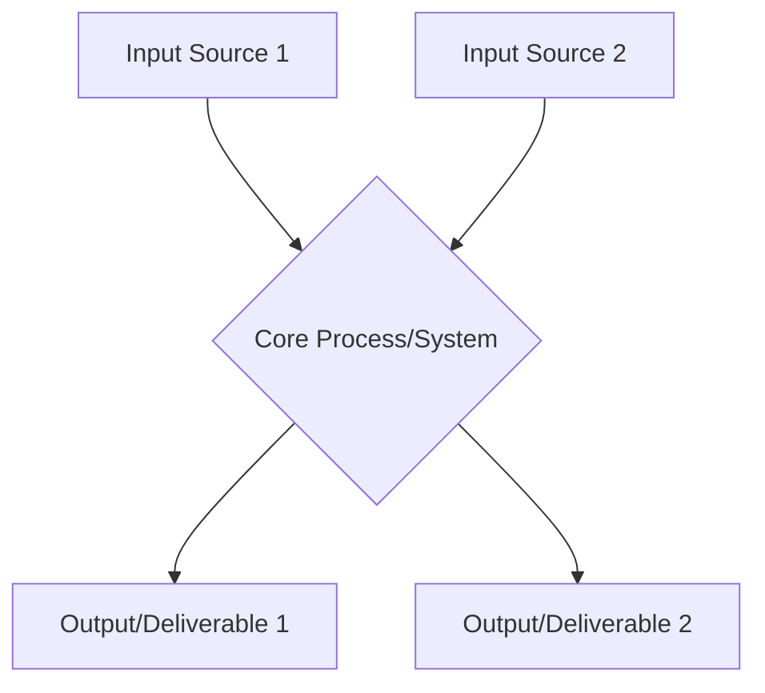

# Strategic Project Overview: [PROJECT_NAME_PLACEHOLDER]

**Version:** [INSTANCE_VERSION_PLACEHOLDER]
**Last Updated:** [DATE_MODIFIED_PLACEHOLDER]
**Project Lead:** [NAME_PLACEHOLDER]
**Status:** [STATUS_PLACEHOLDER]

## 1. Executive Summary & Vision
<!-- What is this project about? What problem does it solve or opportunity does it pursue? What is the long-term vision if successful? (1-2 paragraphs) -->

## 2. Core Problem / Opportunity
<!-- Detailed description of the problem being addressed or the opportunity being seized. Include context and significance. -->

## 3. Proposed Solution & Unique Value Proposition
<!-- How will this project address the problem/opportunity? What makes this solution unique or compelling? -->

## 4. Target Audience / Key Stakeholders
<!-- Who is this project for? Who are the primary beneficiaries or users? Who are other key stakeholders? -->

## 5. High-Level System Architecture / Components
<!-- 
Use a Mermaid diagram (or similar) for a C4 Level 1 style context diagram, or a list of key components and their interactions.
Focus on Inputs -> Key Processes/Components -> Outputs.
-->

## 6. Strategic Roadmap & Key Milestones
<!-- 
High-level phased roadmap. Use a table for clarity.
Phase | Duration Estimate | Key Objectives | Major Deliverables | Success Metrics for Phase
-->
| Phase        | Duration Est. | Key Objectives                                  | Major Deliverables                          | Success Metrics                     |
| :----------- | :------------ | :---------------------------------------------- | :------------------------------------------ | :---------------------------------- |
| Phase 0: Concept & Planning | [e.g., 1 Month] | [Define scope, initial design, resource plan] | [This document, initial PoC plan]         | [Scope approved, PoC funded]      |
| Phase 1: MVP Development    | [e.g., 3 Months]| [Build core functional MVP]                     | [Working MVP, initial user feedback]      | [MVP meets X criteria]            |
| ...          |               |                                                 |                                             |                                     |

### 6.1 Critical Go/No-Go Decision Gates
<!-- What are the key points where a decision will be made to continue, pivot, or halt the project? -->
1.  **Gate 1 (End of Phase X):** Criteria: [e.g., Technical feasibility proven, Market interest validated > Y%]. Decision: Proceed to Phase Y / Pivot / Halt.
2.  ...

## 7. Required Resources & Dependencies
*   **Team & Expertise:** [Skills needed, key personnel if identified]
*   **Budget Estimate (if applicable):** [Capex, Opex, Funding sources]
*   **Technology Stack (Key Choices):** [Languages, frameworks, platforms]
*   **Data Requirements:** [Key datasets needed, sources, privacy considerations]
*   **External Dependencies:** [APIs, 3rd party services, collaborations, regulatory approvals]

## 8. Risk Assessment & Mitigation Plan
| Risk Category    | Specific Risk Description                                 | Likelihood (H/M/L) | Impact (H/M/L) | Mitigation Strategy                                     | Contingency Plan                                  |
| :--------------- | :-------------------------------------------------------- | :----------------- | :------------- | :------------------------------------------------------ | :------------------------------------------------ |
| Technical        | [e.g., Core algorithm proves unscalable]                  | M                  | H              | [e.g., Parallel research on alternative algorithms]     | [e.g., Fallback to simpler, known algorithm]      |
| Market/Adoption  | [e.g., Target users do not adopt solution]                | M                  | H              | [e.g., Early user testing, iterative feedback loops]    | [e.g., Pivot to different user segment]           |
| Resource         | [e.g., Key personnel loss, funding shortfall]             | L                  | H              | [e.g., Cross-training, diversified funding strategy]  | [e.g., Scope reduction, seek bridge funding]      |
| ...              |                                                           |                    |                |                                                         |                                                   |

## 9. Success Metrics & KPIs for the Project
<!-- How will overall project success be measured beyond phase-specific metrics? -->
*   KPI 1: [e.g., User adoption rate, Target: X users by Y date]
*   KPI 2: [e.g., Revenue generated / Cost saved, Target: $Z by QN]
*   KPI 3: [e.g., Scientific impact, Target: N publications/citations]

## 10. Competitive Landscape / Alternatives Analysis (Optional)
<!-- If relevant, briefly analyze existing solutions or alternative approaches. What are this project's differentiators? -->

## 11. Next Steps (Immediate Actions - e.g., Next 30-60 Days)
1.  [Action 1]
2.  [Action 2]

## Appendix (Optional)
*   [e.g., Detailed Market Research Data]
*   [e.g., Technical Deep Dive on Component X]

---
*Instructions for Use: This template provides a framework for outlining a strategic project. Fill in the placeholders with project-specific details. Not all sections may be relevant for every project; adapt as needed.*
