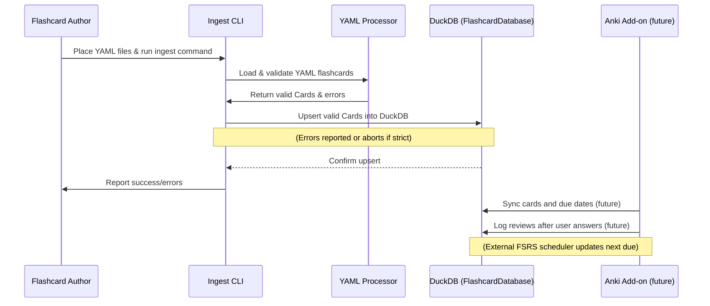

# PR #10: Flashcards/backend-pipeline-foundation

- **Author:** ImmortalDemonGod
- **State:** MERGED
- **Created:** 2025-05-28 03:08
- **Closed:** 2025-05-28 21:08
- **Merged:** 2025-05-28 21:08
- **Base branch:** `master`
- **Head branch:** `flashcards/backend-pipeline-foundation`
- **Files changed:** 34
- **Additions:** 2764
- **Deletions:** 25

## Summary


<!-- This is an auto-generated comment: release notes by coderabbit.ai -->
## Summary by CodeRabbit

- **New Features**
  - Introduced a flashcard system with YAML-based deck definitions, robust validation, and DuckDB-backed storage.
  - Added command-line tools for ingesting flashcard YAML files into a database.
  - Provided sample flashcard decks and YAML schema showcases.
  - Implemented core data models for cards and reviews with strict validation.
  - Developed a database interface supporting batch operations, review tracking, and due card retrieval.
  - Designed a conceptual Anki add-on integrating external scheduling and review data with Anki’s UI.

- **Documentation**
  - Added detailed design documents for flashcard workflows and Anki integration.
  - Updated documentation to reflect new asset and flashcard directory paths.
  - Provided sample YAML files and metadata for literature references.

- **Bug Fixes**
  - None.

- **Tests**
  - Introduced comprehensive unit and integration tests for card models, YAML processing, and database operations.

- **Chores**
  - Updated dependencies and configuration files.
  - Improved .gitignore to exclude large literature PDFs.
<!-- end of auto-generated comment: release notes by coderabbit.ai -->

## Top-level Comments
- **coderabbitai**: <!-- This is an auto-generated comment: summarize by coderabbit.ai -->
<!-- walkthrough_start -->

## Walkthrough

This update introduces a comprehensive flashcard management system ("flashcore") with robust YAML ingestion, DuckDB-backed storage, and schema validation. It adds core data models, a YA... (truncated)
- **coderabbitai**: > [!NOTE]
> Generated docstrings for this pull request at https://github.com/ImmortalDemonGod/Holistic-Performance-Enhancement/pull/11

## CodeRabbit Walkthrough
## Walkthrough

This update introduces a comprehensive flashcard management system ("flashcore") with robust YAML ingestion, DuckDB-backed storage, and schema validation. It adds core data models, a YAML processor, a database interface, CLI scaffolding, analytics and scheduling placeholders, and exporters. Extensive documentation, sample data, and thorough pytest-based unit tests for all major components are included. Asset and flashcard directory paths are updated throughout the documentation and scripts.

## Changes

| File(s) / Group                                           | Change Summary |
|-----------------------------------------------------------|---------------|
| `.gitignore`                                              | Added rule to ignore `cultivation/literature/pdf/molecular_biology_of_the_cell_2022.pdf`. |
| `requirements.txt`                                        | Added `bleach` and `duckdb` dependencies. |
| `cultivation/literature/metadata/molecular_biology_of_the_cell_2022.json`<br>`cultivation/literature/notes/molecular_biology_of_the_cell_2022.md` | Added new literature metadata JSON and a placeholder note markdown for "Molecular Biology of the Cell (2022)". |
| `cultivation/docs/2_requirements/flashcard_system/flashcards_1.md`<br>`cultivation/docs/3_design/knowledge_system/knowledge_acquistion_analysis.md`<br>`cultivation/docs/3_design/knowledge_system/user_experience_knowledge_system.md`<br>`cultivation/docs/2_requirements/flashcard_system/sample.yaml`<br>`cultivation/docs/2_requirements/flashcard_system/flashcards_4.md` | Updated documentation to new flashcard asset paths, added sample YAML, and introduced a detailed Anki add-on design doc. |
| `cultivation/outputs/flashcards/yaml/feature_showcase.yaml` | Added a comprehensive flashcard YAML deck showcasing schema features. |
| `cultivation/outputs/software/dev_daily_reflect/reports/dev_report_2025-05-16.md` | Replaced "no activity" notice with a detailed development activity summary and metrics table. |
| `cultivation/scripts/software/commit_metrics_prototyping.py` | Updated flashcard stub append path to new outputs directory. |
| `cultivation/scripts/flashcards_cli.py`                   | Added CLI entry point stub for flashcard system. |
| `cultivation/scripts/flashcore/__init__.py`<br>`cultivation/scripts/flashcore/exporters/__init__.py` | Added package marker files. |
| `cultivation/scripts/flashcore/card.py`                   | Introduced `Card` and `Review` Pydantic models with validation. |
| `cultivation/scripts/flashcore/config.py`                 | Added config/constants placeholder for flashcore. |
| `cultivation/scripts/flashcore/database.py`               | Implemented DuckDB-backed `FlashcardDatabase` with schema, CRUD, batch ops, and error handling. |
| `cultivation/scripts/flashcore/analytics.py`<br>`cultivation/scripts/flashcore/review_manager.py`<br>`cultivation/scripts/flashcore/scheduler.py` | Added analytics, review manager, and scheduler module placeholders with docstrings. |
| `cultivation/scripts/flashcore/exporters/anki_exporter.py`<br>`cultivation/scripts/flashcore/exporters/markdown_exporter.py` | Added exporter stubs for Anki and Markdown. |
| `cultivation/scripts/flashcore/ingest_flashcards.py`      | Added CLI script for ingesting YAML flashcards into DuckDB. |
| `cultivation/scripts/flashcore/yaml_processor.py`         | Implemented robust YAML loader, validator, sanitizer, and error reporting for flashcards. |
| `tests/flashcore/test_card.py`                            | Added comprehensive unit tests for `Card` and `Review` models. |
| `tests/flashcore/test_database.py`                        | Added full test suite for `FlashcardDatabase` covering connection, schema, CRUD, and error handling. |
| `tests/flashcore/test_yaml_processor.py`                  | Added detailed tests for YAML processing, validation, and error scenarios. |

## Sequence Diagram(s)



## Poem

> 🐇  
> A flash of cards, a hop of code,  
> New models, docs, and tests bestowed.  
> YAMLs parsed, databases neat,  
> With DuckDB, our data’s fleet.  
> CLI and exports on the way—  
> The flashcore garden grows today!  
> 🌱✨

## Git Commit Log

```text
* 9a45769 (flashcards/backend-pipeline-foundation) 📝 docs(outline): update document introduction and formatting
* 9e781a2 ✨ feat(database): add review ID return on batch insert
* e94a3fa 📝 docs(card): update docstring and asset path info
* d3136a3 🔧 chore(literature): update database file
* 49753d5 📝 docs(dev_report): update daily development report
* c8f4e9e ✨ feat(flashcard_system): add internal note feature
* f6e2ea5 📝 docs(feature_showcase): update flashcard YAML documentation
* 0223a61 ✨ feat(scripts): add flashcard ingestion script
* b8eab66 📝 docs(card): update media paths documentation
* ba8276c 📝 docs(knowledge_system): update flashcard paths in documentation
* 359774a 🔧 chore(docs): rename knowledge acquisition analysis file
* 6bc590c ♻️ refactor(commit_metrics_prototyping): update flashcard output path
* 391ffbb ✨ feat(yaml_processor): add internal_note field for YAML entries
* f961e84 📝 docs(flashcard_system): update media path and lint commands
* be68fcc ✨ feat(requirements): add new dependencies for project
* 096fbb0 ♻️ refactor(test): update source yaml file path in tests
* 9449626 ✨ feat(flashcards): add feature showcase YAML configuration
* 7ed9643 ✅ test(tests): add comprehensive test suite for database
* 57091f3 ✨ feat(database): implement FlashcardDatabase class
* 82ed167 🐛 fix(yaml_processor): enhance media path validation
* cb901bf ✅ test(flashcore): enhance YAML processor tests
* d6064c2 ✨ feat(yaml_processor): add tag normalization and validation
* 41711cf 📝 docs(yaml_processor): add debug print statements for tracing
* 653fe3f ✨ feat(yaml_processor): improve YAML processing error handling
* 6103461 ✨ feat(yaml_processor): implement YAML parsing and validation
* 994889e ✨ feat(card): enhance validation checks for model fields
* 6ef315f ✨ feat(card): enhance Card and Review models with validators
* c72361d ✨ feat(literature): add molecular biology of the cell 2022 resources
* a5e45a8 ✨ feat(markdown_exporter): add markdown export logic
* ca7a3ef ✨ feat(flashcore): add initial flashcore module files
* a4d8b61 📝 docs(flashcard_system): add documentation for Anki add-on integration
* 56e0fd9 🔧 chore(docs): rename flashcards_2.md for consistency
* 2d83e58 🔧 chore(.gitignore): update ignore list for PDFs
* a3fa0b6 ✨ feat(cultivation): add Pydantic models for Cards and Reviews
* 9449c84 data: add lunch run GPX and update wellness tracking data
*   0a96b37 Merge pull request #8 from ImmortalDemonGod/taskmaster-integration-setup
* d7e9514 Update add-paper.md
* 4d4c3de Create add-paper.md
* 4e1ec97 (backup-before-fix) ✨ feat(literature): add new research paper metadata and notes
* f2bb6f1 ✨ feat(reader_app): add paper progress tracking endpoint
* ac583f2 ✨ feat(reader_app): add paper management functionality
* 57481c3 ✨ feat(index.html): add input and controls for arXiv papers
* 3da4060 ✨ feat(reader_app): enhance paper loading and progress tracking
* fcd75a9 ✨ feat(reader_app): add endpoint to list all papers
* c8571c2 ✨ feat(reader): add paper selection dropdown and PDF loading
* 7e2fa6f ✨ feat(literature): add new literature entry for RNA modeling
* f2f5ade ✨ feat(reader_app): add finish session endpoint for metrics logging
* cf09851 ✨ feat(reader_app): add finish session button and update script path
* 697da5d ✨ feat(reader_app): implement WebSocket auto-reconnect and session metrics
* c2e0f0c ✨ feat(literature): enhance reading session management
* 2ee80d6 (feature/literature-docs, feature/accidental-main-changes) 📝 docs(literature_system_howto): add practical setup and troubleshooting guide
* 385ffd4 feat: add new training session data with GPX and analysis outputs for week 21
*   f76330d Merge pull request #6 from ImmortalDemonGod/devdailyreflect-mvp
* | 73fd77f (feature/dev-daily-reflect) ✨ feat(training): add week 21 assessment training plan
* | 994819d update data
* | 0d4b363 update data
* | 38ad076 ✨ feat(strength): add new strength training session log
* | df5bf01 ♻️ refactor(scripts): update import path for parse_markdown
* | 78ac968 🔧 chore(data): update binary data files
* | c4461e0 ✨ feat(metrics): add advanced metrics and distributions files
* | 95bd4ea 📝 docs(session): document running session analysis report
* | d635a88 ✨ feat(data): add weekly running and walking summaries
* | 48ad785 📝 docs(training plans): add logging instructions for strength system
* | 65dbff6 ✨ feat(exercise library): add new exercises to library
* 8c1484b chore: update week 20 activity data and remove outdated files
* 09e7e99 🔧 chore(week20): clean up and organize output files
* b241b2c 🔧 chore(week20): remove outdated walk metrics files
* 190add5 ✨ feat(analysis): add new data summary files for week 20
* 47dd3ce 🔧 chore(advanced_metrics): remove unused metric files
* a708b78 ✨ feat(figure): add new walk data files for week 20
* 1cf9e5d refactor: reorganize week20 output files and update run analysis data
*   1499410 Merge pull request #4 from ImmortalDemonGod/feature/operationalize-knowledge-software-etls
* |   8774729 (origin/feature/add-strength-domain, feature/add-strength-domain) Merge remote-tracking branch 'origin/master' into feature/add-strength-domain
* | | | cb6165a 🔧 chore(.gitignore): update ignore patterns for directories
* | | 1e3706e feat: add walk segment data files with GPS traces and timing analysis
* | | 8505b2c ✨ feat(metrics): add new advanced metrics files
* | | ca67d11 ✨ feat(benchmark): add new output files for heart rate analysis
* | | 4cf6d81 ✨ feat(data): add new run analysis output files
* | | 57806f6 ✨ feat(cultivation): add data metrics and diagnostics documentation
* | | 44ab549 ✨ feat(benchmark): add new performance analysis text files
* | | 1b7ee86 ✨ feat(cultivation): add new running data summary files
* | | c0c5d7f ✨ feat(benchmark): add new performance metrics and summaries
* | | 224f9ce ✨ feat(benchmark): add new performance data text files
* | | c998811 ✨ feat(week20): add new analysis files for walking data
* | | 7baca8d 🔧 chore(data): update daily wellness and subjective records
* | | 15a6485 feat: add week20 training data with GPS traces and performance metrics
* | | b921575 📝 docs(README): update README for strength training integration
* | | 293be19 ✨ feat(makefile): update rebuild strength data command
* | | 4b26228 ✨ feat(cultivation): enhance YAML processing and validation
* | | 3bf6cff 🔧 chore(.gitignore): update ignore rules for new data
* | | 66affff ✨ feat(ingest_yaml_log): support ingesting Markdown workout logs
* | | 6272aa9 ✨ feat(strength): add processed strength exercise logs and sessions
* | | d1d4533 ✨ feat(data): add strength training session YAML log
* | | 87dc580 ✨ feat(strength): enhance user input handling
* | | 1f9871e ✨ feat(data): add new exercises to exercise library
* | | 84f9ffc ✨ feat(cultivation): add strength training session data
* | | aea0036 ✨ feat(requirements): add pandas and python-dotenv dependencies
* | | a8966b1 ✨ feat(strength): add interactive CLI for logging strength sessions
* | | 412f5f7 ✨ feat(data): add exercise library and strength log template
* | | 3deb5b2 ✨ feat(docs): add strength data schemas documentation
*   7121d9d Merge pull request #2 from ImmortalDemonGod/feature/week19-advanced-metrics-hr-pace
* a7e52d5 Create 2025_05_11_run_report.md
* 61fe29c Update knowledge_acquistion_analysis
* a76e035 Create knowledge_acquistion_analysis
* 8cfa35e Add files via upload
* e875443 Add files via upload
* df31f30 Add files via upload
* 1491ec1 Add files via upload
* 2826cba Create flashcards_3.md
*   082e2a0 Merge pull request #1 from ImmortalDemonGod/fatigue-kpi-zones-integration-2025-04-30
* 5174eec 📝 docs(run_summary): add advanced metrics and weather details
* 00f05c1 data update
* ca2dbf0 ✨ feat(reports): add detailed run report for April 2025
* 1cbe261 ✨ feat(weather): add weather fetching utility
* acfd33d ✨ feat(performance_analysis): add advanced metrics and weather info
* f811b63 ✨ feat(running): skip already processed run files
* 6004b58 ✨ feat(parse_run_files): integrate advanced metrics for GPX
* 6c6f31b ✨ feat(metrics): add GPX parsing and run metrics calculation
* 72eb7ce ✨ feat(requirements): add requests package to dependencies
* 6d0d4dd 📝 docs(base_ox_block): update Base-Ox mesocycle documentation
* b28316e ✨ feat(docs): add Base-Ox Mesocycle training plan
* 6b2b77a ✨ feat(performance_analysis): enhance output organization and summaries
* ebcb547 ✨ feat(compare_weekly_runs): add image and text output for comparisons
* f92bbe8 ✨ feat(analyze_hr_pace_distribution): add image and text output directories
* 717b8d6 ✨ feat(cultivation): add pace comparison for week 17
* 1fcae2d ✨ feat(cultivation): add heart rate comparison for week 17
* 3aa850c ✨ feat(cultivation): add time in heart rate zone file
* f3ccfb1 ✨ feat(cultivation): add run summary output file
* f7eadf6 ✨ feat(cultivation): add pacing strategy analysis output
* a71ebcb ✨ feat(cultivation): add pace distribution output file
* 42e85e7 ✨ feat(cultivation): add heart rate vs pace correlation data
* 84cf549 ✨ feat(cultivation): add heart rate drift analysis output
* 7543576 ✨ feat(figures): add heart rate distribution data file
* 4123cb0 ✨ feat(cultivation): add time in heart rate zones data
* d7d7a1a ✨ feat(cultivation): add run summary output file
* bc95e1e ✨ feat(cultivation): add pace over time analysis file
* 683ed8e ✨ feat(cultivation): add pace distribution data file
* 79d4093 ✨ feat(cultivation): add heart rate vs pace correlation data
* deec77b ✨ feat(cultivation): add heart rate drift analysis output
* f57e45e ✨ feat(cultivation): add heart rate distribution data file
* cc349c5 🔧 chore(.gitignore): update ignore rules for figures
* 37faeba ✨ feat(performance_analysis): add dynamic figure directory creation
* a1b62e5 ✨ feat(scripts): add weekly comparison step for runs
* aaea7f2 ✨ feat(cultivation): add weekly run comparison script
* b5b320e ✨ feat(analyze_hr_pace_distribution): add figure saving directory structure
* a39538b updated files
* a328e1b ✨ feat(running): update paths in process_all_runs script
* 71abbee 📝 docs(README): add quick start guide for automated data analysis
* c447cbe 🔧 chore(.gitignore): add ignore rules for generated figures
* d54d06e ♻️ refactor(process_all_runs): update project root path
* 6bf37a1 ♻️ refactor(scripts): improve file renaming and processing logic
* ac3e359 ✨ feat(docs): add automated running data ingestion workflow
* 80e5b07 🔧 chore(create_structure): remove create_structure.py file
* 231afbb ✨ feat(requirements): add new data visualization libraries
* 607d9eb ✨ feat(performance_analysis): add advanced run performance analysis script
* bc39215 ✨ feat(scripts): add batch processing for running data files
* ceb502b ✨ feat(scripts): add file parser for FIT and GPX formats
* 71a22c3 ✨ feat(scripts): add auto-rename functionality for raw files
* d5de4cb ✨ feat(scripts): add HR and pace distribution analysis tool
* dbcd84d ✨ feat(reports): add placeholder file for reports directory
* 0fe43f5 ✨ feat(figures): add time in hr zone figure
* 655a5a9 ✨ feat(figures): add pace over time figure
* 693781b ✨ feat(figures): add pace distribution figure
* f0c9cce ✨ feat(figures): add heart rate vs pace hexbin plot
* f5437ce ✨ feat(figures): add HR over time drift figure
* 77bce6e ✨ feat(figures): add heart rate distribution figure
* 9c6a442 ✨ feat(figures): add placeholder for figures output directory
* 308bf12 new run data
* b6bda67 ✨ feat(data): add placeholder file for raw data directory
* 0c25807 new running data
* 3666a6e ✨ feat(processed): add placeholder file for processed data
* 3a137ba ✨ feat(requirements): add initial requirements file
* 035a68e Create systems‑map_and_market‑cheatsheet.md
* ddf2f9c Create system_readiness_audit_2025‑04‑18.md
* 431aae5 Create operational_playbook.md
* e45ef98 Rename Testing-requirements.md to  flashcards_2.md
* b9fb65c Create flashcards_1.md
* 047bc11 Create literature_system_overview.md
* 083e7ce Update design_overview.md
* eacb6de Update Progress.md
* c0f67d9 Update Progress.md
* 842e60c Rename biology_eda.ipynb to malthus_logistic_demo.ipynb
* 52719d5 Update Progress.md
* 85a45aa Update task_master_integration.md
* 94772b8 Create task_master_integration.md
* 45ec03d Update analysis_overview.md
* a65fb4d Create Progress.md
* bdab714 Rename Testing-requirements to Testing-requirements.md
* 2f2cc29 Create lean_guide.md
* 3a732a2 Create roadmap_vSigma.md
* 5e26925 Create math_stack.md
* e6cbfad Create generate_podcast_example.py
* d927c22 🔧 chore(notebooks): update metadata for biology_eda notebook
* a950c52 📝 docs(outline): add detailed framework for raising potential and leveraging synergy
* 2ae9c1a Create Testing-requirements
* 356e119 Rename section_1_test to section_1_test.md
* adb08fa Create section_1_test
* 6f489ac 📝 docs(biology_eda): add detailed explanation and examples
* 0077451 Add Chapter 1: Continuous Population Models for Single Species under docs/5_mathematical_biology
* 2d6a05e Update README.md
* 7619853 keeping the repo txt up to date
* 78c8b04 inital repo commit with all the current documentation and repo structure
* 14b05d7 Initial commit
```

