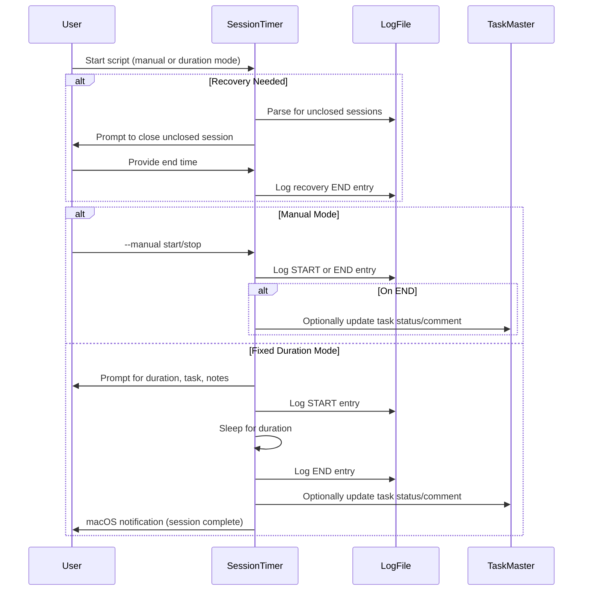

# PR #15: Task 001: RNA Biophysics Knowledge Base Structure Implementation

- **Author:** ImmortalDemonGod
- **State:** MERGED
- **Created:** 2025-06-04 18:41
- **Closed:** 2025-06-04 20:57
- **Merged:** 2025-06-04 20:57
- **Base branch:** `master`
- **Head branch:** `task-001-rna-knowledge-base-structure`
- **Files changed:** 46
- **Additions:** 3390
- **Deletions:** 105

## Summary
## Overview

This PR implements a comprehensive RNA Biophysics Knowledge Base Structure as outlined in Task 1, completing all subtasks 1.1 through 1.5.

## Completed Tasks

### Task 1.1: Main Knowledge Base Structure and Root Section ✅
- **Duration**: 1:00:00
- **KMS chosen**: Markdown (Obsidian/MkDocs/Notion compatible)
- **Main folder created**: `cultivation/docs/5_domain_knowledge_and_curricula/biology/RNA_MODELING/Pillar1_Biophysical_Modeling/`
- **Root document created**: `index.md` with title/metadata
- **Features implemented**:
  - Overview written
  - Table of contents with links
  - Metadata tags in YAML
  - File accessibility verified
- **Additional work**: Thoroughly reviewed prerequisite knowledge and objectives

### Task 1.2: Session Timer Debugging and Enhancement ✅
- **Duration**: 0:08:49
- **Problem solved**: Timer not logging session end/duration correctly on interruptions
- **Improvements implemented**:
  - Manual Start/Stop Mode with proper session tracking
  - Recovery mechanism for interrupted sessions
  - Enhanced testability with configurable log paths
  - Comprehensive test suite (unit, integration, recovery tests)
  - KeyboardInterrupt handling with "INTERRUPTED" status logging
  - CLI argument support for reduced interactive dependencies

### Task 1.3: Standardized Content Templates ✅
- **Duration**: 0:45:00
- **Actions completed**:
  - Audited existing files for consistency
  - Defined gold-standard template (saved to `docs/meta/templates/`)
  - Updated all 6 RNA Pillar 1 KB subsection `index.md` files to match template
  - Ensured consistent structure and formatting across all files

### Task 1.4: Quiz and Assessment Materials Structure ✅
- **Duration**: 0:17:49
- **Quiz files created** in `Quizzes_and_Assessments/`:
  - `Quiz-1.2-Phosphodiester-Backbone.md`
  - `Quiz-1.3-RNA-vs-DNA-Comparison.md`
  - `Quiz-1.4-Thermodynamic-Principles.md`
  - `Quiz-1.5-Energetic-Contributions.md`
  - `Quiz-1.6-Environmental-Factors.md`
- **Features per quiz file**:
  - Proper frontmatter with metadata
  - Multiple question types (MC, short answer, diagram, scenario)
  - Self-assessment guide and instructions
  - Topic-relevant placeholder questions
- **Updated main quiz index** with comprehensive overview and study guidance

### Task 1.5: Cross-References and Learning Progression ✅
- **Duration**: 0:08:09
- **Enhancements implemented**:
  - Updated main index with "Suggested Learning Path"
  - Added comprehensive Concept Map link
  - Enhanced all six subsection indexes with detailed, bidirectional cross-references
  - Added relationship notes between sections
  - Created comprehensive Mermaid concept map
  - Verified all navigation, formatting, and pedagogical structure

## Technical Improvements

### Session Timer Robustness
- Fixed original bug where sessions weren't properly closed on interruption
- Implemented recovery logic for orphaned START entries
- Added comprehensive test coverage (unit, integration, recovery)
- Enhanced CLI interface with argparse for better testability
- Improved error handling and session state management

### Knowledge Base Structure
- Consistent Markdown formatting compatible with Obsidian/MkDocs/Notion
- Standardized YAML frontmatter across all files
- Hierarchical organization with clear navigation paths
- Cross-referencing system for enhanced learning progression
- Assessment materials integrated with knowledge base sections

## Files Modified/Created

### Knowledge Base Structure
- `cultivation/docs/5_domain_knowledge_and_curricula/biology/RNA_MODELING/Pillar1_Biophysical_Modeling/index.md`
- All 6 subsection `index.md` files (1.1 through 1.6)
- `docs/meta/templates/` - standardized templates
- `Quizzes_and_Assessments/` directory with 6 quiz files
- Concept map and cross-reference documentation

### Session Timer Improvements
- Enhanced `session_timer.py` with recovery logic and CLI support
- Added comprehensive test suite:
  - `test_session_timer.py` (unit tests)
  - `test_session_recovery.py` (recovery logic tests)
  - `test_session_integration.py` (integration tests)

## Quality Assurance

- ✅ All session timer tests pass (unit, integration, recovery)
- ✅ Knowledge base structure verified and accessible
- ✅ Cross-references and navigation tested
- ✅ Quiz materials standardized and ready for content population
- ✅ Template consistency across all files
- ✅ Pedagogical structure validated

## Total Time Investment
- **Task 1.1**: 1:00:00
- **Task 1.2**: 0:08:49
- **Task 1.3**: 0:45:00
- **Task 1.4**: 0:17:49
- **Task 1.5**: 0:08:09
- **Total**: ~2:19:47

## Ready for Review

This PR represents a complete implementation of the RNA Biophysics Knowledge Base Structure with enhanced tooling for session tracking and comprehensive assessment materials. All components are tested, documented, and ready for content population.

---
Pull Request opened by [Augment Code](https://www.augmentcode.com/) with guidance from the PR author

<!-- This is an auto-generated comment: release notes by coderabbit.ai -->
## Summary by CodeRabbit

- **New Features**
  - Introduced a comprehensive, phased development roadmap for the Cultivation project, outlining system vision, architecture, and integration plans.
  - Added a foundational knowledge base for RNA biophysics, including structured documentation, quizzes, concept maps, and learning progression guides.
  - Implemented a session timer tool for task management, supporting session logging, recovery, and integration with Task Master.

- **Documentation**
  - Added detailed templates for knowledge base subsections, quizzes, self-assessment tests, strategic plans, and training blocks to standardize content creation.
  - Expanded RNA modeling curriculum with new structured sections, quizzes, concept maps, and cross-references.
  - Updated roadmap and archival status for project planning documents.
  - Improved clarity in training block documentation emphasizing cadence focus.
  - Introduced a strategic plan for organizing reusable template files in documentation.
  - Added a guide for setting up and using PyMarkdown linting in the project.
  - Reformatted and reorganized the main documentation index and MkDocs navigation for better readability.

- **Bug Fixes**
  - Not applicable.

- **Tests**
  - Added integration and unit tests for session timer logging, recovery, and manual operation features.
  - Enhanced scheduling tests with updated task status handling.

- **Chores**
  - Updated task status indicators and improved formatting in task tracking files.
  - Added pymarkdownlnt dependency to project requirements.
  - Added GitHub Actions workflow for automated Markdown linting.
<!-- end of auto-generated comment: release notes by coderabbit.ai -->

## Top-level Comments
- **coderabbitai**: <!-- This is an auto-generated comment: summarize by coderabbit.ai -->
<!-- This is an auto-generated comment: failure by coderabbit.ai -->

> [!CAUTION]
> ## Review failed
> 
> The pull request is closed.

<!-- end of auto-generated comment: failure by coderabbit.ai -->
<!-- walkthrough_start -->

... (truncated)

## CodeRabbit Walkthrough
## Walkthrough

This update introduces a comprehensive RNA Biophysics knowledge base, including foundational content, quizzes, templates, and a concept map. It adds a detailed, phased project roadmap, reorganizes template strategy, and implements a session timer tool with integrated tests. Several documentation and task status updates are also included.

## Changes

| Files / Groups                                                                                      | Change Summary                                                                                                                                                                                                                                                      |
|-----------------------------------------------------------------------------------------------------|---------------------------------------------------------------------------------------------------------------------------------------------------------------------------------------------------------------------------------------------------------------------|
| `cultivation/docs/5_domain_knowledge_and_curricula/biology/RNA_MODELING/Pillar1_Biophysical_Modeling/` (index.md, Concept_Map.md, 1_RNA_Nucleotide_Structure/index.md, 2_Phosphodiester_Backbone/index.md, 3_RNA_vs_DNA_Comparison/index.md, 4_Thermodynamic_Principles/index.md, 5_Energetic_Contributions/index.md, 6_Environmental_Factors/index.md) | Added foundational knowledge base, concept map, and six structured topic sections for RNA biophysical modeling.                                                                                                              |
| `cultivation/docs/5_domain_knowledge_and_curricula/biology/RNA_MODELING/Pillar1_Biophysical_Modeling/Quizzes_and_Assessments/` (index.md, Quiz-1.1-RNA-Nucleotide-Structure.md, Quiz-1.2-Phosphodiester-Backbone.md, Quiz-1.3-RNA-vs-DNA-Comparison.md, Quiz-1.4-Thermodynamic-Principles.md, Quiz-1.5-Energetic-Contributions.md, Quiz-1.6-Environmental-Factors.md) | Added quiz index and six detailed quizzes covering each knowledge subsection.                                                                                                                                                |
| `cultivation/docs/meta/templates/` (knowledge_base_subsection_template.md, quiz_subsection_template.md, general_analysis_report_template.md, running_analysis_template.md, self_assessment_test_template.md, strategic_initiative_plan_template.md, strategic_project_overview_template.md, strength_training_block_template.md, weekly_learning_plan_template.md) | Added multiple markdown templates for knowledge base subsections, quizzes, analysis reports, self-assessment tests, strategic plans, strength training blocks, and weekly learning plans; also updated running analysis template formatting. |
| `cultivation/docs/3_design_and_architecture/roadmap_Cultivation_Integrated_v1.0.md`                 | Added a new, detailed, phased project roadmap for the Cultivation project.                                                                                                                                                   |
| `cultivation/docs/0_vision_and_strategy/archive/roadmap_vSigma.md`                                  | Marked roadmap as archived and superseded by the new integrated roadmap.                                                                                                                                                     |
| `cultivation/docs/5_domain_knowledge_and_curricula/biology/RNA_MODELING/SKILL_MAP_CSM_pillar1.md`   | Condensed to only the legend for source attribution, removing all other content.                                                                                                                                             |
| `cultivation/docs/5_domain_knowledge_and_curricula/running_methodology/training_blocks/synergistic_performance_amplification_block_w22_w25_v1.md` | Clarified the emphasis on cadence over heart rate in short cadence run session templates.                                                                                                                                    |
| `cultivation/docs/meta/templates/TODO.md`                                                           | Added a strategic plan for organizing and consolidating template files.                                                                                                                                                      |
| `cultivation/scripts/task_management/session_timer.py`                                              | Introduced a new session timer tool with logging, recovery, Task Master integration, and macOS notifications.                                                                                                                |
| `cultivation/scripts/task_management/test_session_timer.py`                                         | Added unit tests for session logging functionality.                                                                                                                                                                          |
| `cultivation/scripts/task_management/test_session_recovery.py`                                      | Added tests for detection and handling of unclosed task sessions.                                                                                                                                                            |
| `cultivation/scripts/task_management/test_session_integration.py`                                   | Added integration tests for session timer script, covering recovery and normal session flows.                                                                                                                                |
| `tasks/task_001.txt`                                                                               | Updated task and subtasks statuses from "pending" to "done" for RNA Biophysics Knowledge Base setup.                                                                                                                         |
| `tasks/tasks.json`                                                                                  | Reformatted arrays for readability, normalized numeric values, and updated statuses to "done" for completed tasks.                                                                                                           |
| `cultivation/scripts/task_management/tm_how_to.md`                                                 | Modified document title to a concise how-to guide heading for RNA Modeling Curriculum & Daily Scheduling.                                                                                                                    |
| `.pymarkdown.json`                                                                                  | Added configuration file for PyMarkdown linter with default plugin and customized max line length.                                                                                                                          |
| `cultivation/docs/7_user_guides_and_sops/pymarkdownlnt_setup_and_usage.md`                          | Added comprehensive guide for setting up and using PyMarkdown linter including installation, configuration, running, and CI integration instructions.                                                                       |
| `cultivation/docs/index.md`                                                                         | Reformatted and reorganized documentation index for improved readability and navigation with section headings and clearer structure.                                                                                        |
| `cultivation/scripts/task_management/test_active_scheduler.py`                                     | Modified test to update task status to "pending" before scheduling.                                                                                                                                                          |
| `cultivation/scripts/task_management/test_passive_scheduler.py`                                    | Modified test to mark all tasks as "done" to ensure only default passive review task is scheduled.                                                                                                                          |

## Sequence Diagram(s)

### Session Timer—Manual and Fixed Duration Modes



## Poem

> 🐇  
>   
> A knowledge base blooms, with quizzes anew,  
> Templates for structure, and roadmaps in view.  
> The session timer ticks, logs each task with care,  
> Tests run in harmony—robustness everywhere!  
>   
> With cadence and clarity, this warren grows strong—  
> Onward, dear rabbits, to learning lifelong!  
>   
>

## Git Commit Log

```text
* 3fbcdf0 (origin/task-001-rna-knowledge-base-structure, task-001-rna-knowledge-base-structure) 📝 docs(template): add new assessment and project templates
* 35d9a01 👷 ci(workflow): add markdown linting workflow
* 3115f74 📝 docs(index): update documentation structure and links
* 66edad3 📝 docs(math_stack): update roadmap reference
* 71d5030 📝 docs(index): update links in documentation
* ff966b9 📝 docs(index): update documentation table of contents
* 090fe78 ✨ feat(docs): add PyMarkdown Lint setup guide
* 9422e0f 📝 docs(roadmap): update roadmap with P0 task integration process
* 86ae405 Fix inconsistent logging approach in recovery test
* be56418 Fix missing reciprocal backlinks to Environmental Factors section
* b8f3576 ✨ feat(task_management): enhance session timer functionality
* 3b6263b 📝 docs(task_management): update how-to guide title
* 0ff62f3 ✅ test(task_management): enhance session timer unit tests
* 9a981b0 ✨ feat(test): add parse_log_for_unclosed function
* 1af9c87 ✨ feat(session_timer): enhance session logging format
* 5a36cac 📝 docs(biology): update environmental factors documentation
* 0c1b749 📝 docs(roadmap): update link to superseded roadmap
* 19e396c ✨ feat(todos): add initial TODO for template organization
* c5db646 🔧 chore(tasks): update task statuses to done
* f5e09cd 🐛 fix(tasks): update task status to done
* 78f0c6b ✨ feat(task_management): improve session log file handling
* 8aa086f 📝 docs(biology): update RNA modeling documentation
* debbde7 📝 docs(biology): update RNA modeling documentation
* a9fee12 📝 docs(biology): update RNA modeling pillar documentation
* 6a1941c 📝 docs(biology): update quiz instructions and metadata
* a715a55 💄 style(tasks): format JSON for consistency
* a199222 📝 docs(biology): update quiz content for phosphodiester backbone
* e51b727 ✨ feat(docs): add knowledge base subsection template
* 9a922ec ✨ feat(tasks): update task completion status
* eb39803 ✨ feat(quiz): add energetic contributions quiz
* e4ad8d3 ✨ feat(session_timer): add session timer script with Task Master integration
* 96373b7 ✅ test(task_management): add integration tests for session timer
* 64dd4fc ✨ feat(docs): add quizzes and assessments for biophysical modeling
* fab60cd 📝 docs(biology): add RNA modeling documentation and quizzes
* a847f1f 📝 docs(biology): add RNA vs DNA comparison documentation
* 21d0d3c ✨ feat(docs): add RNA biophysics foundational documents
* 056499c 📝 docs(biology): update RNA modeling skill map documentation
*   9713522 Merge pull request #13 from ImmortalDemonGod/feature/deepwork
* | 4d5d3f5 Merge pull request #10 from ImmortalDemonGod/flashcards/backend-pipeline-foundation
* 9449c84 data: add lunch run GPX and update wellness tracking data
*   0a96b37 Merge pull request #8 from ImmortalDemonGod/taskmaster-integration-setup
* d7e9514 Update add-paper.md
* 4d4c3de Create add-paper.md
* 4e1ec97 (backup-before-fix) ✨ feat(literature): add new research paper metadata and notes
* f2bb6f1 ✨ feat(reader_app): add paper progress tracking endpoint
* ac583f2 ✨ feat(reader_app): add paper management functionality
* 57481c3 ✨ feat(index.html): add input and controls for arXiv papers
* 3da4060 ✨ feat(reader_app): enhance paper loading and progress tracking
* fcd75a9 ✨ feat(reader_app): add endpoint to list all papers
* c8571c2 ✨ feat(reader): add paper selection dropdown and PDF loading
* 7e2fa6f ✨ feat(literature): add new literature entry for RNA modeling
* f2f5ade ✨ feat(reader_app): add finish session endpoint for metrics logging
* cf09851 ✨ feat(reader_app): add finish session button and update script path
* 697da5d ✨ feat(reader_app): implement WebSocket auto-reconnect and session metrics
* c2e0f0c ✨ feat(literature): enhance reading session management
* 2ee80d6 (feature/literature-docs, feature/accidental-main-changes) 📝 docs(literature_system_howto): add practical setup and troubleshooting guide
* 385ffd4 feat: add new training session data with GPX and analysis outputs for week 21
*   f76330d Merge pull request #6 from ImmortalDemonGod/devdailyreflect-mvp
* | 73fd77f (feature/dev-daily-reflect) ✨ feat(training): add week 21 assessment training plan
* | 994819d update data
* | 0d4b363 update data
* | 38ad076 ✨ feat(strength): add new strength training session log
* | df5bf01 ♻️ refactor(scripts): update import path for parse_markdown
* | 78ac968 🔧 chore(data): update binary data files
* | c4461e0 ✨ feat(metrics): add advanced metrics and distributions files
* | 95bd4ea 📝 docs(session): document running session analysis report
* | d635a88 ✨ feat(data): add weekly running and walking summaries
* | 48ad785 📝 docs(training plans): add logging instructions for strength system
* | 65dbff6 ✨ feat(exercise library): add new exercises to library
* 8c1484b chore: update week 20 activity data and remove outdated files
* 09e7e99 🔧 chore(week20): clean up and organize output files
* b241b2c 🔧 chore(week20): remove outdated walk metrics files
* 190add5 ✨ feat(analysis): add new data summary files for week 20
* 47dd3ce 🔧 chore(advanced_metrics): remove unused metric files
* a708b78 ✨ feat(figure): add new walk data files for week 20
* 1cf9e5d refactor: reorganize week20 output files and update run analysis data
*   1499410 Merge pull request #4 from ImmortalDemonGod/feature/operationalize-knowledge-software-etls
* |   8774729 (origin/feature/add-strength-domain, feature/add-strength-domain) Merge remote-tracking branch 'origin/master' into feature/add-strength-domain
* | | | cb6165a 🔧 chore(.gitignore): update ignore patterns for directories
* | | 1e3706e feat: add walk segment data files with GPS traces and timing analysis
* | | 8505b2c ✨ feat(metrics): add new advanced metrics files
* | | ca67d11 ✨ feat(benchmark): add new output files for heart rate analysis
* | | 4cf6d81 ✨ feat(data): add new run analysis output files
* | | 57806f6 ✨ feat(cultivation): add data metrics and diagnostics documentation
* | | 44ab549 ✨ feat(benchmark): add new performance analysis text files
* | | 1b7ee86 ✨ feat(cultivation): add new running data summary files
* | | c0c5d7f ✨ feat(benchmark): add new performance metrics and summaries
* | | 224f9ce ✨ feat(benchmark): add new performance data text files
* | | c998811 ✨ feat(week20): add new analysis files for walking data
* | | 7baca8d 🔧 chore(data): update daily wellness and subjective records
* | | 15a6485 feat: add week20 training data with GPS traces and performance metrics
* | | b921575 📝 docs(README): update README for strength training integration
* | | 293be19 ✨ feat(makefile): update rebuild strength data command
* | | 4b26228 ✨ feat(cultivation): enhance YAML processing and validation
* | | 3bf6cff 🔧 chore(.gitignore): update ignore rules for new data
* | | 66affff ✨ feat(ingest_yaml_log): support ingesting Markdown workout logs
* | | 6272aa9 ✨ feat(strength): add processed strength exercise logs and sessions
* | | d1d4533 ✨ feat(data): add strength training session YAML log
* | | 87dc580 ✨ feat(strength): enhance user input handling
* | | 1f9871e ✨ feat(data): add new exercises to exercise library
* | | 84f9ffc ✨ feat(cultivation): add strength training session data
* | | aea0036 ✨ feat(requirements): add pandas and python-dotenv dependencies
* | | a8966b1 ✨ feat(strength): add interactive CLI for logging strength sessions
* | | 412f5f7 ✨ feat(data): add exercise library and strength log template
* | | 3deb5b2 ✨ feat(docs): add strength data schemas documentation
*   7121d9d Merge pull request #2 from ImmortalDemonGod/feature/week19-advanced-metrics-hr-pace
* a7e52d5 Create 2025_05_11_run_report.md
* 61fe29c Update knowledge_acquistion_analysis
* a76e035 Create knowledge_acquistion_analysis
* 8cfa35e Add files via upload
* e875443 Add files via upload
* df31f30 Add files via upload
* 1491ec1 Add files via upload
* 2826cba Create flashcards_3.md
*   082e2a0 Merge pull request #1 from ImmortalDemonGod/fatigue-kpi-zones-integration-2025-04-30
* 5174eec 📝 docs(run_summary): add advanced metrics and weather details
* 00f05c1 data update
* ca2dbf0 ✨ feat(reports): add detailed run report for April 2025
* 1cbe261 ✨ feat(weather): add weather fetching utility
* acfd33d ✨ feat(performance_analysis): add advanced metrics and weather info
* f811b63 ✨ feat(running): skip already processed run files
* 6004b58 ✨ feat(parse_run_files): integrate advanced metrics for GPX
* 6c6f31b ✨ feat(metrics): add GPX parsing and run metrics calculation
* 72eb7ce ✨ feat(requirements): add requests package to dependencies
* 6d0d4dd 📝 docs(base_ox_block): update Base-Ox mesocycle documentation
* b28316e ✨ feat(docs): add Base-Ox Mesocycle training plan
* 6b2b77a ✨ feat(performance_analysis): enhance output organization and summaries
* ebcb547 ✨ feat(compare_weekly_runs): add image and text output for comparisons
* f92bbe8 ✨ feat(analyze_hr_pace_distribution): add image and text output directories
* 717b8d6 ✨ feat(cultivation): add pace comparison for week 17
* 1fcae2d ✨ feat(cultivation): add heart rate comparison for week 17
* 3aa850c ✨ feat(cultivation): add time in heart rate zone file
* f3ccfb1 ✨ feat(cultivation): add run summary output file
* f7eadf6 ✨ feat(cultivation): add pacing strategy analysis output
* a71ebcb ✨ feat(cultivation): add pace distribution output file
* 42e85e7 ✨ feat(cultivation): add heart rate vs pace correlation data
* 84cf549 ✨ feat(cultivation): add heart rate drift analysis output
* 7543576 ✨ feat(figures): add heart rate distribution data file
* 4123cb0 ✨ feat(cultivation): add time in heart rate zones data
* d7d7a1a ✨ feat(cultivation): add run summary output file
* bc95e1e ✨ feat(cultivation): add pace over time analysis file
* 683ed8e ✨ feat(cultivation): add pace distribution data file
* 79d4093 ✨ feat(cultivation): add heart rate vs pace correlation data
* deec77b ✨ feat(cultivation): add heart rate drift analysis output
* f57e45e ✨ feat(cultivation): add heart rate distribution data file
* cc349c5 🔧 chore(.gitignore): update ignore rules for figures
* 37faeba ✨ feat(performance_analysis): add dynamic figure directory creation
* a1b62e5 ✨ feat(scripts): add weekly comparison step for runs
* aaea7f2 ✨ feat(cultivation): add weekly run comparison script
* b5b320e ✨ feat(analyze_hr_pace_distribution): add figure saving directory structure
* a39538b updated files
* a328e1b ✨ feat(running): update paths in process_all_runs script
* 71abbee 📝 docs(README): add quick start guide for automated data analysis
* c447cbe 🔧 chore(.gitignore): add ignore rules for generated figures
* d54d06e ♻️ refactor(process_all_runs): update project root path
* 6bf37a1 ♻️ refactor(scripts): improve file renaming and processing logic
* ac3e359 ✨ feat(docs): add automated running data ingestion workflow
* 80e5b07 🔧 chore(create_structure): remove create_structure.py file
* 231afbb ✨ feat(requirements): add new data visualization libraries
* 607d9eb ✨ feat(performance_analysis): add advanced run performance analysis script
* bc39215 ✨ feat(scripts): add batch processing for running data files
* ceb502b ✨ feat(scripts): add file parser for FIT and GPX formats
* 71a22c3 ✨ feat(scripts): add auto-rename functionality for raw files
* d5de4cb ✨ feat(scripts): add HR and pace distribution analysis tool
* dbcd84d ✨ feat(reports): add placeholder file for reports directory
* 0fe43f5 ✨ feat(figures): add time in hr zone figure
* 655a5a9 ✨ feat(figures): add pace over time figure
* 693781b ✨ feat(figures): add pace distribution figure
* f0c9cce ✨ feat(figures): add heart rate vs pace hexbin plot
* f5437ce ✨ feat(figures): add HR over time drift figure
* 77bce6e ✨ feat(figures): add heart rate distribution figure
* 9c6a442 ✨ feat(figures): add placeholder for figures output directory
* 308bf12 new run data
* b6bda67 ✨ feat(data): add placeholder file for raw data directory
* 0c25807 new running data
* 3666a6e ✨ feat(processed): add placeholder file for processed data
* 3a137ba ✨ feat(requirements): add initial requirements file
* 035a68e Create systems‑map_and_market‑cheatsheet.md
* ddf2f9c Create system_readiness_audit_2025‑04‑18.md
* 431aae5 Create operational_playbook.md
* e45ef98 Rename Testing-requirements.md to  flashcards_2.md
* b9fb65c Create flashcards_1.md
* 047bc11 Create literature_system_overview.md
* 083e7ce Update design_overview.md
* eacb6de Update Progress.md
* c0f67d9 Update Progress.md
* 842e60c Rename biology_eda.ipynb to malthus_logistic_demo.ipynb
* 52719d5 Update Progress.md
* 85a45aa Update task_master_integration.md
* 94772b8 Create task_master_integration.md
* 45ec03d Update analysis_overview.md
* a65fb4d Create Progress.md
* bdab714 Rename Testing-requirements to Testing-requirements.md
* 2f2cc29 Create lean_guide.md
* 3a732a2 Create roadmap_vSigma.md
* 5e26925 Create math_stack.md
* e6cbfad Create generate_podcast_example.py
* d927c22 🔧 chore(notebooks): update metadata for biology_eda notebook
* a950c52 📝 docs(outline): add detailed framework for raising potential and leveraging synergy
* 2ae9c1a Create Testing-requirements
* 356e119 Rename section_1_test to section_1_test.md
* adb08fa Create section_1_test
* 6f489ac 📝 docs(biology_eda): add detailed explanation and examples
* 0077451 Add Chapter 1: Continuous Population Models for Single Species under docs/5_mathematical_biology
* 2d6a05e Update README.md
* 7619853 keeping the repo txt up to date
* 78c8b04 inital repo commit with all the current documentation and repo structure
* 14b05d7 Initial commit
```

