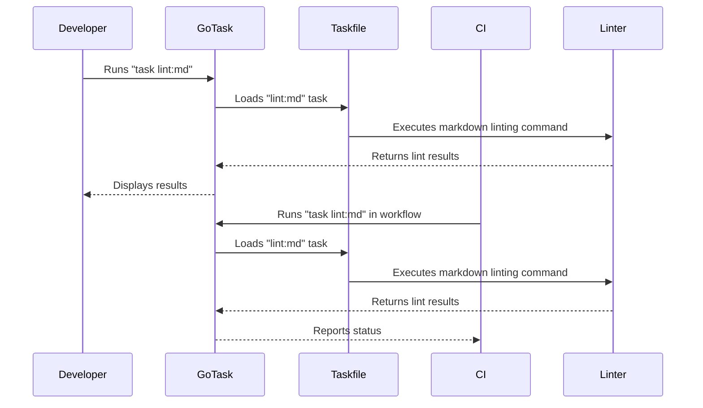

# PR #17: feat(tooling): Implement standardized project task runner (Taskfile)

- **Author:** ImmortalDemonGod
- **State:** MERGED
- **Created:** 2025-06-10 00:00
- **Closed:** 2025-06-13 19:28
- **Merged:** 2025-06-13 19:28
- **Base branch:** `master`
- **Head branch:** `chore/add-task-runner`
- **Files changed:** 24
- **Additions:** 1935
- **Deletions:** 13

## Summary
### Description

This pull request implements the foundational project-wide task runner as specified in **DW_IA_TOOLING_001**. The goal is to standardize all common development and operational commands, reduce cognitive load, and ensure consistency between local development and CI environments.

Go Task (`Taskfile.yml`) was selected over Makefile for its superior cross-platform compatibility, readable YAML syntax, and built-in discoverability features, aligning with the project's long-term goals for maintainability and collaboration.

Addresses Task: `14`

### Execution Analysis: Predicted vs Actual

**Time Estimation Performance:**
- **Initial Prediction:** 4-6 hours (240-360 minutes)
- **Actual Execution:** 1 hour 45 minutes (105 minutes)
- **Variance:** -56% to -69% (completed in ~1/3 to 1/2 of predicted time)

**Key Factors in Variance:**
1. **High Developer Proficiency:** Rapid resolution of environmental issues (Go Task install), YAML syntax errors, and script debugging
2. **Low Friction Implementation:** Go Task's simplicity and YAML syntax accelerated development vs Makefile
3. **Mature Underlying Scripts:** Existing scripts required minimal refactoring for task integration
4. **Conservative Prediction Model:** Original estimate included excessive buffer time for debugging

**Lessons for Future Estimation:** The actual time of ~1.75 hours should serve as a more accurate baseline for similar "high-impact infrastructure tooling" tasks.

### Key Changes & Rationale

-   **Added `Taskfile.yml`:** The new single source of truth for all project commands. It is heavily documented with `desc:` fields for each task, making it self-discoverable via `task --list-all`.
-   **Standardized Command Namespaces:** Implemented tasks for all critical development lifecycle stages:
    -   `setup`: Environment and dependency installation.
    -   `lint`: Python and Markdown linting.
    -   `test`: Pytest suite execution.
    -   `docs`: Building, serving, and deploying the MkDocs site.
    -   `run`: Wrapper commands for key data pipelines and automation scripts.
    -   `clean`: Removing temporary files and caches.
-   **CodeScene Integration:** Went beyond the initial plan to add a full suite of `codescene` tasks for static analysis, providing a powerful new quality assurance tool.
-   **Updated `README.md`:** The root README has been updated with a comprehensive section detailing how to install and use the new task runner, simplifying the onboarding process.
-   **CI Workflow Refactoring:** The `.github/workflows/markdown-lint.yml` has been updated to use `task lint:md` as a proof-of-concept for CI integration.

### Scope Expansion Beyond Original Plan

**Additional Value Delivered:**
- **CodeScene CLI Integration:** Added comprehensive static analysis capabilities with `codescene:check`, `codescene:review`, and `codescene:delta` tasks
- **Enhanced Documentation Generation:** Created `docs:gen-nav` task with automatic dependency integration for `docs:deploy`
- **Script Debugging & Fixes:** Identified and resolved issues in `github_automation.sh` output path during integration testing
- **Environment Variable Documentation:** Added critical `.env` export instructions for `task-master` compatibility

### How to Test This Change

1.  Check out this branch: `git checkout chore/add-task-runner`
2.  Install Go Task if you haven't already (see updated `README.md`).
3.  Set up the environment using the new task: `task setup`
4.  Activate the environment: `source .venv/bin/activate`
5.  Verify key tasks execute correctly:
    -   `task test` (should run the pytest suite)
    -   `task lint` (should run ruff and pymarkdown)
    -   `task docs` (should start the MkDocs local server)
    -   `task --list-all` (should show all available tasks with descriptions)
6.  Review the new `README.md` section for clarity and accuracy.

---

### Pull Request Checklist

-   [x] The work done addresses the objectives of **Task 14**.
-   [x] The new `Taskfile.yml` has been tested locally.
-   [x] All new tasks in the `Taskfile.yml` are documented with a `desc:` field.
-   [x] The main `README.md` has been updated with new setup and usage instructions.
-   [x] The CI workflow (`markdown-lint.yml`) has been updated to use the new task runner.
-   [x] Execution time analysis documented for future estimation improvement.
-   [ ] (Will be checked after opening PR) All CI checks pass with these changes.

---

### Impact on Project Roadmap

This PR completes a critical **Phase 0 ("Operational Bedrock")** milestone, establishing the foundation for:
- Consistent development workflows across team members
- Simplified CI/CD pipeline maintenance
- Reduced onboarding friction for new contributors
- Standardized quality assurance processes

Recommended next steps: **DW_IA_PRECOMMIT_001** (Pre-commit hooks) to build upon this task runner foundation.

<!-- This is an auto-generated comment: release notes by coderabbit.ai -->

## Summary by CodeRabbit

- **New Features**
  - Introduced a standardized project task runner using Go Task, enabling unified commands for development, testing, documentation, and operational workflows.
  - Added a comprehensive Taskfile with tasks for setup, linting, testing, documentation building, deployment, cleaning, and data processing.

- **Documentation**
  - Expanded the README with detailed instructions for using the new task runner, including installation, usage, troubleshooting, and environment setup.
  - Updated documentation index and navigation to include new templates, reports, audits, and strategic initiative documents.

- **Chores**
  - Added and documented a new high-priority infrastructure task for implementing the standardized task runner.
  - Updated CI workflow to utilize the task runner for markdown linting.

- **Reports**
  - Added new daily development reflection reports summarizing code activity and metrics for multiple dates.

<!-- end of auto-generated comment: release notes by coderabbit.ai -->

## Top-level Comments
- **coderabbitai**: <!-- This is an auto-generated comment: summarize by coderabbit.ai -->
<!-- walkthrough_start -->

## Walkthrough

A standardized project-wide task runner using Go Task and a Taskfile.yml was implemented. The README was updated with usage instructions. CI markdown linting was refactored to use the n... (truncated)
- **coderabbitai**: > [!CAUTION]
> No docstrings were generated.

## CodeRabbit Walkthrough
## Walkthrough

A standardized project-wide task runner using Go Task and a Taskfile.yml was implemented. The README was updated with usage instructions. CI markdown linting was refactored to use the new task runner. Documentation and navigation were expanded with new templates and reports. Task specifications and metadata were updated to reflect this infrastructure enhancement.

## Changes

| File(s)                                                                                           | Change Summary                                                                                                                                                                                                                                                                                                                                                                                                                                                                                                                                                                                                                                                                                                                                                                                                                                                                                                                                                                                                                                                                                                                                                                                                                                                                                                                                                                                                                                                                                                                                                                            |
|---------------------------------------------------------------------------------------------------|----------------------------------------------------------------------------------------------------------------------------------------------------------------------------------------------------------------------------------------------------------------------------------------------------------------------------------------------------------------------------------------------------------------------------------------------------------------------------------------------------------------------------------------------------------------------------------------------------------------------------------------------------------------------------------------------------------------------------------------------------------------------------------------------------------------------------------------------------------------------------------------------------------------------------------------------------------------------------------------------------------------------------------------------------------------------------------------------------------------------------------------------------------------------------------------------------------------------------------------------------------------------------------------------------------------------------------------------------------------------------------------------------------------------------------------------------------------------------------------------------------------------------------------------------------------------------------------|
| Taskfile.yml, tasks/task_014.txt, tasks/tasks.json                                                | Added a standardized Taskfile.yml for Go Task-based automation, a detailed implementation task specification, and new task metadata for project-wide command standardization.                                                                                                                                                                                                                                                                                                                                                                                                                                                                                                                                                                                                                                                                                                                                                                                                                                                                                                                                                                                                                                                                                                                                                                                                                                                                                                                                                                    |
| README.md                                                                                         | Added a comprehensive section on using Go Task as the project task runner, including installation, usage, troubleshooting, and environment variable guidance.                                                                                                                                                                                                                                                                                                                                                                                                                                                                                                                                                                                                                                                                                                                                                                                                                                                                                                                                                                                                                                                                                                                                                                                                                                                                                                                                                                                    |
| .github/workflows/markdown-lint.yml                                                               | Refactored markdown linting workflow to use Go Task via `task lint:md` instead of direct PyMarkdown invocation; installs Go Task in CI.                                                                                                                                                                                                                                                                                                                                                                                                                                                                                                                                                                                                                                                                                                                                                                                                                                                                                                                                                                                                                                                                                                                                                                                                                                                                                                                                                                   |
| cultivation/scripts/software/github_automation.sh                                                 | Changed default output directory to be relative to the script's location, not the current working directory.                                                                                                                                                                                                                                                                                                                                                                                                                                                                                                                                                                                                                                                                                                                                                                                                                                                                                                                                                                                                                                                                                                                                                                                                                                                                                                                                                                                            |
| mkdocs.yml, cultivation/docs/index.md                                                             | Expanded documentation navigation and index to include new vision, strategy, audits, reports, and multiple templates.                                                                                                                                                                                                                                                                                                                                                                                                                                                                                                                                                                                                                                                                                                                                                                                                                                                                                                                                                                                                                                                                                                                                                                                                                                                                                                                                                                                    |
| cultivation/outputs/software/dev_daily_reflect/reports/dev_report_2025-06-02.md cultivation/outputs/software/dev_daily_reflect/reports/dev_report_2025-06-03.md cultivation/outputs/software/dev_daily_reflect/reports/dev_report_2025-06-04.md cultivation/outputs/software/dev_daily_reflect/reports/dev_report_2025-06-05.md cultivation/outputs/software/dev_daily_reflect/reports/dev_report_2025-06-06.md cultivation/outputs/software/dev_daily_reflect/reports/dev_report_2025-06-07.md cultivation/outputs/software/dev_daily_reflect/reports/dev_report_2025-06-08.md cultivation/outputs/software/dev_daily_reflect/reports/dev_report_2025-06-09.md | Added new daily development reflection reports for June 2–9, 2025, summarizing commits, code metrics, and author contributions per day.                                                                                                                                                                                                                                                                                                                                                                                                                                                                                                                                                                                                                                                                                                                                                                                                                                                                                                                                                                                                                                                                                                                                                                                                                                                                                     |
| cultivation/outputs/software/pr_markdown_summaries/pr_1_fatigue-kpi-zones-integration-2025-04-30.md cultivation/outputs/software/pr_markdown_summaries/pr_2_featureweek19-advanced-metrics-hr-pace.md cultivation/outputs/software/pr_markdown_summaries/pr_3_featureadd-strength-domain.md cultivation/outputs/software/pr_markdown_summaries/pr_4_featureoperationalize-knowledge-software.md cultivation/outputs/software/pr_markdown_summaries/pr_5_add-docstrings-to-featureoperationalize-.md cultivation/outputs/software/pr_markdown_summaries/pr_6_devdailyreflect-mvp.md cultivation/outputs/software/pr_markdown_summaries/pr_7_add-docstrings-to-devdailyreflect-mvp.md cultivation/outputs/software/pr_markdown_summaries/pr_8_feat-implement-taskmaster-integration-se.md | Added or updated PR markdown summary files with detailed commit logs and summaries for multiple major pull requests, reflecting broad feature, documentation, and infrastructure changes.                                                                                                                                                                                                                                                                                                                                                                                                                                                                                                                                                                                                                                                                                                                                                                                                                                                                                                                                                                                                                                                                                                                                                                                           |

## Sequence Diagram(s)

## Poem

> Hopping through tasks with a Go-powered stride,  
> The Taskfile now leads where all commands reside.  
> Docs and reports bloom like carrots in spring,  
> Linting and cleaning—just ask, and they spring!  
> With every new hop, our project feels bright—  
> Automation and order, a rabbit’s delight!  
> 🥕✨

## Git Commit Log

> No commit log found for this PR.

