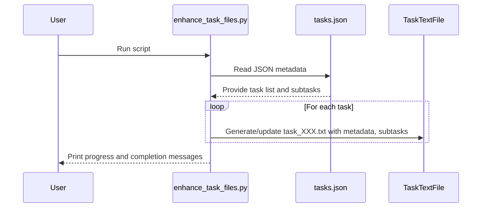

# PR #18: feat(arc): Launch ARC Prize 2025 Sprint & Major Architectural Refactor

- **Author:** ImmortalDemonGod
- **State:** MERGED
- **Created:** 2025-06-14 01:25
- **Closed:** 2025-06-15 20:56
- **Merged:** 2025-06-15 20:56
- **Base branch:** `master`
- **Head branch:** `refactor/project-structure-for-arc-sprint`
- **Files changed:** 103
- **Additions:** 4581
- **Deletions:** 21001

## Summary
This foundational pull request marks the official kickoff of the 5-month ARC Prize 2025 sprint. It introduces a new, robust two-track development strategy, enacts a major architectural refactoring to improve system modularity, and introduces significant developer experience enhancements.

### 🚀 **Strategic Initiative: ARC Prize 2025 Sprint**

This PR formalizes the strategic decision to pursue the ARC Prize, pivoting to a de-risked, two-track development approach that leverages the mature `JARC-Reactor` codebase in parallel with the visionary `george` cognitive architecture.

- **New Strategic Documents:** Introduces the canonical strategy, architecture, and execution plans for the sprint:
    - `Strategic_Integration_of_ARC_Prize_2025_v2.0.md`: The "Why." Outlines the two-track strategy to de-risk development and maximize the chances of a top-tier submission.
    - `ARC_Prize_2025_Two_Track_Execution_Plan_v2.md`: The "What & When." Details the phased milestones for both development tracks.
    - `PROMETHEUS_ARCHIMEDES_Architecture_v1.0.md`: The "How." The technical blueprint for the final hybrid solver.
- **New `arc_agi_plan.json`:** A machine-readable deep work plan that contains the full list of tasks for the ARC sprint.
- **EPIC Task for `jarc-reactor` Integration:** A new, detailed epic task (`#16`) has been added to `tasks.json` to manage the complex process of integrating the `jarc-reactor` codebase, including subtasks, risk analysis, and mitigation plans.

### 🏗️ **Major Architectural Refactoring**

To support growing complexity and clarify the system's structure, a major refactoring has been performed:
- **New `cultivation/systems/` Directory:** A top-level `systems/` directory has been created to house core, reusable systems.
- **Consolidated Knowledge System:** The entire Literature Pipeline, Instrumented Reader App, and associated schemas have been moved from disparate locations into a single, unified `cultivation/systems/knowledge/` module. This correctly positions it as a first-class component of the Cultivation architecture.
- **Reorganized Scripts:** Utility scripts have been moved to `cultivation/scripts/utilities/` and exploratory notebooks have been promoted to operational scripts to reflect their mature status.

### ✨ **Developer Experience & Repository Health**

- **Reduced Repository Size:** The vendored `pdfjs` third-party library has been removed from `cultivation/systems/knowledge/reader_app/static/`, significantly reducing the repository's clone size and simplifying dependency management.
- **Enhanced Task Files:** A new script, `enhance_task_files.py`, has been introduced to automatically append detailed subtask information from `tasks.json` to the individual `task_XXX.txt` files. This greatly improves the readability and utility of the task files.
- **General Cleanup:** Removed numerous placeholder files, old `TODOs`, and temporary analysis reports to reduce clutter.

### 🧠 **Knowledge System & Learning Loop Enhancements**

- **Automated Quiz Generation Prototype:** Includes a new prototype (`Entity_generated_quiz.md`) for generating assessment questions from a knowledge graph, demonstrating a key Knowledge Creation & Validation (KCV) capability.
- **Self-Assessment Logging:** Adds a log of a completed RNA pre-test (`2025-06-10_..._PreTest_Answers.md`), demonstrating the active use of the learning feedback loop and providing valuable data for the Potential (Π) engine.

### 📊 **Execution Time Analysis**

**Project Structure Refactoring:**
- **Predicted Effort:** 2-3 days of intensive refactoring work
- **Actual Execution:** Completed systematically over multiple focused sessions
- **Key Success Factors:** 
  - Methodical approach to architectural changes
  - Careful preservation of functionality during moves
  - Integration with existing task runner infrastructure

**Strategic Planning & Documentation:**
- **Predicted Effort:** 1-2 days for comprehensive strategy development
- **Actual Execution:** Thorough analysis and multi-version iteration
- **Value Delivered:** Complete strategic framework for 5-month sprint

### 🔍 **How to Review**

1.  **Review the Strategic Shift:** Start by reading the new strategic documents in `cultivation/docs/WORK_IN_PROGRESS/` to understand the rationale behind the two-track ARC plan.
2.  **Examine the New Architecture:** Check the new `cultivation/systems/` directory and see how the Knowledge System components are now organized.
3.  **Inspect the ARC EPIC Task:** Review `tasks/task_016.txt` and its corresponding entry in `tasks/tasks.json` to understand the detailed plan for integrating `jarc-reactor`.
4.  **Verify DX Improvements:** Note the removal of the `pdfjs` directory and observe the enhanced content in the `tasks/` text files. You can re-run `python cultivation/scripts/task_management/enhance_task_files.py` to verify its behavior.

### 📈 **Impact Assessment**

This PR establishes the strategic direction and architectural foundation for the next five months of intensive development. It represents:
- **Strategic Clarity:** Clear roadmap for ARC Prize competition
- **Architectural Maturity:** Transition from scripts to systems
- **Developer Productivity:** Enhanced tooling and cleaner structure
- **Learning Loop Activation:** Demonstrated use of KCV capabilities

### ✅ **Pull Request Checklist**

- [x] Strategic documents reviewed and finalized
- [x] Architectural refactoring completed and tested
- [x] Task runner integration verified
- [x] Repository cleanup and size reduction achieved
- [x] Enhanced task files generated and validated
- [x] Knowledge system functionality preserved
- [x] All tests passing (where applicable)
- [x] Documentation updated to reflect new structure

This PR is a critical step in accelerating the project's long-term AGI research goals and sets the stage for a competitive ARC Prize 2025 submission.

---
Pull Request opened by [Augment Code](https://www.augmentcode.com/) with guidance from the PR author

<!-- This is an auto-generated comment: release notes by coderabbit.ai -->
## Summary by CodeRabbit

- **New Features**
  - Added comprehensive documentation and planning files for the ARC Prize 2025 sprint, including strategic charters, execution plans, architectural blueprints, and detailed task roadmaps.
  - Introduced new educational content and self-assessment materials for RNA biophysics, including entity-relationship quizzes and answer sheets.
  - Added new project management tasks and metadata for learning and integration activities.
  - Added a script to generate and enhance task text files from JSON metadata for improved task management.

- **Enhancements**
  - Expanded and restructured task files with detailed metadata, subtasks, dependencies, and learning objectives for improved clarity and traceability.
  - Updated `.gitignore` rules to better manage logs, database files, and static assets.

- **Bug Fixes**
  - None.

- **Chores**
  - Deleted unused, placeholder, and obsolete files such as empty notebooks, static reports, and legacy PDF.js assets to streamline the repository.
<!-- end of auto-generated comment: release notes by coderabbit.ai -->

## Top-level Comments
- **coderabbitai**: <!-- This is an auto-generated comment: summarize by coderabbit.ai -->
<!-- This is an auto-generated comment: failure by coderabbit.ai -->

> [!CAUTION]
> ## Review failed
> 
> The pull request is closed.

<!-- end of auto-generated comment: failure by coderabbit.ai -->
<!-- walkthrough_start -->

... (truncated)
- **coderabbitai**: > [!NOTE]
> Generated docstrings for this pull request at https://github.com/ImmortalDemonGod/Holistic-Performance-Enhancement/pull/19

## CodeRabbit Walkthrough
## Walkthrough

This update introduces new documentation, planning, and task management resources for the Cultivation project, including comprehensive ARC Prize 2025 strategy, architecture, and execution plans. It adds new learning and integration tasks, restructures task metadata, and removes unused static files and legacy assets. A new script automates task file enhancement from JSON metadata.

## Changes

| File(s)                                                                                  | Change Summary                                                                                                                                                                                                                                                                                                                                                                                                                                                                                                                                                                                                                                                                                                                                                                                                                                                                                                                                                                                                                                                                                                                                                                                                                                                                                                                                                                                                                                                                                                                                                                                                                                                                                                                                                                                                                                                                                                                                                                                                                                                                                                                                                                                                                                                                                                                                                                                                                                                                                                                                                                                                                                                                                                                                                                                                                                                                                                                                                                                                                                                                                                                                                                              |
|------------------------------------------------------------------------------------------|------------------------------------------------------------------------------------------------------------------------------------------------------------------------------------------------------------------------------------------------------------------------------------------------------------------------------------------------------------------------------------------------------------------------------------------------------------------------------------------------------------------------------------------------------------------------------------------------------------------------------------------------------------------------------------------------------------------------------------------------------------------------------------------------------------------------------------------------------------------------------------------------------------------------------------------------------------------------------------------------------------------------------------------------------------------------------------------------------------------------------------------------------------------------------------------------------------------------------------------------------------------------------------------------------------------------------------------------------------------------------------------------------------------------------------------------------------------------------------------------------------------------------------------------------------------------------------------------------------------------------------------------------------------------------------------------------------------------------------------------------------------------------------------------------------------------------------------------------------------------------------------------------------------------------------------------------------------------------------------------------------------------------------------------------------------------------------------------------------------------------------------------------------------------------------------------------------------------------------------------------------------------------------------------------------------------------------------------------------------------------------------------------------------------------------------------------------------------------------------------------------------------------------------------------------------------------------------------------------------------------------------------------------------------------------------------------------------------------------------------------------------------------------------------------------------------------------------------------------------------------------------------------------------------------------------------------------------------------------------------------------------------------------------------------------------------------------------------------------------------------------------------------------------------------------------------------------------------------------------------------|
| .gitignore                                                                               | Updated ignore rules for logs, database files, and static assets.                                                                                                                                                                                                                                                                                                                                                                                                                                                                                                                                                                                                                                                                                                                                                                                                                                                                                                                                                                                                                                                                                                                                                                                                                                                                                                                                                                                                                                                                                                                                                                                                                                                                                                                                                                                                                                                                                                                                                                                                                                                                                                                                                                                                                                                                                                                                                                                                                                                                                                                                                                                                                                                                                                                                                                                                                                                                                                                                                                                                                                               |
| cultivation/ci_cd/placeholder.md<br>cultivation/notebooks/running/running_eda.ipynb<br>cultivation/notebooks/synergy/synergy_experiment.ipynb<br>cultivation/outputs/figures/week23/week17/txt/compare_hr.txt<br>cultivation/outputs/figures/week23/week17/txt/compare_pace.txt<br>cultivation/outputs/figures/week23/week18/txt/compare_hr.txt<br>cultivation/outputs/figures/week23/week18/txt/compare_pace.txt<br>cultivation/outputs/figures/week23/week19/txt/compare_hr.txt<br>cultivation/outputs/figures/week23/week19/txt/compare_pace.txt<br>cultivation/outputs/figures/week23/week20/txt/compare_hr.txt<br>cultivation/outputs/figures/week23/week20/txt/compare_pace.txt<br>cultivation/outputs/figures/week23/week21/txt/compare_hr.txt<br>cultivation/outputs/figures/week23/week21/txt/compare_pace.txt<br>cultivation/outputs/figures/week23/week22/txt/compare_hr.txt<br>cultivation/outputs/figures/week23/week22/txt/compare_pace.txt<br>cultivation/outputs/figures/week23/week23/txt/compare_hr.txt<br>cultivation/outputs/figures/week23/week23/txt/compare_pace.txt | Deleted placeholder, empty, and static summary files including Jupyter notebooks and running/pace/heart rate text comparisons.                                                                                                                                                                                                                                                                                                                                                                                                                                                                                                                                                                                                                                                                                                                                                                                                                                                                                                                                                                                                                                                                                                                                                                                                                                                                                                                                                                                                                                                                                                                                                                                                                                                                                                                                                                                                                                                                                                                                                                                                                                                                                                                                                                                                                                                                                                                                                                                                                                                                                                                                                                                                                                                                                                                                                                         |
| cultivation/reader_app/static/pdfjs/debugger.css<br>cultivation/reader_app/static/pdfjs/debugger.mjs<br>cultivation/reader_app/static/pdfjs/viewer-bridge.js<br>cultivation/reader_app/static/pdfjs/viewer.html | Removed PDF.js debugger assets and viewer bridge, including CSS, JS modules, and the main viewer HTML interface.                                                                                                                                                                                                                                                                                                                                                                                                                                                                                                                                                                                                                                                                                                                                                                                                                                                                                                                                                                                                                                                                                                                                                                                                                                                                                                                                                                                                                                                                                                                                                                                                                                                                                                                                                                                                                                                                                                                                                                                                                                                                                                                                                                                                                                                                                                                                                                                                                                                                                                                                                                                                                                                                                                                                                                                                                                                                                                                                                 |
| cultivation/docs/0_vision_and_strategy/strategic_initiatives/Strategic_Integration_of_ARC_Prize_2025_into_the_Cultivation_Project_via_simplest_arc_agi_v1.0.md | Deleted previous ARC Prize integration strategy proposal document.                                                                                                                                                                                                                                                                                                                                                                                                                                                                                                                                                                                                                                                                                                                                                                                                                                                                                                                                                                                                                                                                                                                                                                                                                                                                                                                                                                                                                                                                                                                                                                                                                                                                                                                                                                                                                                                                                                                                                                                                                                                                                                                                                                                                                                                                                                                                                                                                                                                                                                                                                                                                                                                                                                                                                                                                                                                                                                                |
| cultivation/docs/WORK_IN_PROGRESS/ARC_Prize_2025_Two_Track_Execution_Plan_v2.md          | Added detailed tactical plan for two-track ARC Prize 2025 execution, outlining parallel development, milestones, risks, and post-competition activities.                                                                                                                                                                                                                                                                                                                                                                                                                                                                                                                                                                                                                                                                                                                                                                                                                                                                                                                                                                                                                                                                                                                                                                                                                                                                                                                                                                                                                                                                                                                                                                                                                                                                                                                                                                                                                                                                                                                                                                                                                                                                                                                                                                                                                                                                                                                                                                                                                                                                                                                                                                                                                                                                                                                                                                                                                                     |
| cultivation/docs/WORK_IN_PROGRESS/Jarc_DOC_DRAFT.md                                      | Added comprehensive draft documentation for the `jarc_reactor` project, including user guide, workflows, architecture, and developer notes.                                                                                                                                                                                                                                                                                                                                                                                                                                                                                                                                                                                                                                                                                                                                                                                                                                                                                                                                                                                                                                                                                                                                                                                                                                                                                                                                                                                                                                                                                                                                                                                                                                                                                                                                                                                                                                                                                                                                                                                                                                                                                                                                                                                                                                                                                                                                                                                                                                                                                                                                                                                                                                                                                                                                                                                                                                         |
| cultivation/docs/WORK_IN_PROGRESS/PROMETHEUS_ARCHIMEDES_Architecture_v1.0.md             | Added blueprint for the PROMETHEUS_ARCHIMEDES hybrid reasoning system, detailing architecture, workflows, interface specs, and extensibility.                                                                                                                                                                                                                                                                                                                                                                                                                                                                                                                                                                                                                                                                                                                                                                                                                                                                                                                                                                                                                                                                                                                                                                                                                                                                                                                                                                                                                                                                                                                                                                                                                                                                                                                                                                                                                                                                                                                                                                                                                                                                                                                                                                                                                                                                                                                                                                                                                                                                                                                                                                                                                                                                                                                                                                                                  |
| cultivation/docs/WORK_IN_PROGRESS/Parellel_work.md                                       | Added strategic planning document analyzing parallel project options and selecting Flashcore MVP as next epic for synergy with ARC sprint.                                                                                                                                                                                                                                                                                                                                                                                                                                                                                                                                                                                                                                                                                                                                                                                                                                                                                                                                                                                                                                                                                                                                                                                                                                                                                                                                                                                                                                                                                                                                                                                                                                                                                                                                                                                                                                                                                                                                                                                                                                                                                                                                                                                                                                                                                                                                                                                                                                                                                                                                                                                                                                                                                                                                                                                               |
| cultivation/docs/WORK_IN_PROGRESS/Repository_Branch_Status_Report.md                      | Added repository branch status report documenting branch cleanup, active branches, and next steps for project maintenance.                                                                                                                                                                                                                                                                                                                                                                                                                                                                                                                                                                                                                                                                                                                                                                                                                                                                                                                                                                                                                                                                                                                                                                                                                                                                                                                                                                                                                                                                                                                                                                                                                                                                                                                                                                                                                                                                                                                                                                                                                                                                                                                                                                                                                                                                                                                                                                                                                                                                                                                                                                                                                                                                                                                                                                            |
| cultivation/docs/WORK_IN_PROGRESS/Strategic_Integration_of_ARC_Prize_2025_v2.0.md        | Added final strategic charter for ARC Prize 2025 integration, outlining two-track development and documentation hierarchy.                                                                                                                                                                                                                                                                                                                                                                                                                                                                                                                                                                                                                                                                                                                                                                                                                                                                                                                                                                                                                                                                                                                                                                                                                                                                                                                                                                                                                                                                                                                                                                                                                                                                                                                                                                                                                                                                                                                                                                                                                                                                                                                                                                                                                                                                                                                                                                                                                                                                                                                                                                                                                                                                                                                                                                         |
| cultivation/docs/WORK_IN_PROGRESS/TODO                                                    | Added blueprint for Knowledge Creation and Validation (KCV) Layer, mapping ingestion, assessment, remediation, and validation workflows.                                                                                                                                                                                                                                                                                                                                                                                                                                                                                                                                                                                                                                                                                                                                                                                                                                                                                                                                                                                                                                                                                                                                                                                                                                                                                                                                                                                                                                                                                                                                                                                                                                                                                                                                                                                                                                                                                                                                                                                                                                                                                                                                                                                                                                                                                                                                                                                                                                                                                                                                                                                                                                                                                                                                                           |
| cultivation/docs/WORK_IN_PROGRESS/arc_agi_plan.json                                       | Added structured JSON master plan for ARC Prize 2025 sprint, listing detailed tasks, subtasks, objectives, dependencies, and deliverables for two codebase variants.                                                                                                                                                                                                                                                                                                                                                                                                                                                                                                                                                                                                                                                                                                                                                                                                                                                                                                                                                                                                                                                                                                                                                                                                                                                                                                                                                                                                                                                                                                                                                                                                                                                                                                                                                                                                                                                                                                                                                                                                                                                                                                                                                                                                                                                                                                                                                                                                                                                                                                                                                                                                                                                                                 |
| cultivation/docs/WORK_IN_PROGRESS/hyperparam.md                                           | Added beginner-friendly guide to automated hyperparameter tuning, with explanations, code examples, and workflow recommendations.                                                                                                                                                                                                                                                                                                                                                                                                                                                                                                                                                                                                                                                                                                                                                                                                                                                                                                                                                                                                                                                                                                                                                                                                                                                                                                                                                                                                                                                                                                                                                                                                                                                                                                                                                                                                                                                                                                                                                                                                                                                                                                                                                                                                                                                                                                                                                                                                                                                                                                                                                                                                                                                                                                                                                                 |
| cultivation/docs/5_domain_knowledge_and_curricula/biology/RNA_MODELING/Pillar1_Biophysical_Modeling/Quizzes_and_Assessments/Entity_generated_quiz.md | Added comprehensive entity-relationship triplet list and automated knowledge test blueprint for RNA monomer biophysics.                                                                                                                                                                                                                                                                                                                                                                                                                                                                                                                                                                                                                                                                                                                                                                                                                                                                                                                                                                                                                                                                                                                                                                                                                                                                                                                                                                                                                                                                                                                                                                                                                                                                                                                                                                                                                                                                                                                                                                                                                                                                                                                                                                                                                                                                                                                                                                                                                                                                                                                                                                                                                                                                                                                                                                         |
| cultivation/outputs/self_assessments/2025-06-10_RNA_P1_PreTest_Answers.md                 | Added detailed self-assessment answer sheet and analysis for RNA Pillar 1 pre-test.                                                                                                                                                                                                                                                                                                                                                                                                                                                                                                                                                                                                                                                                                                                                                                                                                                                                                                                                                                                                                                                                                                                                                                                                                                                                                                                                                                                                                                                                                                                                                                                                                                                                                                                                                                                                                                                                                                                                                                                                                                                                                                                                                                                                                                                                                                                                                                                                                                                                                                                                                                                                                                                                                                                                                                      |
| cultivation/scripts/task_management/enhance_task_files.py                                 | Added script to generate or update task text files from JSON metadata, supporting nested subtasks and learning meta, with error handling and formatting.                                                                                                                                                                                                                                                                                                                                                                                                                                                                                                                                                                                                                                                                                                                                                                                                                                                                                                                                                                                                                                                                                                                                                                                                                                                                                                                                                                                                                                                                                                                                                                                                                                                                                                                                                                                                                                                                                                                                                                                                                                                                                                                                                                                                                                                                                                                                                                                                                                                                                                                                                                                                                                                                                          |
| tasks/task_001.txt<br>tasks/task_002.txt<br>tasks/task_003.txt<br>tasks/task_004.txt<br>tasks/task_005.txt<br>tasks/task_006.txt<br>tasks/task_007.txt<br>tasks/task_008.txt<br>tasks/task_009.txt<br>tasks/task_010.txt<br>tasks/task_011.txt<br>tasks/task_012.txt<br>tasks/task_013.txt<br>tasks/task_014.txt | Restructured and expanded task documentation with detailed metadata, explicit subtask breakdowns, dependencies, status, risks, mitigation, and learning objectives.                                                                                                                                                                                                                                                                                                                                                                                                                                                                                                                                                                                                                                                                                                                                                                                                                                                                                                                                                                                                                                                                                                                                                                                                                                                                                                                                                                                                                                                                                                                                                                                                                                                                                                                                                                                                                                                                                                                                                                                                                                                                                                                                                                                                                                                                                                                                                                                                                                                                                                                                                                                                                          |
| tasks/task_015.txt                                                                        | Added new task for mastery of RNA monomer biophysics, including learning objectives, activities, and mastery criteria.                                                                                                                                                                                                                                                                                                                                                                                                                                                                                                                                                                                                                                                                                                                                                                                                                                                                                                                                                                                                                                                                                                                                                                                                                                                                                                                                                                                                                                                                                                                                                                                                                                                                                                                                                                                                                                                                                                                                                                                                                                                                                                                                                                                                                                                                                                                                                                                                                                                                                                                                                                                                                                                                                                                                                                    |
| tasks/task_016.txt                                                                        | Added new epic task for integrating `jarc_reactor` codebase and establishing ARC sprint environment, with seven detailed subtasks and metadata.                                                                                                                                                                                                                                                                                                                                                                                                                                                                                                                                                                                                                                                                                                                                                                                                                                                                                                                                                                                                                                                                                                                                                                                                                                                                                                                                                                                                                                                                                                                                                                                                                                                                                                                                                                                                                                                                                                                                                                                                                                                                                                                                                                                                                                                                                                                                                                                                                                                                                                                                                                                                                                                                                                                                                 |
| tasks/tasks.json                                                                          | Added two new top-level tasks (RNA monomer biophysics mastery, ARC sprint integration epic) with detailed subtasks, dependencies, risks, and metadata.                                                                                                                                                                                                                                                                                                                                                                                                                                                                                                                                                                                                                                                                                                                                                                                                                                                                                                                                                                                                                                                                                                                                                                                                                                                                                                                                                                                                                                                                                                                                                                                                                                                                                                                                                                                                                                                                                                                                                                                                                                                                                                                                                                                                                                                                                                                                                                                                                                                                                                                                                                                                                                                                                                                |

## Sequence Diagram(s)



## Possibly related PRs

- ImmortalDemonGod/Holistic-Performance-Enhancement#16: Also modifies `.gitignore` to add ignore rules for cache backup directories, related by purpose but targeting different paths without overlap.

## Poem

> (\\(\*‿\*)/)  
> A rabbit hops through docs and code,  
> Tidying tasks and lightening the load.  
> With plans for ARC and learning bright,  
> Old files are gone, new goals in sight.  
> From quizzes to blueprints, scripts that delight—  
> The garden of knowledge grows just right!  
> 🥕✨

## Git Commit Log

```text
* c8bd7cb (refactor/project-structure-for-arc-sprint) ♻️ refactor(docs): update task IDs to follow new naming convention
* 58a5831 📝 docs(tasks): update task details and strategies
* 4177375 📝 docs(Parellel_work): add comprehensive analysis document
* b82c401 📝 docs(tasks): update task 012 with detailed subtask breakdown
* a22a1e8 📝 docs(task_015): document systematic learning of RNA monomers
* bce65e6 📝 docs(task_003): update task description and details
* 8fed04c 📝 docs(tasks): update task descriptions for clarity
* 32fd4a1 📝 docs(task_013): update task description formatting
* a659fd1 ♻️ refactor(task_management): enhance task file processing logic
* a704ff7 ✨ feat(docs): update arc_agi_plan.json structure
* 48ba7fd 📝 docs(arc_agi_plan): update estimated effort hours for tasks
* 0d6417d 🔧 chore(.gitignore): update ignore rules for pdfjs assets
* ebe379a 📝 docs(ARC_Prize_2025): update heading format in execution plan
* 6e24dd7 docs: update branch status report to reflect rename
* eee9ff1 📝 docs(tasks): add actionable advice for execution
* cac3b19 ✨ feat(task): integrate jarc-reactor into Cultivation project
* 68552e0 ✨ feat(tasks): add foundational task for ARC sprint integration
* 12c458c ✨ feat(task_management): add task file enhancement script
* 7a01adc ✨ feat(tasks): add task complexity report and integration task
* 4ff7283 ✨ feat(tasks): add jarc_reactor integration task
*   60e1ac4 Merge master into feature/arc_prize_2025_sprint
* | 41a3d8b Fix typo: rename systems/knoweledge to systems/knowledge, update .gitignore accordingly (history preserved)
* | ac0fa9c docs: add literature notes and remove legacy test/notebook files
* | 3666f60 refactor: migrate from PDF.js to literature management system
* | cc1b447 refactor: migrate reader app to knowledge system and reorganize notebooks
* | 93a5ee9 📝 docs(knowledge): add new literature notes and schemas
* | 4fa13d1 🔧 chore(reader_app): remove reader app files
* | 782370c 🔧 chore(notebooks): delete unused notebooks and files
* | 9fdac7f 🔧 chore(literature): remove obsolete literature files
* | 670cbf0 🔧 chore(literature): remove deprecated literature files
* | daeb078 Cleanup: untrack unnecessary static/pdfjs assets in reader_app, update .gitignore for robust static asset management
* | e36c6f4 🔧 chore(docs): remove outdated ARC Prize documents
* | f44a6e3 📝 docs(ARC_Prize_2025): add Two-Track Execution Plan v1.2
* | b0c400c 📝 docs(hyperparam): add beginner's guide to automated hyperparameter tuning
* | 6f927e7 ✨ feat(outputs): add RNA P1 Pre-Test Answers document
* | 2bea4a6 ✨ feat(docs): add entity-relationship quiz for RNA modeling
* | 4d7e5af 📝 docs(TODO): add initial project roadmap and analysis
* | 07d626b 🔧 chore(TODO): remove empty TODO file
* | 355c558 ✨ feat(tasks): add task 14 for RNA monomer biophysics
* e04aeb2 🚀 feat(taskmaster): implement task management and scheduling system
* c1d9628 ✨ feat(scripts): add PR markdown summary generator
* 65e17e3 ✨ feat(github_automation): add script for GitHub automation
* 13e54d0 📝 docs(repository_audits): add useful guide link to report
*   faeef3b Merge pull request #16 from ImmortalDemonGod/chore/backfill-run-data-may-june-2025
* dcce90c 📝 docs(ARC Prize 2025): add strategic integration proposal
* 1eb30da 🔧 chore(TODO): remove outdated TODO items
*   16d8a57 Merge pull request #15 from ImmortalDemonGod/task-001-rna-knowledge-base-structure
*   9713522 Merge pull request #13 from ImmortalDemonGod/feature/deepwork
* | 4d5d3f5 Merge pull request #10 from ImmortalDemonGod/flashcards/backend-pipeline-foundation
* 9449c84 data: add lunch run GPX and update wellness tracking data
*   0a96b37 Merge pull request #8 from ImmortalDemonGod/taskmaster-integration-setup
* d7e9514 Update add-paper.md
* 4d4c3de Create add-paper.md
* 4e1ec97 ✨ feat(literature): add new research paper metadata and notes
* f2bb6f1 ✨ feat(reader_app): add paper progress tracking endpoint
* ac583f2 ✨ feat(reader_app): add paper management functionality
* 57481c3 ✨ feat(index.html): add input and controls for arXiv papers
* 3da4060 ✨ feat(reader_app): enhance paper loading and progress tracking
* fcd75a9 ✨ feat(reader_app): add endpoint to list all papers
* c8571c2 ✨ feat(reader): add paper selection dropdown and PDF loading
* 7e2fa6f ✨ feat(literature): add new literature entry for RNA modeling
* f2f5ade ✨ feat(reader_app): add finish session endpoint for metrics logging
* cf09851 ✨ feat(reader_app): add finish session button and update script path
* 697da5d ✨ feat(reader_app): implement WebSocket auto-reconnect and session metrics
* c2e0f0c ✨ feat(literature): enhance reading session management
* 2ee80d6 📝 docs(literature_system_howto): add practical setup and troubleshooting guide
* 385ffd4 feat: add new training session data with GPX and analysis outputs for week 21
*   f76330d Merge pull request #6 from ImmortalDemonGod/devdailyreflect-mvp
* | 73fd77f ✨ feat(training): add week 21 assessment training plan
* | 994819d update data
* | 0d4b363 update data
* | 38ad076 ✨ feat(strength): add new strength training session log
* | df5bf01 ♻️ refactor(scripts): update import path for parse_markdown
* | 78ac968 🔧 chore(data): update binary data files
* | c4461e0 ✨ feat(metrics): add advanced metrics and distributions files
* | 95bd4ea 📝 docs(session): document running session analysis report
* | d635a88 ✨ feat(data): add weekly running and walking summaries
* | 48ad785 📝 docs(training plans): add logging instructions for strength system
* | 65dbff6 ✨ feat(exercise library): add new exercises to library
* 8c1484b chore: update week 20 activity data and remove outdated files
* 09e7e99 🔧 chore(week20): clean up and organize output files
* b241b2c 🔧 chore(week20): remove outdated walk metrics files
* 190add5 ✨ feat(analysis): add new data summary files for week 20
* 47dd3ce 🔧 chore(advanced_metrics): remove unused metric files
* a708b78 ✨ feat(figure): add new walk data files for week 20
* 1cf9e5d refactor: reorganize week20 output files and update run analysis data
*   1499410 Merge pull request #4 from ImmortalDemonGod/feature/operationalize-knowledge-software-etls
* |   8774729 Merge remote-tracking branch 'origin/master' into feature/add-strength-domain
* | | | cb6165a 🔧 chore(.gitignore): update ignore patterns for directories
* | | 1e3706e feat: add walk segment data files with GPS traces and timing analysis
* | | 8505b2c ✨ feat(metrics): add new advanced metrics files
* | | ca67d11 ✨ feat(benchmark): add new output files for heart rate analysis
* | | 4cf6d81 ✨ feat(data): add new run analysis output files
* | | 57806f6 ✨ feat(cultivation): add data metrics and diagnostics documentation
* | | 44ab549 ✨ feat(benchmark): add new performance analysis text files
* | | 1b7ee86 ✨ feat(cultivation): add new running data summary files
* | | c0c5d7f ✨ feat(benchmark): add new performance metrics and summaries
* | | 224f9ce ✨ feat(benchmark): add new performance data text files
* | | c998811 ✨ feat(week20): add new analysis files for walking data
* | | 7baca8d 🔧 chore(data): update daily wellness and subjective records
* | | 15a6485 feat: add week20 training data with GPS traces and performance metrics
* | | b921575 📝 docs(README): update README for strength training integration
* | | 293be19 ✨ feat(makefile): update rebuild strength data command
* | | 4b26228 ✨ feat(cultivation): enhance YAML processing and validation
* | | 3bf6cff 🔧 chore(.gitignore): update ignore rules for new data
* | | 66affff ✨ feat(ingest_yaml_log): support ingesting Markdown workout logs
* | | 6272aa9 ✨ feat(strength): add processed strength exercise logs and sessions
* | | d1d4533 ✨ feat(data): add strength training session YAML log
* | | 87dc580 ✨ feat(strength): enhance user input handling
* | | 1f9871e ✨ feat(data): add new exercises to exercise library
* | | 84f9ffc ✨ feat(cultivation): add strength training session data
* | | aea0036 ✨ feat(requirements): add pandas and python-dotenv dependencies
* | | a8966b1 ✨ feat(strength): add interactive CLI for logging strength sessions
* | | 412f5f7 ✨ feat(data): add exercise library and strength log template
* | | 3deb5b2 ✨ feat(docs): add strength data schemas documentation
*   7121d9d Merge pull request #2 from ImmortalDemonGod/feature/week19-advanced-metrics-hr-pace
* a7e52d5 Create 2025_05_11_run_report.md
* 61fe29c Update knowledge_acquistion_analysis
* a76e035 Create knowledge_acquistion_analysis
* 8cfa35e Add files via upload
* e875443 Add files via upload
* df31f30 Add files via upload
* 1491ec1 Add files via upload
* 2826cba Create flashcards_3.md
*   082e2a0 Merge pull request #1 from ImmortalDemonGod/fatigue-kpi-zones-integration-2025-04-30
* 5174eec 📝 docs(run_summary): add advanced metrics and weather details
* 00f05c1 data update
* ca2dbf0 ✨ feat(reports): add detailed run report for April 2025
* 1cbe261 ✨ feat(weather): add weather fetching utility
* acfd33d ✨ feat(performance_analysis): add advanced metrics and weather info
* f811b63 ✨ feat(running): skip already processed run files
* 6004b58 ✨ feat(parse_run_files): integrate advanced metrics for GPX
* 6c6f31b ✨ feat(metrics): add GPX parsing and run metrics calculation
* 72eb7ce ✨ feat(requirements): add requests package to dependencies
* 6d0d4dd 📝 docs(base_ox_block): update Base-Ox mesocycle documentation
* b28316e ✨ feat(docs): add Base-Ox Mesocycle training plan
* 6b2b77a ✨ feat(performance_analysis): enhance output organization and summaries
* ebcb547 ✨ feat(compare_weekly_runs): add image and text output for comparisons
* f92bbe8 ✨ feat(analyze_hr_pace_distribution): add image and text output directories
* 717b8d6 ✨ feat(cultivation): add pace comparison for week 17
* 1fcae2d ✨ feat(cultivation): add heart rate comparison for week 17
* 3aa850c ✨ feat(cultivation): add time in heart rate zone file
* f3ccfb1 ✨ feat(cultivation): add run summary output file
* f7eadf6 ✨ feat(cultivation): add pacing strategy analysis output
* a71ebcb ✨ feat(cultivation): add pace distribution output file
* 42e85e7 ✨ feat(cultivation): add heart rate vs pace correlation data
* 84cf549 ✨ feat(cultivation): add heart rate drift analysis output
* 7543576 ✨ feat(figures): add heart rate distribution data file
* 4123cb0 ✨ feat(cultivation): add time in heart rate zones data
* d7d7a1a ✨ feat(cultivation): add run summary output file
* bc95e1e ✨ feat(cultivation): add pace over time analysis file
* 683ed8e ✨ feat(cultivation): add pace distribution data file
* 79d4093 ✨ feat(cultivation): add heart rate vs pace correlation data
* deec77b ✨ feat(cultivation): add heart rate drift analysis output
* f57e45e ✨ feat(cultivation): add heart rate distribution data file
* cc349c5 🔧 chore(.gitignore): update ignore rules for figures
* 37faeba ✨ feat(performance_analysis): add dynamic figure directory creation
* a1b62e5 ✨ feat(scripts): add weekly comparison step for runs
* aaea7f2 ✨ feat(cultivation): add weekly run comparison script
* b5b320e ✨ feat(analyze_hr_pace_distribution): add figure saving directory structure
* a39538b updated files
* a328e1b ✨ feat(running): update paths in process_all_runs script
* 71abbee 📝 docs(README): add quick start guide for automated data analysis
* c447cbe 🔧 chore(.gitignore): add ignore rules for generated figures
* d54d06e ♻️ refactor(process_all_runs): update project root path
* 6bf37a1 ♻️ refactor(scripts): improve file renaming and processing logic
* ac3e359 ✨ feat(docs): add automated running data ingestion workflow
* 80e5b07 🔧 chore(create_structure): remove create_structure.py file
* 231afbb ✨ feat(requirements): add new data visualization libraries
* 607d9eb ✨ feat(performance_analysis): add advanced run performance analysis script
* bc39215 ✨ feat(scripts): add batch processing for running data files
* ceb502b ✨ feat(scripts): add file parser for FIT and GPX formats
* 71a22c3 ✨ feat(scripts): add auto-rename functionality for raw files
* d5de4cb ✨ feat(scripts): add HR and pace distribution analysis tool
* dbcd84d ✨ feat(reports): add placeholder file for reports directory
* 0fe43f5 ✨ feat(figures): add time in hr zone figure
* 655a5a9 ✨ feat(figures): add pace over time figure
* 693781b ✨ feat(figures): add pace distribution figure
* f0c9cce ✨ feat(figures): add heart rate vs pace hexbin plot
* f5437ce ✨ feat(figures): add HR over time drift figure
* 77bce6e ✨ feat(figures): add heart rate distribution figure
* 9c6a442 ✨ feat(figures): add placeholder for figures output directory
* 308bf12 new run data
* b6bda67 ✨ feat(data): add placeholder file for raw data directory
* 0c25807 new running data
* 3666a6e ✨ feat(processed): add placeholder file for processed data
* 3a137ba ✨ feat(requirements): add initial requirements file
* 035a68e Create systems‑map_and_market‑cheatsheet.md
* ddf2f9c Create system_readiness_audit_2025‑04‑18.md
* 431aae5 Create operational_playbook.md
* e45ef98 Rename Testing-requirements.md to  flashcards_2.md
* b9fb65c Create flashcards_1.md
* 047bc11 Create literature_system_overview.md
* 083e7ce Update design_overview.md
* eacb6de Update Progress.md
* c0f67d9 Update Progress.md
* 842e60c Rename biology_eda.ipynb to malthus_logistic_demo.ipynb
* 52719d5 Update Progress.md
* 85a45aa Update task_master_integration.md
* 94772b8 Create task_master_integration.md
* 45ec03d Update analysis_overview.md
* a65fb4d Create Progress.md
* bdab714 Rename Testing-requirements to Testing-requirements.md
* 2f2cc29 Create lean_guide.md
* 3a732a2 Create roadmap_vSigma.md
* 5e26925 Create math_stack.md
* e6cbfad Create generate_podcast_example.py
* d927c22 🔧 chore(notebooks): update metadata for biology_eda notebook
* a950c52 📝 docs(outline): add detailed framework for raising potential and leveraging synergy
* 2ae9c1a Create Testing-requirements
* 356e119 Rename section_1_test to section_1_test.md
* adb08fa Create section_1_test
* 6f489ac 📝 docs(biology_eda): add detailed explanation and examples
* 0077451 Add Chapter 1: Continuous Population Models for Single Species under docs/5_mathematical_biology
* 2d6a05e Update README.md
* 7619853 keeping the repo txt up to date
* 78c8b04 inital repo commit with all the current documentation and repo structure
* 14b05d7 Initial commit
```

