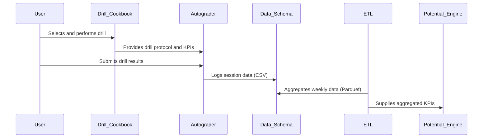

# PR #20: feat(domain): Formalize Mentat Cognitive Augmentation Domain

- **Author:** ImmortalDemonGod
- **State:** MERGED
- **Created:** 2025-06-15 22:09
- **Closed:** 2025-06-15 22:16
- **Merged:** 2025-06-15 22:16
- **Base branch:** `master`
- **Head branch:** `feature/mentat-os-cognitive-augmentation-domain`
- **Files changed:** 6
- **Additions:** 604
- **Deletions:** 2

## Summary
#### **1. Summary & Rationale**

This pull request introduces the **Mentat Cognitive Augmentation Domain**, a new core pillar of the "Cultivation" project. It formalizes the previously discussed concepts of "Training the Mind Like a Machine" and the "Mentat-OS" into a structured, actionable framework.

The primary rationale for this change is to move beyond ad-hoc cognitive drills and establish a systematic, measurable, and evidence-based curriculum for enhancing cognitive performance. This new domain is designed to be deeply integrated with the project's Holistic Integration Layer (HIL), providing a rich new data stream for the Potential (Π) and Synergy engines and creating a powerful human-AI partnership model.

This PR lays the complete foundational groundwork for the new domain by introducing five core documents that define its architecture, training protocols, data contracts, and implementation plan.

---

#### **2. Key Changes & New Documents Added**

This PR introduces the following new files:

*   **`cultivation/docs/5_domain_knowledge_and_curricula/cognitive_augmentation/README.md`**
    *   **Purpose:** The central entry point and table of contents for the new domain. Provides a mission statement and navigational links to the other core documents.

*   **`cultivation/docs/5_domain_knowledge_and_curricula/cognitive_augmentation/mentat_os_blueprint.md`**
    *   **Purpose:** The architectural charter for the Mentat-OS. Details the 5-layer cognitive architecture (Intuition, Cognitive Core, Somatic, Social, Governance), its guiding principles, and its strategic mapping to the Cultivation Ranking System.

*   **`cultivation/docs/5_domain_knowledge_and_curricula/cognitive_augmentation/drill_cookbook.md`**
    *   **Purpose:** The practical, version-controlled training manual. Provides step-by-step procedures, progression ladders, and measurable KPIs for each of the cognitive drills designed to train the five layers of the Mentat-OS.

*   **`cultivation/docs/2_requirements_and_specifications/data_schemas/cognitive_training_schemas.md`**
    *   **Purpose:** The technical data contract for the domain. It specifies the schemas for the raw `cognitive_drill_log.csv` and the processed `cognitive_training_weekly.parquet` files, ensuring data integrity for the ETL pipeline.

*   **`cultivation/docs/5_domain_knowledge_and_curricula/cognitive_augmentation/mentat_os_pilot_plan.md`**
    *   **Purpose:** The actionable project plan for the initial 4-week MVP pilot. It outlines the schedule, success criteria, and a concrete integration roadmap with `DW_` task identifiers for implementation.

#### **3. Modified Files**

*   **`cultivation/docs/5_domain_knowledge_and_curricula/README.md`**
    *   **Change:** Updated to formally include the "Cognitive Augmentation" domain in the top-level list of curricula, ensuring it is discoverable and properly positioned within the project's knowledge base.

---

#### **4. Impact on the "Cultivation" System**

*   **Architectural Impact:** Establishes a new, major functional domain within the project. It provides a clear blueprint for subsequent development of ETL scripts, HIL integration, and scheduling features related to cognitive training.
*   **Data Pipeline Impact:** Defines the new `ETL_CognitiveTraining` pipeline and its associated data artifacts (`cognitive_drill_log.csv`, `cognitive_training_weekly.parquet`).
*   **Strategic Impact:** This is a significant step towards realizing the project's grand ambitions, particularly "Enhance Human Potential." It provides the framework for systematically improving the human operator's cognitive capabilities, which acts as a force multiplier for all other domains.

---

#### **5. Next Steps & Implementation Plan**

The approval and merge of this PR marks the completion of the *planning and design phase* for the Mentat-OS. The immediate next steps are to execute the **4-Week MVP Pilot Plan**, which involves:

1.  **Scaffolding:** Creating the necessary directory structures and script files (`mentat_autograder.py`, etc.).
2.  **Instrumentation:** Setting up the KPI dashboard for data logging.
3.  **Baseline Testing:** Conducting Day-0 baseline measurements for all relevant cognitive KPIs.
4.  **Initiating Training:** Beginning the daily drill protocol as outlined in the `drill_cookbook.md` and `pilot_plan.md`.

These implementation tasks will be tracked via `DW_` tasks in the project's `tasks.json` file.

---

#### **6. Review Checklist**

*   [x] All new documents are internally consistent and cross-referenced.
*   [x] The new domain is correctly integrated into the existing documentation structure.
*   [x] The proposed changes align with the overall vision and architecture of the "Cultivation" project.
*   [ ] (Reviewer) Confirm that the defined data schemas are sufficient for the initial data pipeline.
*   [ ] (Reviewer) Confirm that the pilot plan is clear and actionable.

---

### **🧠 Mentat-OS Architecture Overview**

This PR introduces a systematic 5-layer cognitive architecture:

1. **Intuition Engine** - Pattern recognition and rapid inference capabilities
2. **Cognitive Core** - Working memory, logical reasoning, and executive control
3. **Somatic Interface** - Mind-body integration and interoceptive awareness
4. **Social Engine** - Interpersonal cognition and emotional intelligence
5. **Ethical Governor** - Value alignment and long-term consequence evaluation

### **📊 Key Performance Indicators Established**

- **Working Memory Span**: Measured through digit span and N-back tasks
- **Pattern Recognition Speed**: Visual and conceptual pattern identification metrics
- **Logical Reasoning Accuracy**: Inference and deduction performance tracking
- **Interoceptive Accuracy**: Body awareness and somatic intelligence measurement
- **Social Cognition**: Theory of mind and emotional intelligence assessment

### **🎯 4-Week MVP Pilot Success Criteria**

- Complete 80% of scheduled training sessions (19/24 sessions)
- Achieve measurable improvement in at least 3 core KPIs
- Establish reliable baseline measurements for all 5 cognitive layers
- Demonstrate data pipeline functionality and integration capability

This foundational PR establishes the strategic framework for systematic cognitive enhancement, creating a new domain that will serve as a force multiplier across all other areas of the Cultivation ecosystem.

---
Pull Request opened by [Augment Code](https://www.augmentcode.com/) with guidance from the PR author

<!-- This is an auto-generated comment: release notes by coderabbit.ai -->
## Summary by CodeRabbit

- **New Features**
  - Introduced comprehensive documentation for the Cognitive Augmentation Domain, including an overview, detailed training drill cookbook, system blueprint, and a 4-week pilot plan.
  - Added data schema specifications for cognitive training logs and aggregated analytics.
  - Expanded the curricula section with detailed descriptions of all training domains and their integration within the holistic performance system.
<!-- end of auto-generated comment: release notes by coderabbit.ai -->

## Top-level Comments
- **coderabbitai**: <!-- This is an auto-generated comment: summarize by coderabbit.ai -->
<!-- This is an auto-generated comment: failure by coderabbit.ai -->

> [!CAUTION]
> ## Review failed
> 
> The pull request is closed.

<!-- end of auto-generated comment: failure by coderabbit.ai -->
<!-- walkthrough_start -->

... (truncated)

## CodeRabbit Walkthrough
## Walkthrough

This update introduces comprehensive documentation for the Cognitive Augmentation Domain within the Cultivation project. It adds detailed specifications for cognitive training data schemas, a domain overview, a drill cookbook, the Mentat-OS architectural blueprint, and a 4-week pilot plan. Additionally, it provides an expanded curricula section overview, outlining all knowledge domains and their integration.

## Changes

| File(s)                                                                                     | Change Summary                                                                                                    |
|--------------------------------------------------------------------------------------------|------------------------------------------------------------------------------------------------------------------|
| cultivation/docs/2_requirements_and_specifications/data_schemas/cognitive_training_schemas.md | New document specifying schemas for cognitive drill session logs and weekly aggregated data.                      |
| cultivation/docs/5_domain_knowledge_and_curricula/README.md                                 | Complete rewrite: now a detailed overview of curricula domains and their integration in the Cultivation project.  |
| cultivation/docs/5_domain_knowledge_and_curricula/cognitive_augmentation/README.md          | New README: introduces the Cognitive Augmentation Domain, its mission, integration, objectives, and KPIs.         |
| cultivation/docs/5_domain_knowledge_and_curricula/cognitive_augmentation/drill_cookbook.md  | New document: full specification of Mentat-OS Drill Cookbook, including drills, KPIs, and progression ladders.    |
| cultivation/docs/5_domain_knowledge_and_curricula/cognitive_augmentation/mentat_os_blueprint.md | New document: Mentat-OS blueprint detailing cognitive architecture, training ranks, and system integration.       |
| cultivation/docs/5_domain_knowledge_and_curricula/cognitive_augmentation/mentat_os_pilot_plan.md | New document: 4-week pilot plan for Mentat-OS cognitive augmentation, with objectives and integration roadmap.    |

## Sequence Diagram(s)



## Poem

> In the garden of knowledge, new seeds now grow,  
> With blueprints and cookbooks, our minds in tow.  
> Drills for the cortex, plans for the week,  
> Data flows steady—insights we seek.  
> A hop and a leap, with whiskers held high,  
> The rabbit records progress, reaching for the sky!  
> 🐇✨

## Git Commit Log

```text
* 313a64b (origin/feature/mentat-os-cognitive-augmentation-domain, feature/mentat-os-cognitive-augmentation-domain) 📝 docs(README): update measurable KPIs in curriculum
* 4836088 📝 docs(cognitive_training_schemas): update KPI descriptions
* 9c36a71 📝 docs(cognitive_training_schemas): update cognitive training schemas
* 39aa8a4 📚 docs(cognitive_augmentation): add cognitive training documentation
*   539fbbd Merge pull request #18 from ImmortalDemonGod/refactor/project-structure-for-arc-sprint
* |   b9ec6fe Merge pull request #17 from ImmortalDemonGod/chore/add-task-runner
* e04aeb2 🚀 feat(taskmaster): implement task management and scheduling system
* c1d9628 ✨ feat(scripts): add PR markdown summary generator
* 65e17e3 ✨ feat(github_automation): add script for GitHub automation
* 13e54d0 📝 docs(repository_audits): add useful guide link to report
*   faeef3b Merge pull request #16 from ImmortalDemonGod/chore/backfill-run-data-may-june-2025
* dcce90c 📝 docs(ARC Prize 2025): add strategic integration proposal
* 1eb30da 🔧 chore(TODO): remove outdated TODO items
*   16d8a57 Merge pull request #15 from ImmortalDemonGod/task-001-rna-knowledge-base-structure
*   9713522 Merge pull request #13 from ImmortalDemonGod/feature/deepwork
* | 4d5d3f5 Merge pull request #10 from ImmortalDemonGod/flashcards/backend-pipeline-foundation
* 9449c84 data: add lunch run GPX and update wellness tracking data
*   0a96b37 Merge pull request #8 from ImmortalDemonGod/taskmaster-integration-setup
* d7e9514 Update add-paper.md
* 4d4c3de Create add-paper.md
* 4e1ec97 ✨ feat(literature): add new research paper metadata and notes
* f2bb6f1 ✨ feat(reader_app): add paper progress tracking endpoint
* ac583f2 ✨ feat(reader_app): add paper management functionality
* 57481c3 ✨ feat(index.html): add input and controls for arXiv papers
* 3da4060 ✨ feat(reader_app): enhance paper loading and progress tracking
* fcd75a9 ✨ feat(reader_app): add endpoint to list all papers
* c8571c2 ✨ feat(reader): add paper selection dropdown and PDF loading
* 7e2fa6f ✨ feat(literature): add new literature entry for RNA modeling
* f2f5ade ✨ feat(reader_app): add finish session endpoint for metrics logging
* cf09851 ✨ feat(reader_app): add finish session button and update script path
* 697da5d ✨ feat(reader_app): implement WebSocket auto-reconnect and session metrics
* c2e0f0c ✨ feat(literature): enhance reading session management
* 2ee80d6 📝 docs(literature_system_howto): add practical setup and troubleshooting guide
* 385ffd4 feat: add new training session data with GPX and analysis outputs for week 21
*   f76330d Merge pull request #6 from ImmortalDemonGod/devdailyreflect-mvp
* | 73fd77f ✨ feat(training): add week 21 assessment training plan
* | 994819d update data
* | 0d4b363 update data
* | 38ad076 ✨ feat(strength): add new strength training session log
* | df5bf01 ♻️ refactor(scripts): update import path for parse_markdown
* | 78ac968 🔧 chore(data): update binary data files
* | c4461e0 ✨ feat(metrics): add advanced metrics and distributions files
* | 95bd4ea 📝 docs(session): document running session analysis report
* | d635a88 ✨ feat(data): add weekly running and walking summaries
* | 48ad785 📝 docs(training plans): add logging instructions for strength system
* | 65dbff6 ✨ feat(exercise library): add new exercises to library
* 8c1484b chore: update week 20 activity data and remove outdated files
* 09e7e99 🔧 chore(week20): clean up and organize output files
* b241b2c 🔧 chore(week20): remove outdated walk metrics files
* 190add5 ✨ feat(analysis): add new data summary files for week 20
* 47dd3ce 🔧 chore(advanced_metrics): remove unused metric files
* a708b78 ✨ feat(figure): add new walk data files for week 20
* 1cf9e5d refactor: reorganize week20 output files and update run analysis data
*   1499410 Merge pull request #4 from ImmortalDemonGod/feature/operationalize-knowledge-software-etls
* |   8774729 Merge remote-tracking branch 'origin/master' into feature/add-strength-domain
* | | | cb6165a 🔧 chore(.gitignore): update ignore patterns for directories
* | | 1e3706e feat: add walk segment data files with GPS traces and timing analysis
* | | 8505b2c ✨ feat(metrics): add new advanced metrics files
* | | ca67d11 ✨ feat(benchmark): add new output files for heart rate analysis
* | | 4cf6d81 ✨ feat(data): add new run analysis output files
* | | 57806f6 ✨ feat(cultivation): add data metrics and diagnostics documentation
* | | 44ab549 ✨ feat(benchmark): add new performance analysis text files
* | | 1b7ee86 ✨ feat(cultivation): add new running data summary files
* | | c0c5d7f ✨ feat(benchmark): add new performance metrics and summaries
* | | 224f9ce ✨ feat(benchmark): add new performance data text files
* | | c998811 ✨ feat(week20): add new analysis files for walking data
* | | 7baca8d 🔧 chore(data): update daily wellness and subjective records
* | | 15a6485 feat: add week20 training data with GPS traces and performance metrics
* | | b921575 📝 docs(README): update README for strength training integration
* | | 293be19 ✨ feat(makefile): update rebuild strength data command
* | | 4b26228 ✨ feat(cultivation): enhance YAML processing and validation
* | | 3bf6cff 🔧 chore(.gitignore): update ignore rules for new data
* | | 66affff ✨ feat(ingest_yaml_log): support ingesting Markdown workout logs
* | | 6272aa9 ✨ feat(strength): add processed strength exercise logs and sessions
* | | d1d4533 ✨ feat(data): add strength training session YAML log
* | | 87dc580 ✨ feat(strength): enhance user input handling
* | | 1f9871e ✨ feat(data): add new exercises to exercise library
* | | 84f9ffc ✨ feat(cultivation): add strength training session data
* | | aea0036 ✨ feat(requirements): add pandas and python-dotenv dependencies
* | | a8966b1 ✨ feat(strength): add interactive CLI for logging strength sessions
* | | 412f5f7 ✨ feat(data): add exercise library and strength log template
* | | 3deb5b2 ✨ feat(docs): add strength data schemas documentation
*   7121d9d Merge pull request #2 from ImmortalDemonGod/feature/week19-advanced-metrics-hr-pace
* a7e52d5 Create 2025_05_11_run_report.md
* 61fe29c Update knowledge_acquistion_analysis
* a76e035 Create knowledge_acquistion_analysis
* 8cfa35e Add files via upload
* e875443 Add files via upload
* df31f30 Add files via upload
* 1491ec1 Add files via upload
* 2826cba Create flashcards_3.md
*   082e2a0 Merge pull request #1 from ImmortalDemonGod/fatigue-kpi-zones-integration-2025-04-30
* 5174eec 📝 docs(run_summary): add advanced metrics and weather details
* 00f05c1 data update
* ca2dbf0 ✨ feat(reports): add detailed run report for April 2025
* 1cbe261 ✨ feat(weather): add weather fetching utility
* acfd33d ✨ feat(performance_analysis): add advanced metrics and weather info
* f811b63 ✨ feat(running): skip already processed run files
* 6004b58 ✨ feat(parse_run_files): integrate advanced metrics for GPX
* 6c6f31b ✨ feat(metrics): add GPX parsing and run metrics calculation
* 72eb7ce ✨ feat(requirements): add requests package to dependencies
* 6d0d4dd 📝 docs(base_ox_block): update Base-Ox mesocycle documentation
* b28316e ✨ feat(docs): add Base-Ox Mesocycle training plan
* 6b2b77a ✨ feat(performance_analysis): enhance output organization and summaries
* ebcb547 ✨ feat(compare_weekly_runs): add image and text output for comparisons
* f92bbe8 ✨ feat(analyze_hr_pace_distribution): add image and text output directories
* 717b8d6 ✨ feat(cultivation): add pace comparison for week 17
* 1fcae2d ✨ feat(cultivation): add heart rate comparison for week 17
* 3aa850c ✨ feat(cultivation): add time in heart rate zone file
* f3ccfb1 ✨ feat(cultivation): add run summary output file
* f7eadf6 ✨ feat(cultivation): add pacing strategy analysis output
* a71ebcb ✨ feat(cultivation): add pace distribution output file
* 42e85e7 ✨ feat(cultivation): add heart rate vs pace correlation data
* 84cf549 ✨ feat(cultivation): add heart rate drift analysis output
* 7543576 ✨ feat(figures): add heart rate distribution data file
* 4123cb0 ✨ feat(cultivation): add time in heart rate zones data
* d7d7a1a ✨ feat(cultivation): add run summary output file
* bc95e1e ✨ feat(cultivation): add pace over time analysis file
* 683ed8e ✨ feat(cultivation): add pace distribution data file
* 79d4093 ✨ feat(cultivation): add heart rate vs pace correlation data
* deec77b ✨ feat(cultivation): add heart rate drift analysis output
* f57e45e ✨ feat(cultivation): add heart rate distribution data file
* cc349c5 🔧 chore(.gitignore): update ignore rules for figures
* 37faeba ✨ feat(performance_analysis): add dynamic figure directory creation
* a1b62e5 ✨ feat(scripts): add weekly comparison step for runs
* aaea7f2 ✨ feat(cultivation): add weekly run comparison script
* b5b320e ✨ feat(analyze_hr_pace_distribution): add figure saving directory structure
* a39538b updated files
* a328e1b ✨ feat(running): update paths in process_all_runs script
* 71abbee 📝 docs(README): add quick start guide for automated data analysis
* c447cbe 🔧 chore(.gitignore): add ignore rules for generated figures
* d54d06e ♻️ refactor(process_all_runs): update project root path
* 6bf37a1 ♻️ refactor(scripts): improve file renaming and processing logic
* ac3e359 ✨ feat(docs): add automated running data ingestion workflow
* 80e5b07 🔧 chore(create_structure): remove create_structure.py file
* 231afbb ✨ feat(requirements): add new data visualization libraries
* 607d9eb ✨ feat(performance_analysis): add advanced run performance analysis script
* bc39215 ✨ feat(scripts): add batch processing for running data files
* ceb502b ✨ feat(scripts): add file parser for FIT and GPX formats
* 71a22c3 ✨ feat(scripts): add auto-rename functionality for raw files
* d5de4cb ✨ feat(scripts): add HR and pace distribution analysis tool
* dbcd84d ✨ feat(reports): add placeholder file for reports directory
* 0fe43f5 ✨ feat(figures): add time in hr zone figure
* 655a5a9 ✨ feat(figures): add pace over time figure
* 693781b ✨ feat(figures): add pace distribution figure
* f0c9cce ✨ feat(figures): add heart rate vs pace hexbin plot
* f5437ce ✨ feat(figures): add HR over time drift figure
* 77bce6e ✨ feat(figures): add heart rate distribution figure
* 9c6a442 ✨ feat(figures): add placeholder for figures output directory
* 308bf12 new run data
* b6bda67 ✨ feat(data): add placeholder file for raw data directory
* 0c25807 new running data
* 3666a6e ✨ feat(processed): add placeholder file for processed data
* 3a137ba ✨ feat(requirements): add initial requirements file
* 035a68e Create systems‑map_and_market‑cheatsheet.md
* ddf2f9c Create system_readiness_audit_2025‑04‑18.md
* 431aae5 Create operational_playbook.md
* e45ef98 Rename Testing-requirements.md to  flashcards_2.md
* b9fb65c Create flashcards_1.md
* 047bc11 Create literature_system_overview.md
* 083e7ce Update design_overview.md
* eacb6de Update Progress.md
* c0f67d9 Update Progress.md
* 842e60c Rename biology_eda.ipynb to malthus_logistic_demo.ipynb
* 52719d5 Update Progress.md
* 85a45aa Update task_master_integration.md
* 94772b8 Create task_master_integration.md
* 45ec03d Update analysis_overview.md
* a65fb4d Create Progress.md
* bdab714 Rename Testing-requirements to Testing-requirements.md
* 2f2cc29 Create lean_guide.md
* 3a732a2 Create roadmap_vSigma.md
* 5e26925 Create math_stack.md
* e6cbfad Create generate_podcast_example.py
* d927c22 🔧 chore(notebooks): update metadata for biology_eda notebook
* a950c52 📝 docs(outline): add detailed framework for raising potential and leveraging synergy
* 2ae9c1a Create Testing-requirements
* 356e119 Rename section_1_test to section_1_test.md
* adb08fa Create section_1_test
* 6f489ac 📝 docs(biology_eda): add detailed explanation and examples
* 0077451 Add Chapter 1: Continuous Population Models for Single Species under docs/5_mathematical_biology
* 2d6a05e Update README.md
* 7619853 keeping the repo txt up to date
* 78c8b04 inital repo commit with all the current documentation and repo structure
* 14b05d7 Initial commit
```

