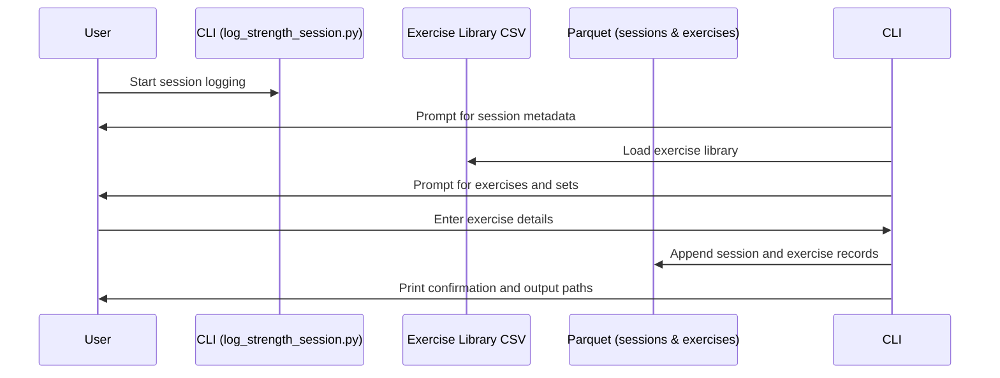
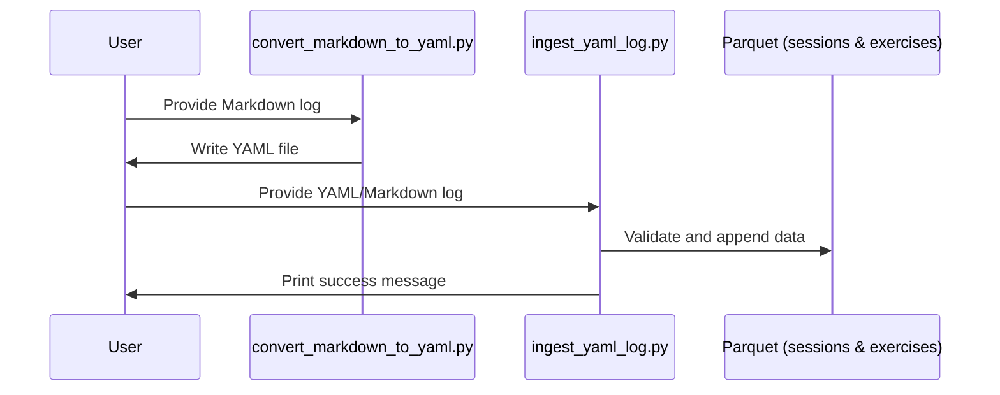

# PR #3: Feature/add-strength-domain

- **Author:** ImmortalDemonGod
- **State:** MERGED
- **Created:** 2025-05-14 19:08
- **Closed:** 2025-05-17 00:10
- **Merged:** 2025-05-17 00:10
- **Base branch:** `master`
- **Head branch:** `feature/add-strength-domain`
- **Files changed:** 69
- **Additions:** 85734
- **Deletions:** 6

## Summary


<!-- This is an auto-generated comment: release notes by coderabbit.ai -->

## Summary by CodeRabbit

- **New Features**
  - Introduced strength training data management, including structured logging, ingestion, and analysis for strength sessions.
  - Added interactive command-line tools for logging and processing strength workout data.
  - New data schemas and templates for strength training session and exercise logs.
  - Expanded documentation to cover strength training workflows and data structures.

- **Documentation**
  - Added detailed guides and schema references for strength training data and ingestion processes.
  - Provided benchmark analysis and diagnostic notes for strength and running metrics.

- **Chores**
  - Updated dependencies and `.gitignore` to support new strength training features.
  - Added placeholder files to ensure new directories are tracked.

- **Data**
  - Added new sample strength training session logs and summaries.
  - Included comprehensive outputs and statistical summaries for running and strength sessions.

<!-- end of auto-generated comment: release notes by coderabbit.ai -->

## Top-level Comments
- **coderabbitai**: <!-- This is an auto-generated comment: summarize by coderabbit.ai -->
<!-- walkthrough_start -->

## Walkthrough

This update introduces comprehensive support for strength training data management within the project. It adds documentation, data schemas, ingestion scripts, CLI tools, Makefile automa... (truncated)

## CodeRabbit Walkthrough
## Walkthrough

This update introduces comprehensive support for strength training data management within the project. It adds documentation, data schemas, ingestion scripts, CLI tools, Makefile automation, and sample data files for structured logging and analysis of strength workouts. Numerous output and summary files for running and strength sessions are also included, alongside bug diagnostics and minor dependency and ignore file adjustments.

## Changes

| File(s) / Path(s)                                                                                                  | Change Summary                                                                                                                                                                                                                                                                                                                                                                                                                                                                                                                                                                                                                                                                                                                                                                                                                                                                                                                                                                                                                                                                                                                                                                                                                                                                                                                                                                                                                                                                                                                                                                                                                                                                                                                                                                                                                                                                                                                                                                                                                                                                                                                                                                                                                                                                                                                                                                                                                                                                                                                                                                                                                                                                                                                                                                                                                                                                                                                                                                                                                                                                                                                                                                                                                                                                                                                                                                                                                                                                                                                                                                                                                                                                                      |
|--------------------------------------------------------------------------------------------------------------------|----------------------------------------------------------------------------------------------------------------------------------------------------------------------------------------------------------------------------------------------------------------------------------------------------------------------------------------------------------------------------------------------------------------------------------------------------------------------------------------------------------------------------------------------------------------------------------------------------------------------------------------------------------------------------------------------------------------------------------------------------------------------------------------------------------------------------------------------------------------------------------------------------------------------------------------------------------------------------------------------------------------------------------------------------------------------------------------------------------------------------------------------------------------------------------------------------------------------------------------------------------------------------------------------------------------------------------------------------------------------------------------------------------------------------------------------------------------------------------------------------------------------------------------------------------------------------------------------------------------------------------------------------------------------------------------------------------------------------------------------------------------------------------------------------------------------------------------------------------------------------------------------------------------------------------------------------------------------------------------------------------------------------------------------------------------------------------------------------------------------------------------------------------------------------------------------------------------------------------------------------------------------------------------------------------------------------------------------------------------------------------------------------------------------------------------------------------------------------------------------------------------------------------------------------------------------------------------------------------------------------------------------------------------------------------------------------------------------------------------------------------------------------------------------------------------------------------------------------------------------------------------------------------------------------------------------------------------------------------------------------------------------------------------------------------------------------------------------------------------------------------------------------------------------------------------------------------------------------------------------------------------------------------------------------------------------------------------------------------------------------------------------------------------------------------------------------------------------------------------------------------------------------------------------------------------------------------------------------------------------------------------------------------------------------------------------|
| .gitignore                                                                                                         | Added ignore patterns for `cultivation/reader_app/*` and `cultivation/data/processed` to exclude these directories from version control.                                                                                                                                                                                                                                                                                                                                                                                                                                                                                                                                                                                                                                                                                                                                                                                                                                                                                                                                                                                                                                                                                                                                                                                                                                                                                                                                                                                                                                                                                                                                                                                                                                                                                                                                                                                                                                                                                                                                                                                                                                                                                                                                                                                                                                                                                                                                                                                                                                                                                                                                                                                                                                                                                                                                                                                                                                                                                                                                                                                                                                                                                                                                                                                                                                                                                                                                                                                                                                      |
| Makefile                                                                                                           | Introduced a `rebuild-strength-data` target to automate deletion and regeneration of processed strength data files from raw logs using a Python module.                                                                                                                                                                                                                                                                                                                                                                                                                                                                                                                                                                                                                                                                                                                                                                                                                                                                                                                                                                                                                                                                                                                                                                                                                                                                                                                                                                                                                                                                                                                                                                                                                                                                                                                                                                                                                                                                                                                                                                                                                                                                                                                                                                                                                                                                                                                                                                                                                                                                                                                                                                                                                                                                                                                                                                                                                                                                                                                                                                                                                                                                                                                                                                                                                                                                                                                                                                                                                  |
| README.md                                                                                                          | Updated to document the new strength training domain, its data workflow, repository structure, and ingestion process. Added a dedicated section for strength training data logging and processing.                                                                                                                                                                                                                                                                                                                                                                                                                                                                                                                                                                                                                                                                                                                                                                                                                                                                                                                                                                                                                                                                                                                                                                                                                                                                                                                                                                                                                                                                                                                                                                                                                                                                                                                                                                                                                                                                                                                                                                                                                                                                                                                                                                                                                                                                                                                                                                                                                                                                                                                                                                                                                                                                                                                                                                                                                                                                                                                                                                                                                                                                                                                                                                                                                                                                                       |
| requirements.txt                                                                                                   | Added `pandas-stubs` as a new dependency.                                                                                                                                                                                                                                                                                                                                                                                                                                                                                                                                                                                                                                                                                                                                                                                                                                                                                                                                                                                                                                                                                                                                                                                                                                                                                                                                                                                                                                                                                                                                                                                                                                                                                                                                                                                                                                                                                                                                                                                                                                                                                                                                                                                                                                                                                                                                                                                                                                                                                                                                                                                                                                                                                                                                                                                                                                                                                                                                                                                                                                                                                                                                                                                                                                                                                                                                                                                                                                                     |
| cultivation/data/strength/processed/.gitkeep                                                                       | Added empty file to ensure the processed strength data directory is tracked by version control.                                                                                                                                                                                                                                                                                                                                                                                                                                                                                                                                                                                                                                                                                                                                                                                                                                                                                                                                                                                                                                                                                                                                                                                                                                                                                                                                                                                                                                                                                                                                                                                                                                                                                                                                                                                                                                                                                                                                                                                                                                                                                                                                                                                                                                                                                                                                                                                                                                                                                                                                                                                                                                                                                                                                                                                                                                                                                                                                                                                                                                                                                                                                                                                                                                                                                                                                                                                        |
| cultivation/data/strength/raw/.gitkeep                                                                             | Added empty file to ensure the raw strength data directory is tracked by version control.                                                                                                                                                                                                                                                                                                                                                                                                                                                                                                                                                                                                                                                                                                                                                                                                                                                                                                                                                                                                                                                                                                                                                                                                                                                                                                                                                                                                                                                                                                                                                                                                                                                                                                                                                                                                                                                                                                                                                                                                                                                                                                                                                                                                                                                                                                                                                                                                                                                                                                                                                                                                                                                                                                                                                                                                                                                                                                                                                                                                                                                                                                                                                                                                                                                                                                                                                                                           |
| cultivation/data/strength/raw/20250513_W20_Tue_StrengthFocus1.md<br>cultivation/data/strength/raw/20250513_W20_Tue_StrengthFocus1.yaml | Added detailed raw and YAML-formatted logs for a strength training session on 2025-05-13, including session metadata and granular exercise/set data.                                                                                                                                                                                                                                                                                                                                                                                                                                                                                                                                                                                                                                                                                                                                                                                                                                                                                                                                                                                                                                                                                                                                                                                                                                                                                                                                                                                                                                                                                                                                                                                                                                                                                                                                                                                                                                                                                                                                                                                                                                                                                                                                                                                                                                                                                                                                                                                                                                                                                                                                                                                                                                                                                                                                                                                                                                                                                                                                                                                                                                                                                                                                                                                                                                                                                                           |
| cultivation/data/strength/raw/strength_log_template.md                                                             | Added a structured Markdown template for logging strength training sessions with metadata and exercise/set details.                                                                                                                                                                                                                                                                                                                                                                                                                                                                                                                                                                                                                                                                                                                                                                                                                                                                                                                                                                                                                                                                                                                                                                                                                                                                                                                                                                                                                                                                                                                                                                                                                                                                                                                                                                                                                                                                                                                                                                                                                                                                                                                                                                                                                                                                                                                                                                                                                                                                                                                                                                                                                                                                                                                                                                                                                                                                                                                                                                                                                                                                                                                                                                                                                                                                                                                                                        |
| cultivation/docs/3_design/strength_data_schemas.md                                                                 | Added documentation describing the data schemas for strength sessions, exercise logs, and exercise library CSV files.                                                                                                                                                                                                                                                                                                                                                                                                                                                                                                                                                                                                                                                                                                                                                                                                                                                                                                                                                                                                                                                                                                                                                                                                                                                                                                                                                                                                                                                                                                                                                                                                                                                                                                                                                                                                                                                                                                                                                                                                                                                                                                                                                                                                                                                                                                                                                                                                                                                                                                                                                                                                                                                                                                                                                                                                                                                                                                                                                                                                                                                                                                                                                                                                                                                                                                                                     |
| cultivation/outputs/figures/week20/20250513_183508_W20Tue_NME1_strength_focus_gps_trace_benchmark/...              | Added numerous output files (summaries, metrics, distributions, session notes, weather, etc.) for a Week 20 strength and running session, including detailed markdown analysis, statistical summaries, and tabular/JSON data for various performance metrics.                                                                                                                                                                                                                                                                                                                                                                                                                                                                                                                                                                                                                                                                                                                                                                                                                                                                                                                                                                                                                                                                                                                                                                                                                                                                                                                                                                                                                                                                                                                                                                                                                                                                                                                                                                                                                                                                                                                                                                                                                                                                                                                                                                                                                                                                                                                                                                                                                                                                                                                                                                                                                                                                                                                                                                                                                                                                                                                                                                                                                                                                                                                                                             |
| cultivation/outputs/figures/week20/20250514_174726_lunch_cad168_Z3Z4run_RW_hot/...                                 | Added output files for a Week 20 running session, including summaries, metrics, distributions, and weather data.                                                                                                                                                                                                                                                                                                                                                                                                                                                                                                                                                                                                                                                                                                                                                                                                                                                                                                                                                                                                                                                                                                                                                                                                                                                                                                                                                                                                                                                                                                                                                                                                                                                                                                                                                                                                                                                                                                                                                                                                                                                                                                                                                                                                                                                                                                                                                                                                                                                                                                                                                                                                                                                                                                                                                                                                                                                                                                                                                                                                                                                                                                                                                                                                                                                                                                                                 |
| cultivation/outputs/figures/week20/txt/compare_hr.txt<br>cultivation/outputs/figures/week20/txt/compare_pace.txt   | Added comparison summaries for heart rate and pace across Week 20 sessions.                                                                                                                                                                                                                                                                                                                                                                                                                                                                                                                                                                                                                                                                                                                                                                                                                                                                                                                                                                                                                                                                                                                                                                                                                                                                                                                                                                                                                                                                                                                                                                                                                                                                                                                                                                                                                                                                                                                                                                                                                                                                                                                                                                                                                                                                                                                                                                                                                                                                                                                                                                                                                                                                                                                                                                                                                                                                                                                                                                                                                                                                                                                                                                                                                                                                                                                         |
| cultivation/scripts/strength/bugs.md                                                                               | Added a bug tracking and diagnostics document for data integrity and processing pipeline issues, with proposed fixes and code snippets.                                                                                                                                                                                                                                                                                                                                                                                                                                                                                                                                                                                                                                                                                                                                                                                                                                                                                                                                                                                                                                                                                                                                                                                                                                                                                                                                                                                                                                                                                                                                                                                                                                                                                                                                                                                                                                                                                                                                                                                                                                                                                                                                                                                                                                                                                                                                                                                                                                                                                                                                                                                                                                                                                                                                                                                                                                                                                                                                                                                                                                                                                                                                                                                                                                                                                          |
| cultivation/scripts/strength/convert_markdown_to_yaml.py                                                           | Added a script to convert structured Markdown workout logs with YAML frontmatter into consolidated YAML files, extracting exercises from the Markdown body.                                                                                                                                                                                                                                                                                                                                                                                                                                                                                                                                                                                                                                                                                                                                                                                                                                                                                                                                                                                                                                                                                                                                                                                                                                                                                                                                                                                                                                                                                                                                                                                                                                                                                                                                                                                                                                                                                                                                                                                                                                                                                                                                                                                                                                                                                                                                                                                                                                                                                                                                                                                                                                                                                                                                                                                                                                                                                                                                                                                                                                                                                                                                                                                                                                                                                 |
| cultivation/scripts/strength/ingest_yaml_log.py                                                                    | Added a script to ingest YAML or Markdown workout logs, validate them, and append session/exercise data into Parquet files, ensuring exercise names match the library and avoiding duplication.                                                                                                                                                                                                                                                                                                                                                                                                                                                                                                                                                                                                                                                                                                                                                                                                                                                                                                                                                                                                                                                                                                                                                                                                                                                                                                                                                                                                                                                                                                                                                                                                                                                                                                                                                                                                                                                                                                                                                                                                                                                                                                                                                                                                                                                                                                                                                                                                                                                                                                                                                                                                                                                                                                                                                                                                                                                                                                                                                                                                                                                                                                                                                                                                                                                      |
| cultivation/scripts/strength/log_strength_session.py                                                               | Added an interactive CLI tool for logging strength sessions and exercises, validating inputs, and appending them to Parquet files, with support for exercise library lookup and session ID generation.                                                                                                                                                                                                                                                                                                                                                                                                                                                                                                                                                                                                                                                                                                                                                                                                                                                                                                                                                                                                                                                                                                                                                                                                                                                                                                                                                                                                                                                                                                                                                                                                                                                                                                                                                                                                                                                                                                                                                                                                                                                                                                                                                                                                                                                                                                                                                                                                                                                                                                                                                                                                                                                                                                                                                                                                                                                                                                                                                                                                                                                                                                                                                                                                                                         |

## Sequence Diagram(s)

### Strength Session Logging and Ingestion Flow



### Markdown to YAML Conversion and Ingestion



## Poem

> In burrows deep, I log and leap,  
> Strength and stats now mine to keep!  
> With YAML, Markdown, Parquet too,  
> I crunch each rep and RPE through.  
> 🏋️‍♂️🐇 From logs to charts, my data grows—  
> This bunny’s strength, the project shows!  
>  
>  (\(\  
>  ( -.-)  
> o_(")(")

## Git Commit Log

```text
*   8774729 (origin/feature/add-strength-domain, feature/add-strength-domain) Merge remote-tracking branch 'origin/master' into feature/add-strength-domain
* | | cb6165a 🔧 chore(.gitignore): update ignore patterns for directories
* | 1e3706e feat: add walk segment data files with GPS traces and timing analysis
* | 8505b2c ✨ feat(metrics): add new advanced metrics files
* | ca67d11 ✨ feat(benchmark): add new output files for heart rate analysis
* | 4cf6d81 ✨ feat(data): add new run analysis output files
* | 57806f6 ✨ feat(cultivation): add data metrics and diagnostics documentation
* | 44ab549 ✨ feat(benchmark): add new performance analysis text files
* | 1b7ee86 ✨ feat(cultivation): add new running data summary files
* | c0c5d7f ✨ feat(benchmark): add new performance metrics and summaries
* | 224f9ce ✨ feat(benchmark): add new performance data text files
* | c998811 ✨ feat(week20): add new analysis files for walking data
* | 7baca8d 🔧 chore(data): update daily wellness and subjective records
* | 15a6485 feat: add week20 training data with GPS traces and performance metrics
* | b921575 📝 docs(README): update README for strength training integration
* | 293be19 ✨ feat(makefile): update rebuild strength data command
* | 4b26228 ✨ feat(cultivation): enhance YAML processing and validation
* | 3bf6cff 🔧 chore(.gitignore): update ignore rules for new data
* | 66affff ✨ feat(ingest_yaml_log): support ingesting Markdown workout logs
* | 6272aa9 ✨ feat(strength): add processed strength exercise logs and sessions
* | d1d4533 ✨ feat(data): add strength training session YAML log
* | 87dc580 ✨ feat(strength): enhance user input handling
* | 1f9871e ✨ feat(data): add new exercises to exercise library
* | 84f9ffc ✨ feat(cultivation): add strength training session data
* | aea0036 ✨ feat(requirements): add pandas and python-dotenv dependencies
* | a8966b1 ✨ feat(strength): add interactive CLI for logging strength sessions
* | 412f5f7 ✨ feat(data): add exercise library and strength log template
* | 3deb5b2 ✨ feat(docs): add strength data schemas documentation
*   7121d9d Merge pull request #2 from ImmortalDemonGod/feature/week19-advanced-metrics-hr-pace
* a7e52d5 Create 2025_05_11_run_report.md
* 61fe29c Update knowledge_acquistion_analysis
* a76e035 Create knowledge_acquistion_analysis
* 8cfa35e Add files via upload
* e875443 Add files via upload
* df31f30 Add files via upload
* 1491ec1 Add files via upload
* 2826cba Create flashcards_3.md
*   082e2a0 Merge pull request #1 from ImmortalDemonGod/fatigue-kpi-zones-integration-2025-04-30
* 5174eec 📝 docs(run_summary): add advanced metrics and weather details
* 00f05c1 data update
* ca2dbf0 ✨ feat(reports): add detailed run report for April 2025
* 1cbe261 ✨ feat(weather): add weather fetching utility
* acfd33d ✨ feat(performance_analysis): add advanced metrics and weather info
* f811b63 ✨ feat(running): skip already processed run files
* 6004b58 ✨ feat(parse_run_files): integrate advanced metrics for GPX
* 6c6f31b ✨ feat(metrics): add GPX parsing and run metrics calculation
* 72eb7ce ✨ feat(requirements): add requests package to dependencies
* 6d0d4dd 📝 docs(base_ox_block): update Base-Ox mesocycle documentation
* b28316e ✨ feat(docs): add Base-Ox Mesocycle training plan
* 6b2b77a ✨ feat(performance_analysis): enhance output organization and summaries
* ebcb547 ✨ feat(compare_weekly_runs): add image and text output for comparisons
* f92bbe8 ✨ feat(analyze_hr_pace_distribution): add image and text output directories
* 717b8d6 ✨ feat(cultivation): add pace comparison for week 17
* 1fcae2d ✨ feat(cultivation): add heart rate comparison for week 17
* 3aa850c ✨ feat(cultivation): add time in heart rate zone file
* f3ccfb1 ✨ feat(cultivation): add run summary output file
* f7eadf6 ✨ feat(cultivation): add pacing strategy analysis output
* a71ebcb ✨ feat(cultivation): add pace distribution output file
* 42e85e7 ✨ feat(cultivation): add heart rate vs pace correlation data
* 84cf549 ✨ feat(cultivation): add heart rate drift analysis output
* 7543576 ✨ feat(figures): add heart rate distribution data file
* 4123cb0 ✨ feat(cultivation): add time in heart rate zones data
* d7d7a1a ✨ feat(cultivation): add run summary output file
* bc95e1e ✨ feat(cultivation): add pace over time analysis file
* 683ed8e ✨ feat(cultivation): add pace distribution data file
* 79d4093 ✨ feat(cultivation): add heart rate vs pace correlation data
* deec77b ✨ feat(cultivation): add heart rate drift analysis output
* f57e45e ✨ feat(cultivation): add heart rate distribution data file
* cc349c5 🔧 chore(.gitignore): update ignore rules for figures
* 37faeba ✨ feat(performance_analysis): add dynamic figure directory creation
* a1b62e5 ✨ feat(scripts): add weekly comparison step for runs
* aaea7f2 ✨ feat(cultivation): add weekly run comparison script
* b5b320e ✨ feat(analyze_hr_pace_distribution): add figure saving directory structure
* a39538b updated files
* a328e1b ✨ feat(running): update paths in process_all_runs script
* 71abbee 📝 docs(README): add quick start guide for automated data analysis
* c447cbe 🔧 chore(.gitignore): add ignore rules for generated figures
* d54d06e ♻️ refactor(process_all_runs): update project root path
* 6bf37a1 ♻️ refactor(scripts): improve file renaming and processing logic
* ac3e359 ✨ feat(docs): add automated running data ingestion workflow
* 80e5b07 🔧 chore(create_structure): remove create_structure.py file
* 231afbb ✨ feat(requirements): add new data visualization libraries
* 607d9eb ✨ feat(performance_analysis): add advanced run performance analysis script
* bc39215 ✨ feat(scripts): add batch processing for running data files
* ceb502b ✨ feat(scripts): add file parser for FIT and GPX formats
* 71a22c3 ✨ feat(scripts): add auto-rename functionality for raw files
* d5de4cb ✨ feat(scripts): add HR and pace distribution analysis tool
* dbcd84d ✨ feat(reports): add placeholder file for reports directory
* 0fe43f5 ✨ feat(figures): add time in hr zone figure
* 655a5a9 ✨ feat(figures): add pace over time figure
* 693781b ✨ feat(figures): add pace distribution figure
* f0c9cce ✨ feat(figures): add heart rate vs pace hexbin plot
* f5437ce ✨ feat(figures): add HR over time drift figure
* 77bce6e ✨ feat(figures): add heart rate distribution figure
* 9c6a442 ✨ feat(figures): add placeholder for figures output directory
* 308bf12 new run data
* b6bda67 ✨ feat(data): add placeholder file for raw data directory
* 0c25807 new running data
* 3666a6e ✨ feat(processed): add placeholder file for processed data
* 3a137ba ✨ feat(requirements): add initial requirements file
* 035a68e Create systems‑map_and_market‑cheatsheet.md
* ddf2f9c Create system_readiness_audit_2025‑04‑18.md
* 431aae5 Create operational_playbook.md
* e45ef98 Rename Testing-requirements.md to  flashcards_2.md
* b9fb65c Create flashcards_1.md
* 047bc11 Create literature_system_overview.md
* 083e7ce Update design_overview.md
* eacb6de Update Progress.md
* c0f67d9 Update Progress.md
* 842e60c Rename biology_eda.ipynb to malthus_logistic_demo.ipynb
* 52719d5 Update Progress.md
* 85a45aa Update task_master_integration.md
* 94772b8 Create task_master_integration.md
* 45ec03d Update analysis_overview.md
* a65fb4d Create Progress.md
* bdab714 Rename Testing-requirements to Testing-requirements.md
* 2f2cc29 Create lean_guide.md
* 3a732a2 Create roadmap_vSigma.md
* 5e26925 Create math_stack.md
* e6cbfad Create generate_podcast_example.py
* d927c22 🔧 chore(notebooks): update metadata for biology_eda notebook
* a950c52 📝 docs(outline): add detailed framework for raising potential and leveraging synergy
* 2ae9c1a Create Testing-requirements
* 356e119 Rename section_1_test to section_1_test.md
* adb08fa Create section_1_test
* 6f489ac 📝 docs(biology_eda): add detailed explanation and examples
* 0077451 Add Chapter 1: Continuous Population Models for Single Species under docs/5_mathematical_biology
* 2d6a05e Update README.md
* 7619853 keeping the repo txt up to date
* 78c8b04 inital repo commit with all the current documentation and repo structure
* 14b05d7 Initial commit
```

