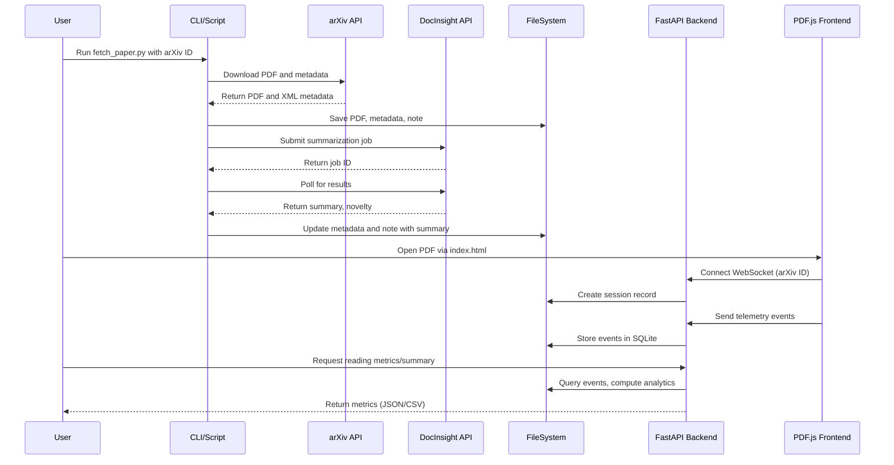

# PR #4: Feature/operationalize knowledge software etls

- **Author:** ImmortalDemonGod
- **State:** MERGED
- **Created:** 2025-05-17 00:13
- **Closed:** 2025-05-17 00:49
- **Merged:** 2025-05-17 00:49
- **Base branch:** `master`
- **Head branch:** `feature/operationalize-knowledge-software-etls`
- **Files changed:** 69
- **Additions:** 31230
- **Deletions:** 5

## Summary


<!-- This is an auto-generated comment: release notes by coderabbit.ai -->
## Summary by CodeRabbit

- **New Features**
  - Introduced an instrumented PDF reader app with a web interface, real-time telemetry collection, and analytics dashboard for reading sessions.
  - Added scripts for automated retrieval, metadata extraction, summarization, and batch processing of arXiv papers, including integration with DocInsight for novelty assessment.
  - Implemented a comprehensive literature survey document and a systematic debugging workflow guide.
  - Added data aggregation and visualization tools for reading metrics and user engagement.
  - Added a new CI workflow for testing across multiple Python versions.
  - Introduced a detailed PDF.js debugging toolset with font inspection, stepping, and statistics panels.

- **Documentation**
  - Expanded and added multiple README files detailing setup, usage, and advanced configuration for literature processing and the PDF reader.
  - Added detailed guides for debugging and literature survey to inform users and contributors.

- **Tests**
  - Added extensive unit, integration, and end-to-end tests for literature processing scripts, schema validation, and the PDF reader application.
  - Introduced mock servers and fixtures to support robust automated testing.

- **Chores**
  - Updated requirements files and `.gitignore` for new dependencies and directory structures.
  - Added configuration files for CI, testing, and development environments.

- **Style**
  - Introduced new CSS styles for the PDF viewer and debugging interfaces.
<!-- end of auto-generated comment: release notes by coderabbit.ai -->

## Top-level Comments
- **coderabbitai**: <!-- This is an auto-generated comment: summarize by coderabbit.ai -->
<!-- walkthrough_start -->

## Walkthrough

This update introduces a comprehensive literature processing pipeline for the Cultivation project. It adds scripts for fetching, annotating, and analyzing arXiv papers, integrates DocIn... (truncated)
- **coderabbitai**: > [!NOTE]
> Generated docstrings for this pull request at https://github.com/ImmortalDemonGod/Holistic-Performance-Enhancement/pull/5

## CodeRabbit Walkthrough
## Walkthrough

This update introduces a comprehensive literature processing pipeline for the Cultivation project. It adds scripts for fetching, annotating, and analyzing arXiv papers, integrates DocInsight for summarization, and implements a telemetry-enabled PDF reader with backend and frontend components. Extensive documentation, JSON schemas, and robust automated tests for all new features are included.

## Changes

| File(s)                                                                                     | Change Summary |
|---------------------------------------------------------------------------------------------|---------------|
| .github/workflows/ci-literature.yml                                                         | Added a GitHub Actions CI workflow for Python linting and testing across multiple versions. |
| .gitignore                                                                                  | Updated to ignore specific subdirectories in `cultivation/reader_app/static/pdfjs/` and `node_modules`. |
| README.md                                                                                   | Added detailed documentation for the literature processing pipeline, usage, and configuration. |
| cultivation/docs/comprehensive_debugging_guide.md                                           | Added a systematic, multi-phase debugging workflow guide integrating scientific and LLM-driven methods. |
| cultivation/literature/metadata/*.json                                                      | Added metadata JSON files for multiple recent arXiv papers, including bibliographic details and local paths. |
| cultivation/literature/notes/*.md                                                           | Added markdown literature notes for new papers, summarizing abstracts and providing annotation placeholders. |
| cultivation/literature/to_read.md                                                           | Added a survey document summarizing recent research and its relevance to Cultivation’s design. |
| cultivation/reader_app/README.md                                                            | Added documentation for the reader app setup and test scripts. |
| cultivation/reader_app/babel.config.js                                                      | Added Babel configuration targeting the current Node.js version. |
| cultivation/reader_app/e2e-server.js                                                        | Added a static file and WebSocket server for end-to-end testing. |
| cultivation/reader_app/jest.config.js                                                       | Added Jest configuration for unit and integration testing. |
| cultivation/reader_app/main.py                                                              | Added FastAPI backend for telemetry event ingestion, session management, and analytics endpoints. |
| cultivation/reader_app/package.json                                                         | Added npm package definition with scripts and devDependencies for testing and serving. |
| cultivation/reader_app/playwright.config.js                                                 | Added Playwright configuration for automated browser-based end-to-end tests. |
| cultivation/reader_app/requirements.txt                                                     | Added Python dependencies for FastAPI, Uvicorn, and JSON schema validation. |
| cultivation/reader_app/static/__tests__/*.js                                                | Added Jest unit tests for main.js and PDF.js viewer bridge scripts. |
| cultivation/reader_app/static/index.html                                                    | Added the main HTML UI for the instrumented PDF reader. |
| cultivation/reader_app/static/main.js                                                       | Added JavaScript for PDF.js integration, telemetry, and WebSocket communication. |
| cultivation/reader_app/static/pdfjs/README.txt                                              | Added instructions for populating the PDF.js distribution. |
| cultivation/reader_app/static/pdfjs/debugger.css                                            | Added CSS for the PDF.js debugger and text layer visualization. |
| cultivation/reader_app/static/pdfjs/debugger.mjs                                            | Added a modular PDF.js debugger with font inspection, stepping, and stats tools. |
| cultivation/reader_app/static/pdfjs/viewer.html                                             | Added a full-featured PDF.js viewer interface with event bridging for telemetry. |
| cultivation/reader_app/static/pdfjs/viewer-bridge.js                                        | Added a minimal stub module for PDF.js event bridging to support testing. |
| cultivation/reader_app/tests/e2e/load.spec.js                                               | Added Playwright end-to-end test for PDF loading and WebSocket connection. |
| cultivation/reader_app/tests/test_plan.md                                                   | Added a detailed test plan for the PDF viewer’s JavaScript components. |
| cultivation/schemas/paper.schema.json                                                       | Added a JSON schema for validating paper metadata files. |
| cultivation/scripts/literature/__init__.py                                                  | Added an empty line (no functional change). |
| cultivation/scripts/literature/docinsight_client.py                                         | Added a Python client for DocInsight API with robust polling and error handling. |
| cultivation/scripts/literature/fetch_arxiv_batch.py                                         | Added a script for batch fetching arXiv papers by query, with state tracking. |
| cultivation/scripts/literature/fetch_paper.py                                               | Added a script to fetch and process a single arXiv paper, integrate DocInsight, and create notes. |
| cultivation/scripts/literature/metrics_literature.py                                        | Added a script to aggregate literature metadata and reading metrics into a Parquet file. |
| cultivation/scripts/literature/plot_reading_metrics.py                                      | Added a script to visualize reading telemetry and analyze text selection events. |
| cultivation/scripts/literature/process_docinsight_results.py                                | Added a background worker to fetch and update DocInsight results for pending jobs. |
| cultivation/scripts/literature/reading_session.py                                           | Added a CLI tool to manage reading sessions and collect user metrics. |
| cultivation/scripts/running/metrics.py                                                      | Enhanced GPX parsing to support files without XML namespaces. |
| cultivation/scripts/running/walk_utils.py                                                   | Corrected and clarified logic for GPS jitter filtering in walking data. |
| requirements.txt                                                                            | Added dependencies: `jsonschema`, `pandera`, and `flask`. |
| tests/__init__.py, tests/mocks/__init__.py                                                  | Added empty `__init__.py` files for test package structure. |
| tests/literature/test_docinsight_client.py                                                  | Added unit tests for DocInsightClient methods and polling logic. |
| tests/literature/test_fetch_arxiv_batch.py                                                  | Added tests for batch fetching logic, state management, and API parsing. |
| tests/literature/test_fetch_paper.py                                                        | Added comprehensive tests for paper fetching, error handling, and CLI integration. |
| tests/literature/test_fetch_paper_integration.py                                            | Added integration test for end-to-end paper fetching with a mock DocInsight server. |
| tests/literature/test_metadata_schema.py                                                    | Added tests to validate metadata files against the JSON schema. |
| tests/literature/test_metrics_literature.py                                                 | Added tests for metadata loading and aggregation functions. |
| tests/literature/test_reading_stats_schema.py                                               | Added Pandera-based schema validation tests for reading statistics. |
| tests/mocks/docinsight_mock.py                                                              | Added a Flask-based mock server for DocInsight API endpoints. |

## Sequence Diagram(s)



## Poem

> In burrows deep, I hop and scan,  
> New scripts for papers, what a plan!  
> Fetch, summarize, annotate—  
> With DocInsight, we contemplate.  
> Tests abound, the schema’s sound,  
> Telemetry hops all around.  
> 🐇 Cheers to knowledge, leap and bound!

## Git Commit Log

```text
*   6b87655 (feature/operationalize-knowledge-software-etls) Merge branch 'master' into feature/operationalize-knowledge-software-etls
* | 1432352 ✨ feat(main): add metadata validation endpoint
* | cc45697 ✨ feat(package): add serve-handler dependency
* | 2fb9ec9 ✨ feat(requirements): add jsonschema dependency
* | 13c0292 ✨ feat(reader_app): add minimal PDF.js viewer bridge module
* | 01bdf9a ✨ feat(pdfjs): enhance security in postMessage usage
* | ae307c4 ✅ test(tests): improve test coverage and reliability
* | 451961f 🔧 chore(ci): update setup-python action version
* | 66adfed 🔧 chore(literature): update database file
* | c78755a ✨ feat(static): add PDF.js library
* | e99a2a8 📝 docs(test): add comprehensive testing plan for JavaScript components
* | 1a58d83 🔧 chore(.gitignore): update ignore patterns
* | 9ae3eab ✨ feat(literature): add new PDF documents for research
* | 613c132 ✨ feat(reader_app): initialize reader_app with Babel and Jest
* | 4bb4500 ✨ feat(literature): add new research papers metadata and notes
* | 369cf82 ✅ test(main): add unit tests for main.js functionalities
* | 22ca389 feat: add PDF.js viewer with source maps and configuration files
* | 5ebe1f1 ✨ feat(literature): add arXiv paper 2504.05496
* | 119bad1 ✨ feat(literature): add PDF.js viewer and literature management files
* | 55c5268 ✨ feat(pdfjs): add initial pdf viewer implementation
* | c79a4bd ✨ feat(literature): add text clustering and page assignment
* | ff64056 ✨ feat(scripts): add plot reading metrics script
* | ed9550e ✨ feat(reader_app): add instrumented PDF reader application
* | b484467 ✨ feat(literature): enhance metrics aggregation with reading sessions
* | 5fec150 ✨ feat(fetch_paper): improve schema validation and error handling
* | ff8d9f7 👷 ci(literature): add CI workflow for testing across Python versions
* | 7e45801 ✨ feat(literature): enhance arXiv fetching and DocInsight integration
* | 2dd48ed ✅ test(literature): enhance fetch paper tests with mocking
* | 843c781 🔧 chore(literature): remove outdated metadata and notes files
* | e98f8fe ✨ feat(literature): enhance DocInsight client integration
* | fcd4fde 🔧 chore(tests): update test imports and exceptions
* | ef333d1 ✨ feat(cultivation): add new paper metadata and notes
* | 959eb0a ✨ feat(literature): enhance DocInsight client with error handling
* | 711f1f8 ✨ feat(metrics): add schema validation and logging
* | e30607f 📝 docs(README): add literature processing pipeline section
* | 68a6467 ✨ feat(literature): add support for environment variable overrides
* | a3999bb ✨ feat(literature): add batch fetching and metrics scripts
* | b790297 ✨ feat(literature): enhance DocInsight integration in fetch_paper
* | c4f0ffb ✨ feat(metrics): add fallback for un-namespaced GPX trkpt tags
* | ecd65fa ✨ feat(literature): enhance DocInsightClient functionality
* | 1fd1d99 ✅ test(literature): add unit tests for fetch_arxiv_paper
* | 88399f9 📝 docs(debugging): add comprehensive debugging guide
* | f00db4c ✨ feat(fetch_paper): enhance paper fetching functionality
* | 09215e4 ✨ feat(literature): add initial literature scripts and mock server
*   7121d9d Merge pull request #2 from ImmortalDemonGod/feature/week19-advanced-metrics-hr-pace
* a7e52d5 Create 2025_05_11_run_report.md
* 61fe29c Update knowledge_acquistion_analysis
* a76e035 Create knowledge_acquistion_analysis
* 8cfa35e Add files via upload
* e875443 Add files via upload
* df31f30 Add files via upload
* 1491ec1 Add files via upload
* 2826cba Create flashcards_3.md
*   082e2a0 Merge pull request #1 from ImmortalDemonGod/fatigue-kpi-zones-integration-2025-04-30
* 5174eec 📝 docs(run_summary): add advanced metrics and weather details
* 00f05c1 data update
* ca2dbf0 ✨ feat(reports): add detailed run report for April 2025
* 1cbe261 ✨ feat(weather): add weather fetching utility
* acfd33d ✨ feat(performance_analysis): add advanced metrics and weather info
* f811b63 ✨ feat(running): skip already processed run files
* 6004b58 ✨ feat(parse_run_files): integrate advanced metrics for GPX
* 6c6f31b ✨ feat(metrics): add GPX parsing and run metrics calculation
* 72eb7ce ✨ feat(requirements): add requests package to dependencies
* 6d0d4dd 📝 docs(base_ox_block): update Base-Ox mesocycle documentation
* b28316e ✨ feat(docs): add Base-Ox Mesocycle training plan
* 6b2b77a ✨ feat(performance_analysis): enhance output organization and summaries
* ebcb547 ✨ feat(compare_weekly_runs): add image and text output for comparisons
* f92bbe8 ✨ feat(analyze_hr_pace_distribution): add image and text output directories
* 717b8d6 ✨ feat(cultivation): add pace comparison for week 17
* 1fcae2d ✨ feat(cultivation): add heart rate comparison for week 17
* 3aa850c ✨ feat(cultivation): add time in heart rate zone file
* f3ccfb1 ✨ feat(cultivation): add run summary output file
* f7eadf6 ✨ feat(cultivation): add pacing strategy analysis output
* a71ebcb ✨ feat(cultivation): add pace distribution output file
* 42e85e7 ✨ feat(cultivation): add heart rate vs pace correlation data
* 84cf549 ✨ feat(cultivation): add heart rate drift analysis output
* 7543576 ✨ feat(figures): add heart rate distribution data file
* 4123cb0 ✨ feat(cultivation): add time in heart rate zones data
* d7d7a1a ✨ feat(cultivation): add run summary output file
* bc95e1e ✨ feat(cultivation): add pace over time analysis file
* 683ed8e ✨ feat(cultivation): add pace distribution data file
* 79d4093 ✨ feat(cultivation): add heart rate vs pace correlation data
* deec77b ✨ feat(cultivation): add heart rate drift analysis output
* f57e45e ✨ feat(cultivation): add heart rate distribution data file
* cc349c5 🔧 chore(.gitignore): update ignore rules for figures
* 37faeba ✨ feat(performance_analysis): add dynamic figure directory creation
* a1b62e5 ✨ feat(scripts): add weekly comparison step for runs
* aaea7f2 ✨ feat(cultivation): add weekly run comparison script
* b5b320e ✨ feat(analyze_hr_pace_distribution): add figure saving directory structure
* a39538b updated files
* a328e1b ✨ feat(running): update paths in process_all_runs script
* 71abbee 📝 docs(README): add quick start guide for automated data analysis
* c447cbe 🔧 chore(.gitignore): add ignore rules for generated figures
* d54d06e ♻️ refactor(process_all_runs): update project root path
* 6bf37a1 ♻️ refactor(scripts): improve file renaming and processing logic
* ac3e359 ✨ feat(docs): add automated running data ingestion workflow
* 80e5b07 🔧 chore(create_structure): remove create_structure.py file
* 231afbb ✨ feat(requirements): add new data visualization libraries
* 607d9eb ✨ feat(performance_analysis): add advanced run performance analysis script
* bc39215 ✨ feat(scripts): add batch processing for running data files
* ceb502b ✨ feat(scripts): add file parser for FIT and GPX formats
* 71a22c3 ✨ feat(scripts): add auto-rename functionality for raw files
* d5de4cb ✨ feat(scripts): add HR and pace distribution analysis tool
* dbcd84d ✨ feat(reports): add placeholder file for reports directory
* 0fe43f5 ✨ feat(figures): add time in hr zone figure
* 655a5a9 ✨ feat(figures): add pace over time figure
* 693781b ✨ feat(figures): add pace distribution figure
* f0c9cce ✨ feat(figures): add heart rate vs pace hexbin plot
* f5437ce ✨ feat(figures): add HR over time drift figure
* 77bce6e ✨ feat(figures): add heart rate distribution figure
* 9c6a442 ✨ feat(figures): add placeholder for figures output directory
* 308bf12 new run data
* b6bda67 ✨ feat(data): add placeholder file for raw data directory
* 0c25807 new running data
* 3666a6e ✨ feat(processed): add placeholder file for processed data
* 3a137ba ✨ feat(requirements): add initial requirements file
* 035a68e Create systems‑map_and_market‑cheatsheet.md
* ddf2f9c Create system_readiness_audit_2025‑04‑18.md
* 431aae5 Create operational_playbook.md
* e45ef98 Rename Testing-requirements.md to  flashcards_2.md
* b9fb65c Create flashcards_1.md
* 047bc11 Create literature_system_overview.md
* 083e7ce Update design_overview.md
* eacb6de Update Progress.md
* c0f67d9 Update Progress.md
* 842e60c Rename biology_eda.ipynb to malthus_logistic_demo.ipynb
* 52719d5 Update Progress.md
* 85a45aa Update task_master_integration.md
* 94772b8 Create task_master_integration.md
* 45ec03d Update analysis_overview.md
* a65fb4d Create Progress.md
* bdab714 Rename Testing-requirements to Testing-requirements.md
* 2f2cc29 Create lean_guide.md
* 3a732a2 Create roadmap_vSigma.md
* 5e26925 Create math_stack.md
* e6cbfad Create generate_podcast_example.py
* d927c22 🔧 chore(notebooks): update metadata for biology_eda notebook
* a950c52 📝 docs(outline): add detailed framework for raising potential and leveraging synergy
* 2ae9c1a Create Testing-requirements
* 356e119 Rename section_1_test to section_1_test.md
* adb08fa Create section_1_test
* 6f489ac 📝 docs(biology_eda): add detailed explanation and examples
* 0077451 Add Chapter 1: Continuous Population Models for Single Species under docs/5_mathematical_biology
* 2d6a05e Update README.md
* 7619853 keeping the repo txt up to date
* 78c8b04 inital repo commit with all the current documentation and repo structure
* 14b05d7 Initial commit
```

