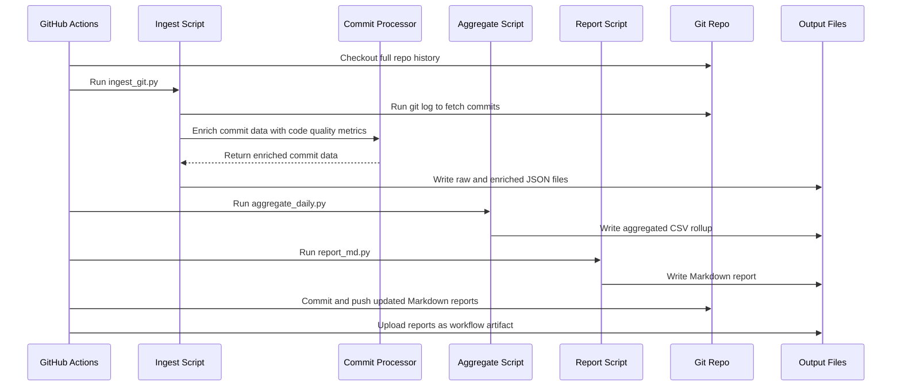

# PR #6: Devdailyreflect mvp

- **Author:** ImmortalDemonGod
- **State:** MERGED
- **Created:** 2025-05-17 02:50
- **Closed:** 2025-05-20 03:30
- **Merged:** 2025-05-20 03:30
- **Base branch:** `master`
- **Head branch:** `devdailyreflect-mvp`
- **Files changed:** 65
- **Additions:** 5244
- **Deletions:** 77

## Summary


<!-- This is an auto-generated comment: release notes by coderabbit.ai -->
## Summary by CodeRabbit

- **New Features**
  - Introduced a daily developer reflection and reporting workflow with automated Git commit ingestion, code quality enrichment, metrics aggregation, and Markdown report generation.
  - Added configuration files and utilities for flexible setup and repository detection.
  - Provided a shell script to automate the full daily reflection process including backfill capabilities.
  - Generated detailed daily reports summarizing development activity and code quality metrics.
  - Added a GitHub Actions workflow for automated daily execution of the reflection process.

- **Bug Fixes**
  - Improved error handling and validation for missing files and invalid configurations.

- **Documentation**
  - Added comprehensive README files detailing the design, architecture, usage, and operational instructions of the daily reflection pipeline.

- **Chores**
  - Updated requirements to include new dependencies for code analysis, linting, Git interaction, and YAML parsing.
  - Added placeholder files to maintain directory structure in version control.

- **Tests**
  - Added integration and unit tests covering commit ingestion, aggregation, code quality analysis, and report generation.
<!-- end of auto-generated comment: release notes by coderabbit.ai -->

## Top-level Comments
- **coderabbitai**: <!-- This is an auto-generated comment: summarize by coderabbit.ai -->
<!-- This is an auto-generated comment: failure by coderabbit.ai -->

> [!CAUTION]
> ## Review failed
> 
> The pull request is closed.

<!-- end of auto-generated comment: failure by coderabbit.ai -->
<!-- walkthrough_start -->

... (truncated)
- **coderabbitai**: > [!NOTE]
> Generated docstrings for this pull request at https://github.com/ImmortalDemonGod/Holistic-Performance-Enhancement/pull/7

## CodeRabbit Walkthrough
## Walkthrough

This update introduces a comprehensive daily developer reflection and reporting pipeline. It adds scripts for ingesting Git commit data, enriching commits with code quality metrics, aggregating daily metrics, and generating Markdown reports. A new GitHub Actions workflow automates these steps daily. The update also includes configuration files, utility modules, integration tests, output directory scaffolding, and detailed README documentation for the system.

## Changes

| File(s) / Path(s)                                                                 | Change Summary                                                                                                                                                                                                                                                                                                                                                                                                                                                                                                                                    |
|-----------------------------------------------------------------------------------|--------------------------------------------------------------------------------------------------------------------------------------------------------------------------------------------------------------------------------------------------------------------------------------------------------------------------------------------------------------------------------------------------------------------------------------------------------------------------------------------------------------------------------------------------|
| .github/workflows/daily_dev_review.yml                                            | Added a new GitHub Actions workflow for daily developer review, running tests, executing the reflection pipeline, committing updated reports, and uploading report artifacts.                                                                                                                                                                                                                                                                                                                                                                  |
| requirements.txt                                                                  | Appended dependencies: radon, ruff, GitPython, PyYAML, pytest pinned to 7.4.0.                                                                                                                                                                                                                                                                                                                                                                                                                                                                 |
| cultivation/scripts/software/commit_metrics.py                                    | Deleted placeholder script file (no functional code).                                                                                                                                                                                                                                                                                                                                                                                                                                                    |
| cultivation/scripts/software/dev_daily_reflect/README.md                          | Added detailed documentation for the DevDailyReflect pipeline, describing architecture, components, configuration, and usage.                                                                                                                                                                                                                                                                                                                                                                        |
| cultivation/scripts/software/dev_daily_reflect/aggregate_daily.py                 | Added script to aggregate commit data per author per day, outputting a rollup CSV.                                                                                                                                                                                                                                                                                                                                                                                                                       |
| cultivation/scripts/software/dev_daily_reflect/config/daily_review.yaml           | Added YAML configuration file specifying repository paths, lookback period, and output directories.                                                                                                                                                                                                                                                                                                                                                                                                       |
| cultivation/scripts/software/dev_daily_reflect/config_loader.py                   | Added utility to load and override configuration from YAML and environment variables.                                                                                                                                                                                                                                                                                                                                                                                                                    |
| cultivation/scripts/software/dev_daily_reflect/ingest_git.py                      | Added script to fetch and parse Git commit data, outputting raw and enriched JSON files.                                                                                                                                                                                                                                                                                                                                                                                                                |
| cultivation/scripts/software/dev_daily_reflect/metrics/commit_processor.py        | Added module to enrich commit data with code quality metrics (cyclomatic complexity, maintainability, Ruff errors).                                                                                                                                                                                                                                                                                                                                                                                      |
| cultivation/scripts/software/dev_daily_reflect/report_md.py                       | Added script to generate Markdown reports from aggregated CSV and enriched commit data.                                                                                                                                                                                                                                                                                                                                                                                                                  |
| cultivation/scripts/software/dev_daily_reflect/test_dev_daily_reflect.sh          | Added shell script to automate running the reflection pipeline with backfill support and validate output files.                                                                                                                                                                                                                                                                                                                                                                                        |
| cultivation/scripts/software/dev_daily_reflect/utils.py                           | Added utility to determine the Git repository root directory.                                                                                                                                                                                                                                                                                                                                                                                                                                            |
| cultivation/outputs/software/dev_daily_reflect/raw/.gitkeep<br>cultivation/outputs/software/dev_daily_reflect/reports/.gitkeep<br>cultivation/outputs/software/dev_daily_reflect/rollup/.gitkeep | Added empty `.gitkeep` files to ensure output directories are tracked in version control.                                                                                                                                                                                                                                                                                                                                                                         |
| cultivation/outputs/software/dev_daily_reflect/raw/git_commits_2025-05-17.json    | Added raw commit metadata JSON log for a specific date, capturing detailed commit information.                                                                                                                                                                                                                                                                                                                                                                                                           |
| cultivation/outputs/software/dev_daily_reflect/raw/git_commits_enriched_2025-05-17.json | Added enriched commit metadata JSON log with code quality metrics for a specific date.                                                                                                                                                                                                                                                                                                                                                                                                                   |
| cultivation/outputs/software/dev_daily_reflect/reports/dev_report_2025-05-16.md<br>cultivation/outputs/software/dev_daily_reflect/reports/dev_report_2025-05-17.md | Added Markdown reports summarizing daily development activity and metrics by author and commit.                                                                                                                                                                                                                                                                                                                                                                   |
| tests/test_aggregate_daily.py                                                     | Added integration test for daily aggregation script, verifying correct CSV rollup output from sample commit data.                                                                                                                                                                                                                                                                                                                                                                                        |
| tests/test_commit_processor.py                                                    | Added tests for commit enrichment, checking code quality metrics extraction and handling of commits with/without Python files.                                                                                                                                                                                                                                                                                                                                                                           |
| tests/test_ingest_git.py                                                          | Added integration test for Git data ingestion script, creating a temporary repo and validating output JSON.                                                                                                                                                                                                                                                                                                                                                                                              |
| tests/test_report_md.py                                                           | Added integration test for Markdown report generation script, verifying correct report output from sample CSV.                                                                                                                                                                                                                                                                                                                                                                                           |
| tests/test_report_md_failfast.py                                                  | Added test to verify report generation script fails gracefully when no rollup CSV exists.                                                                                                                                                                                                                                                                                                                                                                                                                |
| .gitignore                                                                        | Added ignore patterns for JSON, Markdown, and CSV files in the dev_daily_reflect output directories.                                                                                                                                                                                                                                                                                                                                                                                                      |
| cultivation/scripts/software/Readme.md                                            | Added comprehensive documentation for the Daily Dev Review system, detailing architecture, workflow, usage, and integration.                                                                                                                                                                                                                                                                                                                                                                            |
| cultivation/scripts/literature/metrics_literature.py                              | Added `aggregate` function to encapsulate metadata, session, and event data aggregation; improved error handling and schema validation; added logging setup.                                                                                                                                                                                                                                                                                                                                             |
| cultivation/scripts/literature/fetch_paper.py                                    | Modified DocInsightClient instantiation to prefer new environment variable `DOCINSIGHT_BASE_URL_OVERRIDE` over `DOCINSIGHT_API_URL`.                                                                                                                                                                                                                                                                                                                                                                      |
| tests/literature/test_fetch_paper_integration.py                                | Updated test to set `DOCINSIGHT_BASE_URL_OVERRIDE` environment variable and remove `DOCINSIGHT_API_URL` for correct mock server usage; cleaned up imports.                                                                                                                                                                                                                                                                                                                                               |
| tests/literature/test_metrics_literature.py                                     | Refactored and expanded tests to use realistic mock data for aggregation; improved validation and coverage of aggregation logic.                                                                                                                                                                                                                                                                                                                                                                        |
| tests/literature/test_reading_stats_schema.py                                  | Replaced external schema import with local Pandera schema definition for weekly reading stats; updated tests accordingly.                                                                                                                                                                                                                                                                                                                                                                               |

## Sequence Diagram(s)



## Possibly related PRs

- ImmortalDemonGod/Holistic-Performance-Enhancement#6: The main PR and the retrieved PR both introduce the same new GitHub Actions workflow for the daily developer reflection system and add the same set of files and scripts related to the DevDailyReflect MVP, including configuration, ingestion, aggregation, reporting, metrics processing, and orchestration scripts, indicating they are directly related and essentially the same feature implementation.

## Poem

> 🐇  
> A daily hop through code and time,  
> Gathering metrics, sublime!  
> Commits and lines, complexity too,  
> Reports in Markdown, fresh and new.  
> With scripts and tests, the pipeline’s set—  
> Reflect, review, no code regret!  
> 📝✨

## Git Commit Log

```text
* 157ba4d (devdailyreflect-mvp) ♻️ refactor(metrics_literature): update ISO week formatting
* e688d87 🔧 chore(.gitignore): update ignore patterns for reports
* a389ac3 🔧 chore(workflow): update daily dev review setup
* 01ef901 📝 docs(dev_report): update daily dev reflect for 2025-05-16
* aba8a63 ♻️ refactor(fetch_paper): enhance DocInsightClient URL handling
* e618627 ✨ feat(literature): add aggregation function for metrics
* 1b2633f ♻️ refactor(aggregate_daily): restructure argument parsing
* 65ac6a1 ✨ feat(ingest_git): enhance git ingestion script functionality
* 14b1e5b ♻️ refactor(report_md): improve repo path handling and error messages
* f720c18 ♻️ refactor(utils): update environment variable for repo root
* 6605254 ♻️ refactor(test): reorganize imports and update aggregation call
* bbf8ec1 ✅ test(tests): enhance ingest_git test cases
* 23e2340 ♻️ refactor(test): update environment variable name for clarity
* 8671ef9 🐛 fix(test): update get_date_tag method for report generation
* 04d922a ♻️ refactor(test): reorganize imports and improve test setup
* 6a8033a ✅ test(literature): enhance metrics literature tests
* f5f69cd ✅ test(tests): update reading stats schema tests
* bd83ef1 📦 build(requirements): update dependencies
* 4557903 ♻️ refactor(tests): update sys.path and PYTHONPATH configuration
* cc7176d 📝 docs(software_eda): add comprehensive development activity report
* ac65a9d docs(software_eda): publish full exploratory-analysis notebook
* 5f614a0 ✨ feat(software_eda): add author summary and commit analysis files
* 3bc30d7 📝 docs(README): update README with DevDailyReflect program outline
* b2f68f9 📝 docs(Readme): add detailed documentation for Daily Dev Review
* d05a1f1 ✨ feat(ingest_git): add argument parser for date input
* 05de42c 📦 chore(workflows): update daily_dev_review workflow
* 742ebaa 📝 docs(README): update README with DevDailyReflect program outline
* bb53703 ✨ feat(daily_dev_reflect): update daily metrics and reports - add support to skip job for GitHub Actions bot - upload daily report as artifact for better tracking - update metrics in daily report with latest commit data - adjust average maintainability index and total net LOC
* 22e60a8 ✨ feat(dev_daily_reflect): update daily metrics and reports
* 9dd4af5 ✨ feat(requirements): add new dependencies for project
* fcf3037 ✨ feat(reports): add daily development reports for May 16 and 17
* d8b52ef ✨ feat(report): change warning to error for missing files - update error handling to improve user feedback - ensures critical issues are flagged as errors
* cda5c91 ✨ feat(dev_daily_reflect): add configuration loader for daily review
* 09d5897 ✨ feat(dev_daily_reflect): enhance git ingestion configuration
* 17c3fbf ✨ feat(dev_daily_reflect): add configuration for daily review
* acd7b48 🐛 fix(report): change warning to error for missing files
* 9e4bc41 ✅ test(tests): add integration test for ingest_git.py
* 3c30904 🔧 chore(commit_metrics): remove unused commit_metrics.py file
* 9c33239 ♻️ refactor(aggregate_daily): clean up main function
* bb543a6 ✨ feat(ci): add pytest step to daily dev review workflow
* d573070 ✨ feat(aggregate_daily): refactor daily aggregation logic
* a5297c4 ♻️ refactor(dev_daily_reflect): update import paths for utils
* 27b924e 📦 build(workflow): add daily dev review workflow
* c43e3f0 ✨ feat(ingest_git): update datetime to use timezone aware UTC
* 1cfc3f3 ✨ feat(dev_daily_reflect): add daily developer reflection tools
* e165427 ✨ feat(aggregate_daily): enhance JSON file handling for commits
* 2a9f489 ✨ feat(dev_daily_reflect): enhance daily report with metrics
* aed3f03 ✨ feat(metrics): add commit processor for code quality metrics
* effbfbc ✨ feat(dev_daily_reflect): add utility for repo root path
* 8f662ed ✨ feat(dev_daily_reflect): add daily developer reflection pipeline
* 8c1484b chore: update week 20 activity data and remove outdated files
* 09e7e99 🔧 chore(week20): clean up and organize output files
* b241b2c 🔧 chore(week20): remove outdated walk metrics files
* 190add5 ✨ feat(analysis): add new data summary files for week 20
* 47dd3ce 🔧 chore(advanced_metrics): remove unused metric files
* a708b78 ✨ feat(figure): add new walk data files for week 20
* 1cf9e5d refactor: reorganize week20 output files and update run analysis data
*   1499410 Merge pull request #4 from ImmortalDemonGod/feature/operationalize-knowledge-software-etls
* |   8774729 (origin/feature/add-strength-domain, feature/add-strength-domain) Merge remote-tracking branch 'origin/master' into feature/add-strength-domain
* | | | cb6165a 🔧 chore(.gitignore): update ignore patterns for directories
* | | 1e3706e feat: add walk segment data files with GPS traces and timing analysis
* | | 8505b2c ✨ feat(metrics): add new advanced metrics files
* | | ca67d11 ✨ feat(benchmark): add new output files for heart rate analysis
* | | 4cf6d81 ✨ feat(data): add new run analysis output files
* | | 57806f6 ✨ feat(cultivation): add data metrics and diagnostics documentation
* | | 44ab549 ✨ feat(benchmark): add new performance analysis text files
* | | 1b7ee86 ✨ feat(cultivation): add new running data summary files
* | | c0c5d7f ✨ feat(benchmark): add new performance metrics and summaries
* | | 224f9ce ✨ feat(benchmark): add new performance data text files
* | | c998811 ✨ feat(week20): add new analysis files for walking data
* | | 7baca8d 🔧 chore(data): update daily wellness and subjective records
* | | 15a6485 feat: add week20 training data with GPS traces and performance metrics
* | | b921575 📝 docs(README): update README for strength training integration
* | | 293be19 ✨ feat(makefile): update rebuild strength data command
* | | 4b26228 ✨ feat(cultivation): enhance YAML processing and validation
* | | 3bf6cff 🔧 chore(.gitignore): update ignore rules for new data
* | | 66affff ✨ feat(ingest_yaml_log): support ingesting Markdown workout logs
* | | 6272aa9 ✨ feat(strength): add processed strength exercise logs and sessions
* | | d1d4533 ✨ feat(data): add strength training session YAML log
* | | 87dc580 ✨ feat(strength): enhance user input handling
* | | 1f9871e ✨ feat(data): add new exercises to exercise library
* | | 84f9ffc ✨ feat(cultivation): add strength training session data
* | | aea0036 ✨ feat(requirements): add pandas and python-dotenv dependencies
* | | a8966b1 ✨ feat(strength): add interactive CLI for logging strength sessions
* | | 412f5f7 ✨ feat(data): add exercise library and strength log template
* | | 3deb5b2 ✨ feat(docs): add strength data schemas documentation
*   7121d9d Merge pull request #2 from ImmortalDemonGod/feature/week19-advanced-metrics-hr-pace
* a7e52d5 Create 2025_05_11_run_report.md
* 61fe29c Update knowledge_acquistion_analysis
* a76e035 Create knowledge_acquistion_analysis
* 8cfa35e Add files via upload
* e875443 Add files via upload
* df31f30 Add files via upload
* 1491ec1 Add files via upload
* 2826cba Create flashcards_3.md
*   082e2a0 Merge pull request #1 from ImmortalDemonGod/fatigue-kpi-zones-integration-2025-04-30
* 5174eec 📝 docs(run_summary): add advanced metrics and weather details
* 00f05c1 data update
* ca2dbf0 ✨ feat(reports): add detailed run report for April 2025
* 1cbe261 ✨ feat(weather): add weather fetching utility
* acfd33d ✨ feat(performance_analysis): add advanced metrics and weather info
* f811b63 ✨ feat(running): skip already processed run files
* 6004b58 ✨ feat(parse_run_files): integrate advanced metrics for GPX
* 6c6f31b ✨ feat(metrics): add GPX parsing and run metrics calculation
* 72eb7ce ✨ feat(requirements): add requests package to dependencies
* 6d0d4dd 📝 docs(base_ox_block): update Base-Ox mesocycle documentation
* b28316e ✨ feat(docs): add Base-Ox Mesocycle training plan
* 6b2b77a ✨ feat(performance_analysis): enhance output organization and summaries
* ebcb547 ✨ feat(compare_weekly_runs): add image and text output for comparisons
* f92bbe8 ✨ feat(analyze_hr_pace_distribution): add image and text output directories
* 717b8d6 ✨ feat(cultivation): add pace comparison for week 17
* 1fcae2d ✨ feat(cultivation): add heart rate comparison for week 17
* 3aa850c ✨ feat(cultivation): add time in heart rate zone file
* f3ccfb1 ✨ feat(cultivation): add run summary output file
* f7eadf6 ✨ feat(cultivation): add pacing strategy analysis output
* a71ebcb ✨ feat(cultivation): add pace distribution output file
* 42e85e7 ✨ feat(cultivation): add heart rate vs pace correlation data
* 84cf549 ✨ feat(cultivation): add heart rate drift analysis output
* 7543576 ✨ feat(figures): add heart rate distribution data file
* 4123cb0 ✨ feat(cultivation): add time in heart rate zones data
* d7d7a1a ✨ feat(cultivation): add run summary output file
* bc95e1e ✨ feat(cultivation): add pace over time analysis file
* 683ed8e ✨ feat(cultivation): add pace distribution data file
* 79d4093 ✨ feat(cultivation): add heart rate vs pace correlation data
* deec77b ✨ feat(cultivation): add heart rate drift analysis output
* f57e45e ✨ feat(cultivation): add heart rate distribution data file
* cc349c5 🔧 chore(.gitignore): update ignore rules for figures
* 37faeba ✨ feat(performance_analysis): add dynamic figure directory creation
* a1b62e5 ✨ feat(scripts): add weekly comparison step for runs
* aaea7f2 ✨ feat(cultivation): add weekly run comparison script
* b5b320e ✨ feat(analyze_hr_pace_distribution): add figure saving directory structure
* a39538b updated files
* a328e1b ✨ feat(running): update paths in process_all_runs script
* 71abbee 📝 docs(README): add quick start guide for automated data analysis
* c447cbe 🔧 chore(.gitignore): add ignore rules for generated figures
* d54d06e ♻️ refactor(process_all_runs): update project root path
* 6bf37a1 ♻️ refactor(scripts): improve file renaming and processing logic
* ac3e359 ✨ feat(docs): add automated running data ingestion workflow
* 80e5b07 🔧 chore(create_structure): remove create_structure.py file
* 231afbb ✨ feat(requirements): add new data visualization libraries
* 607d9eb ✨ feat(performance_analysis): add advanced run performance analysis script
* bc39215 ✨ feat(scripts): add batch processing for running data files
* ceb502b ✨ feat(scripts): add file parser for FIT and GPX formats
* 71a22c3 ✨ feat(scripts): add auto-rename functionality for raw files
* d5de4cb ✨ feat(scripts): add HR and pace distribution analysis tool
* dbcd84d ✨ feat(reports): add placeholder file for reports directory
* 0fe43f5 ✨ feat(figures): add time in hr zone figure
* 655a5a9 ✨ feat(figures): add pace over time figure
* 693781b ✨ feat(figures): add pace distribution figure
* f0c9cce ✨ feat(figures): add heart rate vs pace hexbin plot
* f5437ce ✨ feat(figures): add HR over time drift figure
* 77bce6e ✨ feat(figures): add heart rate distribution figure
* 9c6a442 ✨ feat(figures): add placeholder for figures output directory
* 308bf12 new run data
* b6bda67 ✨ feat(data): add placeholder file for raw data directory
* 0c25807 new running data
* 3666a6e ✨ feat(processed): add placeholder file for processed data
* 3a137ba ✨ feat(requirements): add initial requirements file
* 035a68e Create systems‑map_and_market‑cheatsheet.md
* ddf2f9c Create system_readiness_audit_2025‑04‑18.md
* 431aae5 Create operational_playbook.md
* e45ef98 Rename Testing-requirements.md to  flashcards_2.md
* b9fb65c Create flashcards_1.md
* 047bc11 Create literature_system_overview.md
* 083e7ce Update design_overview.md
* eacb6de Update Progress.md
* c0f67d9 Update Progress.md
* 842e60c Rename biology_eda.ipynb to malthus_logistic_demo.ipynb
* 52719d5 Update Progress.md
* 85a45aa Update task_master_integration.md
* 94772b8 Create task_master_integration.md
* 45ec03d Update analysis_overview.md
* a65fb4d Create Progress.md
* bdab714 Rename Testing-requirements to Testing-requirements.md
* 2f2cc29 Create lean_guide.md
* 3a732a2 Create roadmap_vSigma.md
* 5e26925 Create math_stack.md
* e6cbfad Create generate_podcast_example.py
* d927c22 🔧 chore(notebooks): update metadata for biology_eda notebook
* a950c52 📝 docs(outline): add detailed framework for raising potential and leveraging synergy
* 2ae9c1a Create Testing-requirements
* 356e119 Rename section_1_test to section_1_test.md
* adb08fa Create section_1_test
* 6f489ac 📝 docs(biology_eda): add detailed explanation and examples
* 0077451 Add Chapter 1: Continuous Population Models for Single Species under docs/5_mathematical_biology
* 2d6a05e Update README.md
* 7619853 keeping the repo txt up to date
* 78c8b04 inital repo commit with all the current documentation and repo structure
* 14b05d7 Initial commit
```

