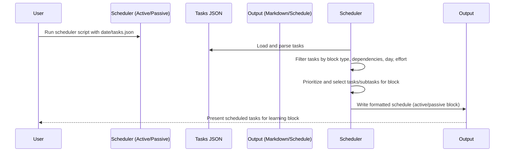
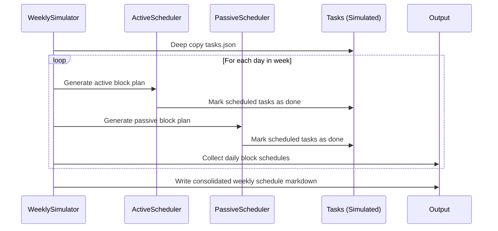

# PR #8: 🚀 feat: Implement Taskmaster Integration Setup - Complete Task Management & Scheduling System

- **Author:** ImmortalDemonGod
- **State:** MERGED
- **Created:** 2025-05-26 23:21
- **Closed:** 2025-05-27 20:06
- **Merged:** 2025-05-27 20:06
- **Base branch:** `master`
- **Head branch:** `taskmaster-integration-setup`
- **Files changed:** 126
- **Additions:** 194531
- **Deletions:** 24

## Summary
## 🎯 Overview

This PR introduces a comprehensive task management and scheduling system for the Holistic Performance Enhancement project, implementing the **Taskmaster Integration** with advanced scheduling capabilities for RNA modeling curriculum and learning workflows.

## ✨ Key Features Implemented

### 📋 Core Task Management System
- **Centralized Task Database**: Enhanced `tasks.json` with rich metadata including HPE learning objectives, scheduling metadata, and CSM references
- **Task Master Documentation**: Complete setup guides and integration documentation
- **Dependency Management**: Robust task dependency tracking and validation

### 🗓️ Advanced Scheduling System
- **Active Learning Block Scheduler** (`active_learning_block_scheduler.py`): Intelligent scheduling for focused learning sessions
- **Passive Learning Block Scheduler** (`passive_learning_block_scheduler.py`): Automated scheduling for review and consolidation activities
- **Weekly Schedule Simulator** (`weekly_schedule_simulator.py`): Full week simulation with task completion tracking
- **Oversized Task Handling**: Strategic approach for managing complex, multi-session tasks

### 🧠 RNA Modeling Curriculum Integration
- **Week 1 CSM Implementation**: Complete task breakdown for RNA nucleotide foundations
- **Learning Objectives Mapping**: Detailed learning metadata with mastery criteria
- **Curriculum-Aware Scheduling**: Tasks aligned with specific learning blocks and days

### 🔧 Enhanced Metadata & Analytics
- **HPE Learning Metadata**: Comprehensive learning objectives, activity types, and effort estimation
- **Scheduling Metadata**: Planned days, curriculum alignment, and CSM tags
- **Task Complexity Analysis**: Automated complexity scoring and recommendations

## 📁 New Files & Components

### Core Scheduling Scripts
- `cultivation/scripts/task_management/active_learning_block_scheduler.py`
- `cultivation/scripts/task_management/passive_learning_block_scheduler.py`
- `cultivation/scripts/task_management/weekly_schedule_simulator.py`

### Documentation & Analysis
- `cultivation/scripts/task_management/tm_how_to.md` - Complete usage guide
- `cultivation/scripts/task_management/task_master_documentation.md` - Integration documentation
- `cultivation/scripts/task_management/hpe_taskmaster_csm_week1_scheduling_analysis_v1.0.md` - Scheduling analysis
- `cultivation/docs/6_scheduling/task_master_integration.md` - Integration setup guide

### Enhanced Task Data
- `tasks/tasks.json` - Enriched with HPE metadata and scheduling information
- `tasks/task_013.txt` - New nucleotide introduction task

### Testing & Validation
- `tests/test_active_scheduler.py` - Comprehensive active scheduler tests
- `tests/test_passive_scheduler.py` - Passive scheduler validation tests

### Output & Reports
- `outputs/learning_curricula_parsed/weekly_schedule_simulated.md` - Generated weekly schedules
- `cultivation/scripts/task_management/task_complexity_report.json` - Task analysis reports

## 🎯 Learning & Curriculum Features

### RNA Modeling Week 1 Tasks
- **Task 13**: Nucleotide introduction with reading and flashcard creation
- **Enhanced Task Metadata**: Learning objectives, mastery criteria, effort estimation
- **Curriculum Alignment**: Tasks mapped to specific CSM days and learning blocks

### Intelligent Scheduling
- **Dependency-Aware**: Respects task prerequisites and completion status
- **Block-Specific**: Different algorithms for active vs passive learning blocks
- **Time-Aware**: Considers effort estimation and available time slots
- **Priority-Based**: Intelligent prioritization based on deadlines and importance

## 🔄 Workflow Integration

### Daily Planning
- Automated generation of daily learning schedules
- Integration with active and passive learning blocks
- Task completion tracking and status updates

### Weekly Simulation
- Full 7-day schedule simulation
- Task progression tracking
- Realistic workload distribution

### Progress Tracking
- Enhanced task status management
- Subtask promotion and completion handling
- Detailed logging for debugging and optimization

## 🧪 Testing & Quality Assurance

### Comprehensive Test Suite
- **Active Scheduler Tests**: Validates task filtering, prioritization, and scheduling logic
- **Passive Scheduler Tests**: Ensures proper dependency handling and time allocation
- **Edge Case Handling**: Tests for oversized tasks, empty schedules, and dependency conflicts

### Validation Features
- Task metadata validation
- Dependency cycle detection
- Schedule feasibility checking

## 📊 Analytics & Reporting

### Task Complexity Analysis
- Automated complexity scoring
- Effort estimation validation
- Scheduling optimization recommendations

### Schedule Analytics
- Weekly workload distribution
- Learning block utilization
- Task completion patterns

## 🚀 Future Enhancements Ready

### Integration Points
- **Flash Memory Integration**: Ready for flashcard system connection
- **GitHub Actions**: Automated scheduling workflows
- **MCP Integration**: Claude Code integration for AI-assisted task management

### Extensibility
- Modular scheduler design for easy extension
- Configurable learning block definitions
- Pluggable prioritization algorithms

## 🔍 Technical Implementation

### Architecture
- **Modular Design**: Separate schedulers for different learning contexts
- **Data-Driven**: Rich JSON-based task definitions with extensive metadata
- **Logging & Debugging**: Comprehensive logging for troubleshooting and optimization

### Key Algorithms
- **Dependency Resolution**: Topological sorting for task prerequisites
- **Time Allocation**: Intelligent fitting of tasks into available time blocks
- **Priority Scoring**: Multi-factor prioritization considering deadlines, importance, and learning objectives

## 📈 Impact & Benefits

### For Learning
- **Structured Curriculum Delivery**: Automated scheduling ensures consistent progress through RNA modeling curriculum
- **Adaptive Planning**: System adjusts to task completion and changing priorities
- **Learning Optimization**: Separate handling of active vs passive learning for maximum effectiveness

### For Development
- **Automated Workflow**: Reduces manual planning overhead
- **Data-Driven Decisions**: Rich analytics for continuous improvement
- **Scalable Architecture**: Ready for additional curricula and learning domains

## 🎉 Ready for Production

This implementation provides a solid foundation for:
- ✅ Daily automated schedule generation
- ✅ Week-long curriculum planning
- ✅ Task dependency management
- ✅ Learning progress tracking
- ✅ Integration with existing HPE workflows

---

**This PR represents a significant milestone in the HPE project, providing the infrastructure needed for systematic, data-driven learning and task management. The system is thoroughly tested, well-documented, and ready for immediate use in managing the RNA modeling curriculum and beyond.**

---
Pull Request opened by [Augment Code](https://www.augmentcode.com/) with guidance from the PR author

<!-- This is an auto-generated comment: release notes by coderabbit.ai -->

## Summary by CodeRabbit

- **New Features**
  - Introduced a comprehensive set of structured learning tasks for RNA Modeling Foundations, including detailed objectives, dependencies, priorities, and instructional content.
  - Added subtasks for each main topic, covering diagrams, explanatory notes, flashcards, and assessments.
  - Integrated metadata for learning objectives, estimated effort, mastery criteria, activity types, scheduling, and deliverables.
  - Enabled logical learning progression with prerequisite dependencies and curriculum alignment.

- **Chores**
  - Added a new JSON file containing all task definitions, metadata, and curriculum integration for streamlined project and instructional management.

<!-- end of auto-generated comment: release notes by coderabbit.ai -->

## Top-level Comments
- **coderabbitai**: <!-- This is an auto-generated comment: summarize by coderabbit.ai -->
<!-- walkthrough_start -->

## Walkthrough

This update introduces a comprehensive RNA Modeling learning system, including a full curriculum skill map, detailed task files, new scheduling and analysis scripts, extensive documenta... (truncated)
- **coderabbitai**: > [!NOTE]
> Generated docstrings for this pull request at https://github.com/ImmortalDemonGod/Holistic-Performance-Enhancement/pull/9

## CodeRabbit Walkthrough
## Walkthrough

This update introduces a comprehensive RNA Modeling learning system, including a full curriculum skill map, detailed task files, new scheduling and analysis scripts, extensive documentation, and robust test suites. It adds structured task metadata, active and passive learning block schedulers, weekly schedule simulation, and supporting configuration, enabling automated, curriculum-aligned learning planning and tracking.

## Changes

| File(s) / Path(s)                                                                                                                                                     | Change Summary                                                                                                                                                                                                                                                                                                                                                                                                                                                                                                                                                                                                                               |
|-----------------------------------------------------------------------------------------------------------------------------------------------------------------------|--------------------------------------------------------------------------------------------------------------------------------------------------------------------------------------------------------------------------------------------------------------------------------------------------------------------------------------------------------------------------------------------------------------------------------------------------------------------------------------------------------------------------------------------------------------------------------------------------------------------------------------------|
| `.env.example`, `.taskmaster/.env.example`, `.taskmasterconfig`, `.windsurfrules`, `.gitignore`, `package.json`                                                       | Added environment, configuration, rules, ignore, and package files for project setup, API keys, model profiles, workflows, and dependencies.                                                                                                                                                                                                                                                                                                                                                                                                                                                         |
| `cultivation/docs/1_background/domains_scope.md`, `cultivation/docs/1_background/final_thoughts.md`, `cultivation/docs/1_background/outline.md`                      | Removed or replaced informal introductory lines with formal comments for clarity and consistency.                                                                                                                                                                                                                                                                                                                                                                                                                                                                                                     |
| `cultivation/docs/4_analysis/operational_playbook.md`                                                                          | Updated section heading for clarity.                                                                                                                                                                                                                                                                                                                                                                                                                                                                                                                                                                 |
| `cultivation/docs/5_biology/RNA_MODELING/README.md`, `SKILL_MAP_CSM_pillar1.md`, `SKILL_MAP_CSM_pillar2.md`, `SKILL_MAP_CSM_pillar3.md`, `SKILL_MAP_CSM_pillar4.md` | Added comprehensive curriculum summary and detailed skill map documents for all four pillars of RNA modeling within the HPE framework.                                                                                                                                                                                                                                                                                                                                                                                                                                                               |
| `cultivation/docs/5_biology/RNA_MODELING/rna-modeling_p1-foundations_week1-7day.md`                                            | Added a detailed 7-day foundational learning plan for Week 1 of RNA modeling.                                                                                                                                                                                                                                                                                                                                                                                                                                                                                                                        |
| `cultivation/docs/5_biology/RNA_MODELING/rna_tasks_hpe_metadata_v1.0.md`                                                        | Proposed and detailed new HPE metadata fields for tasks, with examples for RNA modeling tasks.                                                                                                                                                                                                                                                                                                                                                                                                                                                                                                       |
| `cultivation/docs/6_scheduling/FocusPredictor_TechSpec_v1.1.md`, `My_Optimized_Flex_Learning_System_v2.0.md`, `My_Optimized_Performance_Schedule_v1.0.md`, `scheduling_oversized_tasks_strategy_v1.0.md` | Added technical specifications, operational doctrines, schedules, and strategy documents for focus prediction, flex/learning blocks, performance scheduling, and oversized task handling.                                                                                                                                                                                                                                                                                                                                                                      |
| `cultivation/outputs/figures/week21/...` (multiple new files)                                                                  | Added new run analysis reports, session summaries, and detailed statistical data files for Week 21 running sessions, including metrics, distributions, and weather/context data.                                                                                                                                                                                                                                                                                                                                                                                                                     |
| `cultivation/outputs/learning_curricula_parsed/active_block_schedule_2025-05-26.md`, `passive_block_schedule_2025-05-26.md`, `weekly_schedule_simulated.md`          | Added parsed learning block schedules and a simulated weekly schedule, detailing active and passive learning tasks per block and day.                                                                                                                                                                                                                                                                                                                                                                                                                                                                |
| `cultivation/outputs/reports/2025_05_24_run_report.md`                                                                         | Added a comprehensive Week 21 running performance report with analysis and retrospective.                                                                                                                                                                                                                                                                                                                                                                                                                                                                                                            |
| `cultivation/outputs/training_plans/baseox_daily_plans/week21/week21_rpe10_benchmark_analysis.md`                               | Simplified document opening, replacing verbose intro with a concise title.                                                                                                                                                                                                                                                                                                                                                                                                                                                                                                                          |
| `cultivation/outputs/training_plans/performance_amplification_daily_plans/training_plan_W22-W25_synergistic_performance_amplification_v1.0.md`                        | Added a detailed 4-week training plan integrating physiological modeling, autoregulation, and performance KPIs.                                                                                                                                                                                                                                                                                                                                                                                                                                                                                      |
| `cultivation/scripts/running/analyze_hr_pace_distribution.py`                                                                  | Enhanced pace distribution plotting with robust error handling for empty/uniform data, and improved summary logic.                                                                                                                                                                                                                                                                                                                                                                                                                                                                                   |
| `cultivation/scripts/task_management/__init__.py`                                                                              | Added an empty module initializer.                                                                                                                                                                                                                                                                                                                                                                                                                                                                                                                                                                   |
| `cultivation/scripts/task_management/active_learning_block_scheduler.py`                                                       | New script for scheduling active learning tasks, with dependency checks, prioritization, subtask promotion, and CLI interface.                                                                                                                                                                                                                                                                                                                                                                                                                                                                      |
| `curriculum_parser&task_generator.md`, `deep_work.md`, `example_prd.txt`, `hpe_taskmaster_csm_week1_scheduling_analysis_v1.0.md`, `tm_how_to.md`                      | Added design, analysis, readiness, and user guide documentation for curriculum parsing, task management, and scheduling.                                                                                                                                                                                                                                                                                                                                                                                                                                                                             |
| `cultivation/scripts/task_management/passive_learning_block_scheduler.py`                                                      | New script for scheduling passive learning tasks, with filtering, prioritization, block filling, and CLI support.                                                                                                                                                                                                                                                                                                                                                                                                                                                                                    |
| `cultivation/scripts/task_management/task-complexity-report.json`, `task-complexity-report.md`                                 | Added task complexity analysis reports in JSON and markdown formats.                                                                                                                                                                                                                                                                                                                                                                                                                                                                                                                                 |
| `cultivation/scripts/task_management/test_active_scheduler.py`, `test_passive_scheduler.py`                                    | Added comprehensive unittest suites for active and passive learning block schedulers, covering dependencies, effort constraints, prioritization, subtask promotion, and more.                                                                                                                                                                                                                                                                                                                                                                                                                       |
| `cultivation/scripts/task_management/weekly_schedule_simulator.py`                                                             | New script to simulate a full week's schedule, integrating active and passive schedulers, with in-memory task status updates and consolidated markdown output.                                                                                                                                                                                                                                                                                                                                                                                                                                       |
| `tasks/task_001.txt` – `tasks/task_013.txt`, `tasks/tasks.json`                                                               | Added a detailed set of 13 new learning task files and a comprehensive `tasks.json` with structured curriculum-aligned tasks, subtasks, dependencies, priorities, HPE metadata, and scheduling tags for RNA modeling foundations.                                                                                                                                                                                                                                                                                                                                                                   |

## Sequence Diagram(s)





## Poem

> In fields of RNA and learning bright,  
> New tasks and schedules take their flight.  
> With scripts that plan and tests that guard,  
> Each block of time is wisely starred.  
> From knowledge seeds, a system grows—  
> The rabbit hops where progress flows!  
> 🐇✨📚

## Git Commit Log

```text
* c54ecdf (taskmaster-integration-setup) ✨ feat(tasks): add task 013 for nucleotide introduction
* d17c62b ✨ feat(task_management): enhance task marking functionality
* 35ff49a ✨ feat(test): enhance passive scheduler functionality
* b817d25 ✨ feat(task_management): add task complexity report
* 39b2edc ✨ feat(cultivation): add task complexity report JSON
* f3bed3f ✨ feat(task_management): add allow_off_day_fill option
* 4b5702e ✨ feat(task_management): add initial product requirements document
* b15ffab 📝 docs(task_management): add deep work planning document
* d5b9399 ✨ feat(active_learning): add required fields for subtasks
* 5740f3e ✨ feat(learning): add simulated weekly schedule for RNA curriculum
* 808bdd8 ✨ feat(scheduler): add weekly schedule simulator
* 3ac1ef0 ✨ feat(tasks): add labels for curriculum activities
* 1ab57dc 🔧 chore(outputs): rename active block schedule file
* dff439f ✨ feat(tasks): add new task for RNA nucleotide introduction
* 8f20ade ✅ test(test_active_scheduler): enhance task scheduling tests
* ebd77bd 📝 docs(task_management): add task master documentation
* 5eb0da7 ✨ feat(active_learning_block_scheduler): enhance subtask effort calculation
* fd9b4f4 ✨ feat(task_management): add Week 1 CSM scheduling analysis document
* 9c1a34a ✨ feat(task_management): enhance task scheduling logic
* 28c8fda ✅ test(task_management): add tests for active scheduler
* 68497aa 📝 docs(task_management): add Task Master how-to guide
* 9b1271d ✨ feat(task_management): add active learning block scheduler script
* 69764ba ✨ feat(tasks): update task objectives and assessment details
* 930a65c 📝 docs(scheduling): add strategy document for oversized tasks
* 10a3935 ✨ feat(task): update week 1 learning reflection and progress tracking
* a094057 ♻️ refactor(tasks): standardize estimated effort hours format
* 0f6a93d ✅ test(task_management): add tests for passive scheduler
* 252b66e ✨ feat(tasks): add HPE learning and scheduling metadata
* 134f49d ✨ feat(task_management): add passive learning block scheduler script
* a423bf8 ✨ feat(task_management): add curriculum parser and task generator documentation
* 3d6e375 ✨ feat(task_management): add init file for task management module
* 2d954ea ✨ feat(tasks): add learning and scheduling metadata for RNA modeling
* 4d9dccd ✨ feat(tasks): add HPE learning and scheduling metadata
* c74025f ✨ feat(tasks): add HPE CSM and learning metadata
* 12d6e30 ✨ feat(tasks): add RNA biochemistry learning objectives and metadata
* 296634e ✨ feat(tasks): add learning reflection and progress tracking system
* a8700e7 📝 docs(RNA_MODELING): update RNA modeling documentation
* 71c2d19 ✨ feat(tasks): add comprehensive self-assessment materials
* 9db783e ✨ feat(tasks): add documentation for environmental influences on RNA stability
* acfb94d ✨ feat(tasks): add task for documenting RNA stability factors
* e5a6e69 ✨ feat(tasks): add documentation for RNA stability concepts
* f7f9681 ✨ feat(tasks): add materials for thermodynamic principles in RNA
* 810fd35 ✨ feat(tasks): add RNA vs. DNA comparison task
* b9e7211 ✨ feat(tasks): add task for documenting RNA polymer structure
* 2e5a206 ✨ feat(tasks): add task 002 for RNA nucleotide structure materials
* e675997 🆕 feat(taskmaster): add environment variable examples for API keys
* 7e20236 📦 build(package): add package.json and package-lock.json
* d0fcc39 ✨ feat(.gitignore): add rules for Task Master and environment files
* 2d89265 ✨ feat(env): add example environment variable file
* 6d0db90 ✨ feat(tasks): add initial RNA biophysics knowledge base structure
* 3ad5366 ✨ feat(tasks): add RNA modeling foundations learning plan
* 4d4f450 feat: add walk segment data files for week 21 training sessions
* c43ed4e 📝 docs(task_master_integration): add Task Master integration guide
* 9d48b49 📝 docs(reports): add comprehensive Week 21 performance report
* 276abf9 📝 docs(training_plans): update week 21 RPE 10 analysis document
* 5d0c6fc ✨ feat(training): add comprehensive 4-week training plan
* 6ffc0eb ✨ feat(analyze_hr_pace_distribution): enhance pace data visualization and summary
* 09916c6 feat: add Week 21 performance analysis with RPE10 test improvements and heat adaptation metrics
* 9e5cdde feat: add week21 run analysis outputs and task master integration docs
* 99cdada ✨ feat(analysis): add detailed metrics for Week 21 long run
* 056ec75 ✨ feat(week21): add run and walk summary reports
* 1c24660 feat: improve pace distribution analysis with robust error handling
* 934f367 ✨ feat(docs): add new skill map for RNA biology fundamentals
* 00eeca1 📝 docs(RNA_MODELING): add comprehensive RNA modeling skill map
* c6e27bd 📝 docs(mathematical_biology): remove chapter on single species models
* 4456011 📝 docs(RNA_MODELING): add foundational learning plan for RNA modeling
* c261678 📝 docs(reports): add comprehensive reports on RNA modeling
* 63718e4 📝 docs(RNA_MODELING): add README for RNA modeling curriculum
* 3194dd6 🔧 chore(docs): reorganize documentation structure
* 6da9800 📝 docs(domains_scope): remove outdated introductory text
* 0ddaad8 feat: add Week 21 RPE10 re-test analysis and performance data files
* a7834a8 🔧 chore(data): update parquet data files
* d7e9514 Update add-paper.md
* 4d4c3de Create add-paper.md
* 4e1ec97 (backup-before-fix) ✨ feat(literature): add new research paper metadata and notes
* f2bb6f1 ✨ feat(reader_app): add paper progress tracking endpoint
* ac583f2 ✨ feat(reader_app): add paper management functionality
* 57481c3 ✨ feat(index.html): add input and controls for arXiv papers
* 3da4060 ✨ feat(reader_app): enhance paper loading and progress tracking
* fcd75a9 ✨ feat(reader_app): add endpoint to list all papers
* c8571c2 ✨ feat(reader): add paper selection dropdown and PDF loading
* 7e2fa6f ✨ feat(literature): add new literature entry for RNA modeling
* f2f5ade ✨ feat(reader_app): add finish session endpoint for metrics logging
* cf09851 ✨ feat(reader_app): add finish session button and update script path
* 697da5d ✨ feat(reader_app): implement WebSocket auto-reconnect and session metrics
* c2e0f0c ✨ feat(literature): enhance reading session management
* 2ee80d6 (feature/literature-docs, feature/accidental-main-changes) 📝 docs(literature_system_howto): add practical setup and troubleshooting guide
* 385ffd4 feat: add new training session data with GPX and analysis outputs for week 21
*   f76330d Merge pull request #6 from ImmortalDemonGod/devdailyreflect-mvp
* | 73fd77f (feature/dev-daily-reflect) ✨ feat(training): add week 21 assessment training plan
* | 994819d update data
* | 0d4b363 update data
* | 38ad076 ✨ feat(strength): add new strength training session log
* | df5bf01 ♻️ refactor(scripts): update import path for parse_markdown
* | 78ac968 🔧 chore(data): update binary data files
* | c4461e0 ✨ feat(metrics): add advanced metrics and distributions files
* | 95bd4ea 📝 docs(session): document running session analysis report
* | d635a88 ✨ feat(data): add weekly running and walking summaries
* | 48ad785 📝 docs(training plans): add logging instructions for strength system
* | 65dbff6 ✨ feat(exercise library): add new exercises to library
* 8c1484b chore: update week 20 activity data and remove outdated files
* 09e7e99 🔧 chore(week20): clean up and organize output files
* b241b2c 🔧 chore(week20): remove outdated walk metrics files
* 190add5 ✨ feat(analysis): add new data summary files for week 20
* 47dd3ce 🔧 chore(advanced_metrics): remove unused metric files
* a708b78 ✨ feat(figure): add new walk data files for week 20
* 1cf9e5d refactor: reorganize week20 output files and update run analysis data
*   1499410 Merge pull request #4 from ImmortalDemonGod/feature/operationalize-knowledge-software-etls
* |   8774729 (origin/feature/add-strength-domain, feature/add-strength-domain) Merge remote-tracking branch 'origin/master' into feature/add-strength-domain
* | | | cb6165a 🔧 chore(.gitignore): update ignore patterns for directories
* | | 1e3706e feat: add walk segment data files with GPS traces and timing analysis
* | | 8505b2c ✨ feat(metrics): add new advanced metrics files
* | | ca67d11 ✨ feat(benchmark): add new output files for heart rate analysis
* | | 4cf6d81 ✨ feat(data): add new run analysis output files
* | | 57806f6 ✨ feat(cultivation): add data metrics and diagnostics documentation
* | | 44ab549 ✨ feat(benchmark): add new performance analysis text files
* | | 1b7ee86 ✨ feat(cultivation): add new running data summary files
* | | c0c5d7f ✨ feat(benchmark): add new performance metrics and summaries
* | | 224f9ce ✨ feat(benchmark): add new performance data text files
* | | c998811 ✨ feat(week20): add new analysis files for walking data
* | | 7baca8d 🔧 chore(data): update daily wellness and subjective records
* | | 15a6485 feat: add week20 training data with GPS traces and performance metrics
* | | b921575 📝 docs(README): update README for strength training integration
* | | 293be19 ✨ feat(makefile): update rebuild strength data command
* | | 4b26228 ✨ feat(cultivation): enhance YAML processing and validation
* | | 3bf6cff 🔧 chore(.gitignore): update ignore rules for new data
* | | 66affff ✨ feat(ingest_yaml_log): support ingesting Markdown workout logs
* | | 6272aa9 ✨ feat(strength): add processed strength exercise logs and sessions
* | | d1d4533 ✨ feat(data): add strength training session YAML log
* | | 87dc580 ✨ feat(strength): enhance user input handling
* | | 1f9871e ✨ feat(data): add new exercises to exercise library
* | | 84f9ffc ✨ feat(cultivation): add strength training session data
* | | aea0036 ✨ feat(requirements): add pandas and python-dotenv dependencies
* | | a8966b1 ✨ feat(strength): add interactive CLI for logging strength sessions
* | | 412f5f7 ✨ feat(data): add exercise library and strength log template
* | | 3deb5b2 ✨ feat(docs): add strength data schemas documentation
*   7121d9d Merge pull request #2 from ImmortalDemonGod/feature/week19-advanced-metrics-hr-pace
* a7e52d5 Create 2025_05_11_run_report.md
* 61fe29c Update knowledge_acquistion_analysis
* a76e035 Create knowledge_acquistion_analysis
* 8cfa35e Add files via upload
* e875443 Add files via upload
* df31f30 Add files via upload
* 1491ec1 Add files via upload
* 2826cba Create flashcards_3.md
*   082e2a0 Merge pull request #1 from ImmortalDemonGod/fatigue-kpi-zones-integration-2025-04-30
* 5174eec 📝 docs(run_summary): add advanced metrics and weather details
* 00f05c1 data update
* ca2dbf0 ✨ feat(reports): add detailed run report for April 2025
* 1cbe261 ✨ feat(weather): add weather fetching utility
* acfd33d ✨ feat(performance_analysis): add advanced metrics and weather info
* f811b63 ✨ feat(running): skip already processed run files
* 6004b58 ✨ feat(parse_run_files): integrate advanced metrics for GPX
* 6c6f31b ✨ feat(metrics): add GPX parsing and run metrics calculation
* 72eb7ce ✨ feat(requirements): add requests package to dependencies
* 6d0d4dd 📝 docs(base_ox_block): update Base-Ox mesocycle documentation
* b28316e ✨ feat(docs): add Base-Ox Mesocycle training plan
* 6b2b77a ✨ feat(performance_analysis): enhance output organization and summaries
* ebcb547 ✨ feat(compare_weekly_runs): add image and text output for comparisons
* f92bbe8 ✨ feat(analyze_hr_pace_distribution): add image and text output directories
* 717b8d6 ✨ feat(cultivation): add pace comparison for week 17
* 1fcae2d ✨ feat(cultivation): add heart rate comparison for week 17
* 3aa850c ✨ feat(cultivation): add time in heart rate zone file
* f3ccfb1 ✨ feat(cultivation): add run summary output file
* f7eadf6 ✨ feat(cultivation): add pacing strategy analysis output
* a71ebcb ✨ feat(cultivation): add pace distribution output file
* 42e85e7 ✨ feat(cultivation): add heart rate vs pace correlation data
* 84cf549 ✨ feat(cultivation): add heart rate drift analysis output
* 7543576 ✨ feat(figures): add heart rate distribution data file
* 4123cb0 ✨ feat(cultivation): add time in heart rate zones data
* d7d7a1a ✨ feat(cultivation): add run summary output file
* bc95e1e ✨ feat(cultivation): add pace over time analysis file
* 683ed8e ✨ feat(cultivation): add pace distribution data file
* 79d4093 ✨ feat(cultivation): add heart rate vs pace correlation data
* deec77b ✨ feat(cultivation): add heart rate drift analysis output
* f57e45e ✨ feat(cultivation): add heart rate distribution data file
* cc349c5 🔧 chore(.gitignore): update ignore rules for figures
* 37faeba ✨ feat(performance_analysis): add dynamic figure directory creation
* a1b62e5 ✨ feat(scripts): add weekly comparison step for runs
* aaea7f2 ✨ feat(cultivation): add weekly run comparison script
* b5b320e ✨ feat(analyze_hr_pace_distribution): add figure saving directory structure
* a39538b updated files
* a328e1b ✨ feat(running): update paths in process_all_runs script
* 71abbee 📝 docs(README): add quick start guide for automated data analysis
* c447cbe 🔧 chore(.gitignore): add ignore rules for generated figures
* d54d06e ♻️ refactor(process_all_runs): update project root path
* 6bf37a1 ♻️ refactor(scripts): improve file renaming and processing logic
* ac3e359 ✨ feat(docs): add automated running data ingestion workflow
* 80e5b07 🔧 chore(create_structure): remove create_structure.py file
* 231afbb ✨ feat(requirements): add new data visualization libraries
* 607d9eb ✨ feat(performance_analysis): add advanced run performance analysis script
* bc39215 ✨ feat(scripts): add batch processing for running data files
* ceb502b ✨ feat(scripts): add file parser for FIT and GPX formats
* 71a22c3 ✨ feat(scripts): add auto-rename functionality for raw files
* d5de4cb ✨ feat(scripts): add HR and pace distribution analysis tool
* dbcd84d ✨ feat(reports): add placeholder file for reports directory
* 0fe43f5 ✨ feat(figures): add time in hr zone figure
* 655a5a9 ✨ feat(figures): add pace over time figure
* 693781b ✨ feat(figures): add pace distribution figure
* f0c9cce ✨ feat(figures): add heart rate vs pace hexbin plot
* f5437ce ✨ feat(figures): add HR over time drift figure
* 77bce6e ✨ feat(figures): add heart rate distribution figure
* 9c6a442 ✨ feat(figures): add placeholder for figures output directory
* 308bf12 new run data
* b6bda67 ✨ feat(data): add placeholder file for raw data directory
* 0c25807 new running data
* 3666a6e ✨ feat(processed): add placeholder file for processed data
* 3a137ba ✨ feat(requirements): add initial requirements file
* 035a68e Create systems‑map_and_market‑cheatsheet.md
* ddf2f9c Create system_readiness_audit_2025‑04‑18.md
* 431aae5 Create operational_playbook.md
* e45ef98 Rename Testing-requirements.md to  flashcards_2.md
* b9fb65c Create flashcards_1.md
* 047bc11 Create literature_system_overview.md
* 083e7ce Update design_overview.md
* eacb6de Update Progress.md
* c0f67d9 Update Progress.md
* 842e60c Rename biology_eda.ipynb to malthus_logistic_demo.ipynb
* 52719d5 Update Progress.md
* 85a45aa Update task_master_integration.md
* 94772b8 Create task_master_integration.md
* 45ec03d Update analysis_overview.md
* a65fb4d Create Progress.md
* bdab714 Rename Testing-requirements to Testing-requirements.md
* 2f2cc29 Create lean_guide.md
* 3a732a2 Create roadmap_vSigma.md
* 5e26925 Create math_stack.md
* e6cbfad Create generate_podcast_example.py
* d927c22 🔧 chore(notebooks): update metadata for biology_eda notebook
* a950c52 📝 docs(outline): add detailed framework for raising potential and leveraging synergy
* 2ae9c1a Create Testing-requirements
* 356e119 Rename section_1_test to section_1_test.md
* adb08fa Create section_1_test
* 6f489ac 📝 docs(biology_eda): add detailed explanation and examples
* 0077451 Add Chapter 1: Continuous Population Models for Single Species under docs/5_mathematical_biology
* 2d6a05e Update README.md
* 7619853 keeping the repo txt up to date
* 78c8b04 inital repo commit with all the current documentation and repo structure
* 14b05d7 Initial commit
```

